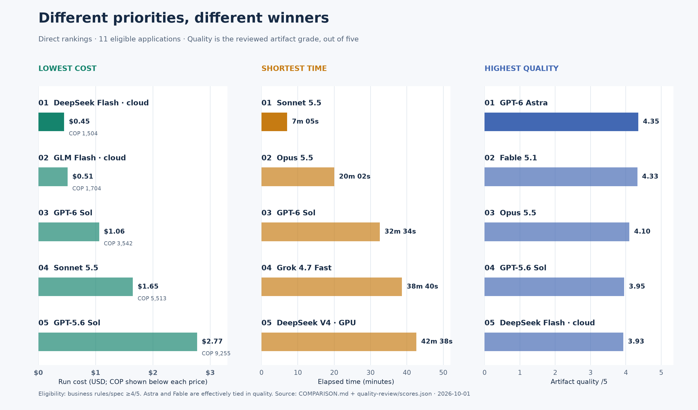
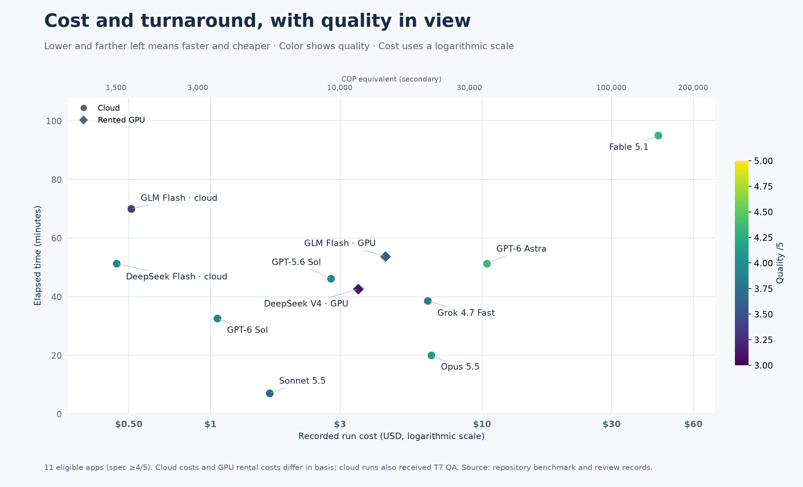
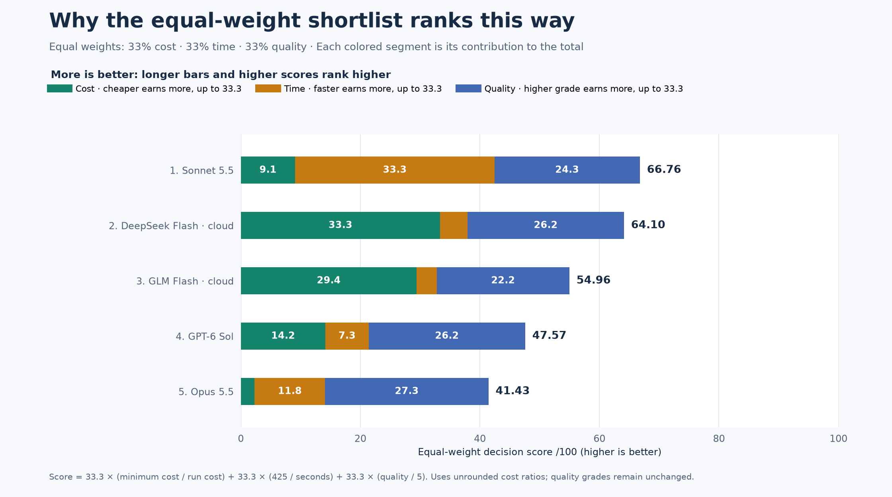

# Inventory website benchmark

Fifteen generated inventory applications, compared by recorded cost, elapsed time and independently reviewed artifact quality. Review date: **October 1, 2026**.

Different priorities produce different winners: **DeepSeek Flash cloud has the lowest eligible cost**, **Sonnet 5.5 has the shortest eligible run**, and **GPT-6 Astra has the highest weighted quality grade**, effectively tied with Fable. The original quality assessments are unchanged.

[Full cost/time comparison and ranking tables](COMPARISON.md) · [Quality grades and review evidence](QUALITY_COMPARISON.md) · [Methodology](#methodology) · [Why the GLM harness was created](#why-the-glm-harness-was-created)

## Cost and time — all 15 runs

Sorted by cost, highest first. Prices show **USD first**, with COP in parentheses. Cloud costs are reported or API-list costs, CPU costs are package energy only, and GPU costs are machine rental time, so the cost bases differ. Each folder links to that model's code and screenshots.

| Folder | Model | Where | Tasks passed | Time | Output tokens | Cost (USD / COP) |
|---|---|---|---|---|---|---|
| [`anthropic-cloud-fable-5.1-high`](anthropic-cloud-fable-5.1-high/) | Claude Fable 5.1 (high) | Anthropic cloud | 7/7 | 1 h 35 min | 380,670 | **$44.46** (COP 148,551) |
| [`openai-cloud-gpt-6-astra-high`](openai-cloud-gpt-6-astra-high/) | Codex GPT-6 Astra (high) | OpenAI cloud | 7/7 | 51 min 19 s | 59,148 | **$10.40** (COP 34,756) |
| [`anthropic-cloud-opus-5.5-medium`](anthropic-cloud-opus-5.5-medium/) | Claude Opus 5.5 (medium) | Anthropic cloud | 7/7 | 20 min 02 s | 118,640 | **$6.50** (COP 21,718) |
| [`xai-cloud-grok-4.7-fast-500k-medium`](xai-cloud-grok-4.7-fast-500k-medium/) | Grok 4.7 Fast, 500k context (medium) | xAI cloud | 7/7 | 38 min 40 s | 273,254 | **$6.31** (COP 21,083) |
| [`4x-rtxpro6000-glm-5.3-flash-q4kxl`](4x-rtxpro6000-glm-5.3-flash-q4kxl/) | GLM-5.3-Flash UD-Q4_K_XL, 1M context, own minimal harness, one conversation for all tasks | 4× RTX PRO 6000 Blackwell, GPU | 6/6 | 53 min 45 s | 130,757 | **$4.41** (COP 14,723; rental; 542.1 Wh GPU) |
| [`4x-rtxpro6000-deepseek-v4-flash-q8kxl`](4x-rtxpro6000-deepseek-v4-flash-q8kxl/) | DeepSeek-V4-Flash UD-Q8_K_XL, 1M context, via Claude Code | 4× RTX PRO 6000 Blackwell, GPU | 6/6 | 42 min 38 s | 32,736 | **$3.50** (COP 11,678; rental; 552.3 Wh GPU) |
| [`openai-cloud-gpt-5.6-sol-medium`](openai-cloud-gpt-5.6-sol-medium/) | Codex GPT-5.6 Sol (medium) | OpenAI cloud | 7/7 | 46 min 12 s | 53,528 | **$2.77** (COP 9,255) |
| [`anthropic-cloud-sonnet-5.5-medium`](anthropic-cloud-sonnet-5.5-medium/) | Claude Sonnet 5.5 (medium) | Anthropic cloud | 7/7 | 7 min 05 s | 56,470 | **$1.65** (COP 5,513) |
| [`openai-cloud-gpt-6-sol-medium`](openai-cloud-gpt-6-sol-medium/) | Codex GPT-6 Sol (medium) | OpenAI cloud | 7/7 | 32 min 34 s | 35,657 | **$1.06** (COP 3,542) |
| [`zai-cloud-glm-5.3-flash`](zai-cloud-glm-5.3-flash/) | GLM-5.3 Flash via Claude Code (claudeg) | z.ai cloud | 7/7 | 1 h 10 min | 187,466 | **$0.51** (COP 1,704) |
| [`deepseek-cloud-deepseek-flash`](deepseek-cloud-deepseek-flash/) | DeepSeek flash via Claude Code (clauded) | DeepSeek cloud | 7/7 | 51 min 20 s | 407,464 | **$0.45** (COP 1,504) |
| [`4x-rtxpro6000-qwen3.5-35b-a3b-q5kxl`](4x-rtxpro6000-qwen3.5-35b-a3b-q5kxl/) | Qwen3.5-35B-A3B UD-Q5_K_XL, 262k context, via Claude Code | 4× RTX PRO 6000 Blackwell, GPU | 5/6 | 2 min 30 s | 25,165 | **$0.20** (COP 685; rental; 25.7 Wh GPU) |
| [`ryzen7-8745hs-qwen38-27b-iq3`](ryzen7-8745hs-qwen38-27b-iq3/) | Qwen3.8-27B GSQ-RCO IQ3_S (+ MTP draft) | Ryzen 7 8745HS, CPU | 5/6 | 8 h 46 min | 38,604 | **$0.1031** (COP 344.6; 423.0 Wh) |
| [`ryzen7-8745hs-qwen36-35b`](ryzen7-8745hs-qwen36-35b/) | Qwen3.6-35B-A3B Q4_K_S | Ryzen 7 8745HS, CPU | 4/6 | 3 h 39 min | 83,433 | **$0.0383** (COP 128.0; 157.1 Wh) |
| [`ryzen7-8745hs-gemma4-26b`](ryzen7-8745hs-gemma4-26b/) | Gemma 4 26B-A4B QAT Q4_K_XL | Ryzen 7 8745HS, CPU | 6/6 | 1 h 30 min | 50,975 | **$0.0176** (COP 58.9; 72.3 Wh) |

[Cost notes, exchange rate and run differences](COMPARISON.md)

## Quality grades — all 15 applications

Every category is graded **1–5**: 1 = missing or largely broken, 3 = usable with material gaps, 5 = excellent for this scope. The weighted overall grade uses UX 25%, visual 15%, code 20%, business rules/spec 25%, robustness 10% and accessibility 5%. Application names link to the review evidence.

| Codebase | UX | Visual | Code | Business rules/spec | Robustness | Accessibility | Weighted overall /5 |
|---|---:|---:|---:|---:|---:|---:|---:|
| [GPT-6 Astra · cloud](quality-review/openai-cloud-gpt-6-astra-high.md) | 4 | 3.5 | 4.5 | 5 | 4.5 | 4.5 | 4.35 |
| [Fable 5.1 · cloud](quality-review/anthropic-cloud-fable-5.1-high.md) | 4.5 | 4 | 4.5 | 4.5 | 3.5 | 4.5 | 4.33 |
| [Opus 5.5 · cloud](quality-review/anthropic-cloud-opus-5.5-medium.md) | 4 | 3.5 | 4.5 | 4.5 | 3.5 | 4 | 4.10 |
| [GPT-5.6 Sol · cloud](quality-review/openai-cloud-gpt-5.6-sol-medium.md) | 3.5 | 4 | 4 | 4.5 | 3.5 | 4 | 3.95 |
| [DeepSeek Flash · cloud](quality-review/deepseek-cloud-deepseek-flash.md) | 3.5 | 3.5 | 4.5 | 4.5 | 3 | 4 | 3.93 |
| [GPT-6 Sol · cloud](quality-review/openai-cloud-gpt-6-sol-medium.md) | 3.5 | 4 | 4 | 4.5 | 3.5 | 3.5 | 3.93 |
| [Grok 4.7 Fast · cloud](quality-review/xai-cloud-grok-4.7-fast-500k-medium.md) | 3.5 | 3.5 | 4 | 4.5 | 3.5 | 3.5 | 3.85 |
| [Sonnet 5.5 · cloud](quality-review/anthropic-cloud-sonnet-5.5-medium.md) | 3.5 | 3.5 | 3.5 | 4.5 | 2.5 | 3.5 | 3.65 |
| [GLM 5.3 Flash · GPU](quality-review/4x-rtxpro6000-glm-5.3-flash-q4kxl.md) | 3.5 | 3 | 4 | 4.5 | 2.5 | 2.5 | 3.63 |
| [GLM 5.3 Flash · cloud](quality-review/zai-cloud-glm-5.3-flash.md) | 3 | 3 | 3.5 | 4 | 2.5 | 3.5 | 3.33 |
| [DeepSeek V4 Flash · GPU](quality-review/4x-rtxpro6000-deepseek-v4-flash-q8kxl.md) | 3 | 3 | 2.5 | 4.5 | 1.5 | 2.5 | 3.10 |
| [Qwen 3.8 27B · CPU](quality-review/ryzen7-8745hs-qwen38-27b-iq3.md) | 2.5 | 2.5 | 3 | 2.5 | 2 | 3 | 2.58 |
| [Qwen 3.5 35B · GPU](quality-review/4x-rtxpro6000-qwen3.5-35b-a3b-q5kxl.md) | 2.5 | 2 | 2.5 | 3 | 1 | 2 | 2.38 |
| [Gemma 4 26B · CPU](quality-review/ryzen7-8745hs-gemma4-26b.md) | 2.5 | 2.5 | 2 | 2.5 | 1 | 2.5 | 2.25 |
| [Qwen 3.6 35B · CPU](quality-review/ryzen7-8745hs-qwen36-35b.md) | 2 | 2.5 | 2 | 2.5 | 1.5 | 2.5 | 2.18 |

[Reviewer comments and evidence by codebase](QUALITY_COMPARISON.md)

## Top 5 by cost, time and quality

These are direct rankings by each metric, separate from the weighted shortlist below. All three use the same **11 eligible applications**, requiring a business rules/spec grade of at least **4/5**. The four applications with major required-workflow defects remain in the full comparison but are excluded from these shortlists. Eligibility does not mean an application is defect-free.

[Exact top-5 tables](COMPARISON.md#top-5-by-primary-driver) · [Vector image](assets/charts/top-five-by-priority.svg)

## Cost, time and quality together

Lower and farther left means a faster, cheaper run. Color represents the quality grade; circles are cloud runs and diamonds are rented-GPU runs. USD is the primary cost axis, with COP as a secondary reference. The cost axis is logarithmic, so equal horizontal distances represent cost multiples. Sonnet stands out for turnaround, while DeepSeek and cloud GLM are cheaper but take much longer.

[All recorded costs and times](COMPARISON.md) · [Vector image](assets/charts/cost-time-quality.svg)

## Cost vs Time vs Quality top 5

The working priority is **33% cost, 33% time and 33% quality**.

**More is better:** every run earns up to **33.3 points each for cost, time and quality**, so higher scores rank higher. Cheaper and faster runs earn more points, using the cheapest and fastest eligible runs as references; higher quality grades earn more quality points. The three factors carry **equal weight**. These weights are assumptions for a decision aid, not additional quality grades.

**Score /100 = 33.3 × (minimum eligible cost / run cost) + 33.3 × (425 / elapsed seconds) + 33.3 × (unrounded quality / 5).**

The minimum eligible cost is **$0.45** (COP 1,504). Calculations preserve the original COP ratios, equivalent to unrounded USD conversions.

Sonnet leads this formula, followed by DeepSeek cloud, cloud GLM, GPT-6 Sol and Opus. Sonnet earns the maximum time contribution; DeepSeek earns the maximum cost contribution. With equal weights, Sonnet's speed outweighs DeepSeek's lower cost, while quality differences between the leaders are small.

[Equal-weight ranking and tradeoffs](COMPARISON.md#cost-vs-time-vs-quality--equal-weight-top-5) · [Vector image](assets/charts/weighted-value.svg)

## Methodology

The benchmark measures how a coding agent builds a working application across successive tasks. Every model received the same [project specification](benchmark/tasks/00-project.md): an inventory website using HTML5 and vanilla JavaScript, with no frameworks or runtime libraries, all application data in `localStorage`, and direct operation by opening `index.html` in a browser.

### Tasks and execution

The [fixed task prompts](benchmark/tasks/) build on the files produced by earlier tasks:

| Task | Requested deliverable |
|---|---|
| T1 | Initialize Git, scaffold the project and write a README. |
| T2 | Add products, stock, persistent storage and first-run sample data. |
| T3 | Let users view, add, edit and delete products. |
| T4 | Add quick inventory lookup. |
| T5 | Add a persistent cart with quantity changes, removal and totals. |
| T6 | Complete purchases, update stock, retain order history and update the README. |
| T7 | Test the site thoroughly in a real browser, fix bugs and commit. |

For the standard protocol, each task starts a new agent process with the project specification plus that task's prompt; project files carry state between sessions. The [operator instructions](benchmark/RUN-BENCHMARK.md) call for fixed prompts, no implementation hints or manual code fixes, and no rerunning tasks simply to obtain a better result. Each task requests a commit. The [runner](benchmark/run-benchmark.sh) records start/end times, exit codes, output and a project snapshot for each task.

Cloud deliverables include T7; the CPU and rented-GPU deliverables stop at T6. The cloud runs therefore had an additional opportunity to find and fix browser defects. Each result folder's `RESULTS.md` records the model, environment, task outcomes and available measurements. A task verified only through the final application is distinguished there from a task checked at its own snapshot.

### Measurements and verification

Elapsed time is task wall-clock time, including the agent's tool work, rather than inference speed alone. Output-token figures come from the agent or serving system. Cloud costs use reported costs or token usage priced at the recorded API rates; CPU costs estimate package energy, a lower bound on total electricity use; GPU costs use machine rental time, with GPU energy shown separately. Prices display **USD first**, with COP secondary at the recorded rate of **$1 USD** = COP 3,341.23. These are different cost bases; calculation details remain in [COMPARISON.md](COMPARISON.md).

Browser verification checks direct-file loading, page errors, seeded stock, product management, search, cart operations and reload persistence. Checkout checks stock deduction, cart clearing and an order that survives reload. Historical pass labels are retained as run records; they are assessed separately from the later quality audit.

### How quality was judged

After generation, each application received a fresh review subagent, strictly one at a time. Reviewers read the implementation and specification, opened the actual `file://` site in an isolated Chrome context, exercised user workflows, and captured and viewed desktop **1440×1000** and mobile **390×844** screenshots. They ran supplied tests where feasible and recorded skips or missing dependencies. Targeted probes examined validation, focus, rendering and storage failures; simulated failure cases are identified separately from normal user actions.

The quality grade combines **UX 25%, visuals 15%, code quality 20%, business rules/spec adherence 25%, robustness 10% and accessibility 5%**, each graded from 1 to 5. Test counts are reported separately. The [review protocol](quality-review/REVIEW_PROTOCOL.md) and [individual evidence reports](quality-review/) document findings and limits. These quality weights are separate from the **equal-weight (33% cost / 33% time / 33% quality)** decision score used above.

### Differences between runs

The results compare delivered artifacts and complete model/agent configurations. They are recorded runs rather than repeated-trial averages. The initial setup used a 30k-token context, while rented-GPU runs used larger model contexts: approximately 1M for DeepSeek and GLM, and 262k for Qwen. CPU checkpointing and compaction also changed across runs, as documented in the comparison notes.

The clean-environment rule was not uniform in practice: [Fable](anthropic-cloud-fable-5.1-high/RESULTS.md) and [Astra](openai-cloud-gpt-6-astra-high/RESULTS.md) used the operator's normal agent configurations, and Astra had its browser MCP tools available. Fable also restarted after a provider overload before any model output. GPU GLM used the custom harness described below. These differences affect comparisons of model capability independently of the surrounding tools and environment.

## Why the GLM harness was created

The GPU-hosted GLM model repeatedly conflicted with Claude Code during the initial attempts. After several such conflicts, a lightweight harness was created to give this model a simpler way to work through the benchmark. The [GPU GLM run notes](4x-rtxpro6000-glm-5.3-flash-q4kxl/RESULTS.md) record a concrete symptom: the Claude Code attempt was stopped during T2 after **two 32,000-token responses spent planning**. That attempt was discarded from the published completed-run result.

The replacement [GLM harness](glm-harness/glm-harness.py) is a small Python agent loop that talks directly to the model's local API. It uses a short system prompt and four explicit tools: `bash`, `read_file`, `write_file` and `edit_file`. The six product task prompts stayed unchanged. All six tasks were appended to **one continuing conversation**, with a 1M-token context and an output allowance of up to **65,536 tokens per response**.

With that configuration, the recorded run completed **T1–T6 in 53 min 45 s**, at **$4.41** (COP 14,723) in GPU rental cost. Its run report records **6/6 tasks passed** and 17 final-site browser checks with no page errors. The later [independent artifact review](quality-review/4x-rtxpro6000-glm-5.3-flash-q4kxl.md) graded it **3.63/5**, including remaining mobile and storage-failure weaknesses. The time and cost describe the completed harness run; they do not include the discarded Claude Code attempt.

**The practical lesson is that the harness matters alongside the model.** A general-purpose coding agent's prompts, tool interface and conversation strategy may fit some models better than others. Here, adapting the harness helped a model that had stalled complete the workflow. Depending on the model, a smaller custom harness can be the better practical choice.

This run changed the harness, conversation handling and response allowance together, so it cannot isolate which change produced the improvement. It is explicitly reported as a distinct model-and-harness configuration. A controlled comparison would hold those other settings constant and repeat both configurations. The [harness review](quality-review/glm-harness.md) also documents the lightweight runner's implementation and reproducibility limitations.
