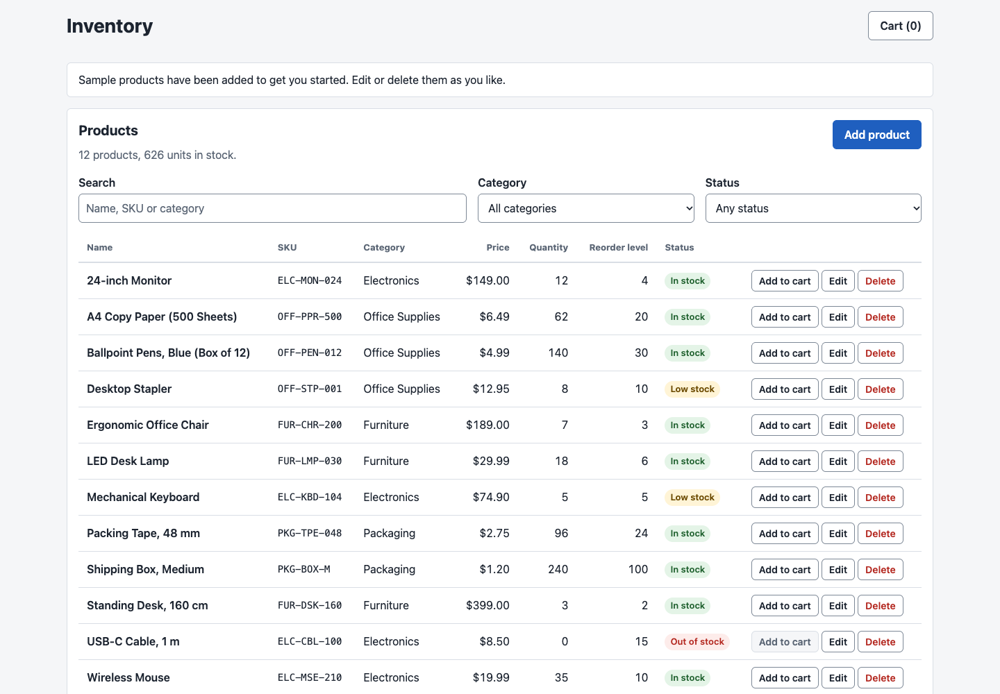
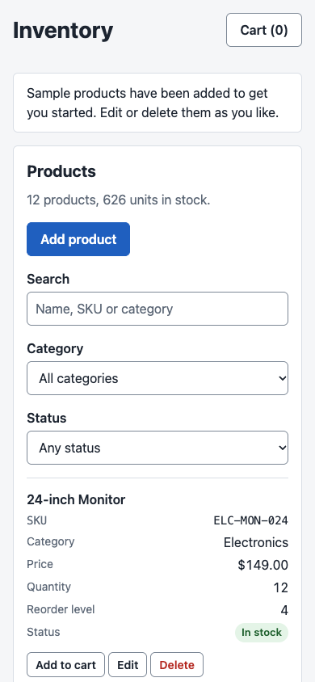
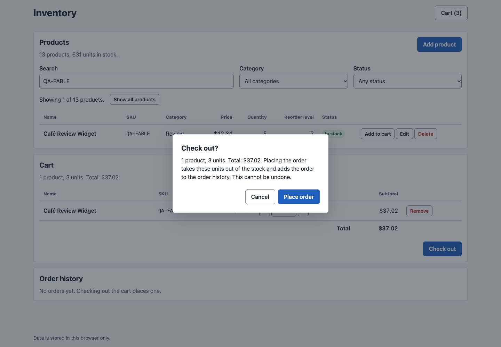
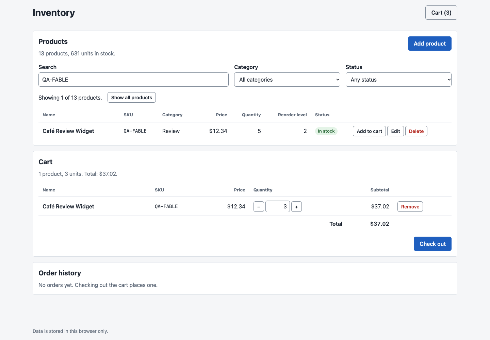
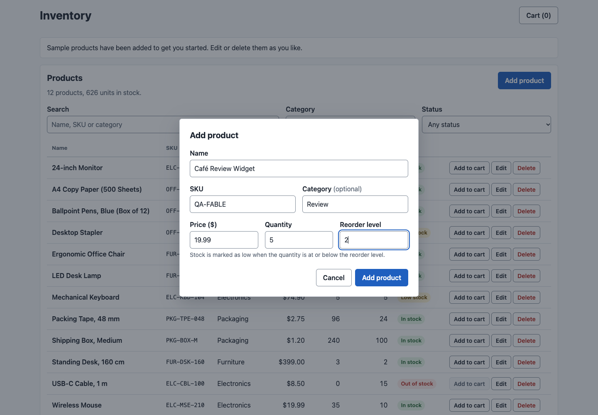
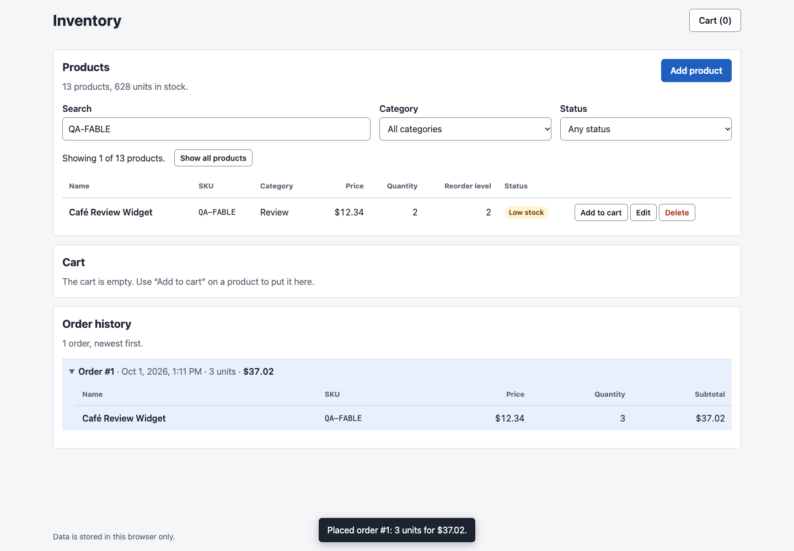
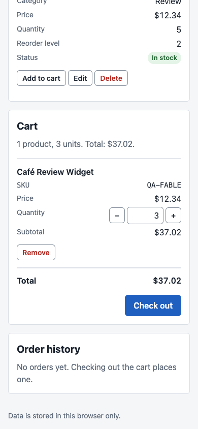
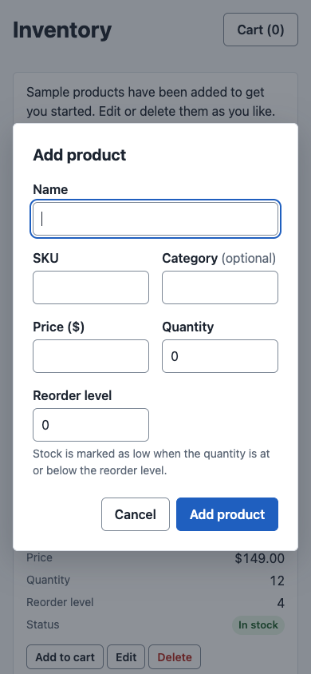
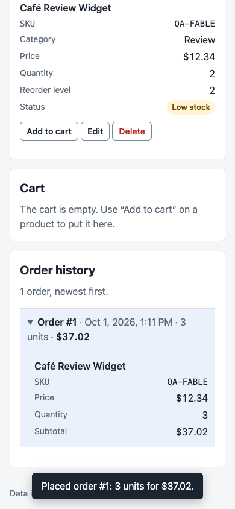

# Inventory

A small inventory website built with HTML5, CSS and vanilla JavaScript. There
are no frameworks, libraries or build steps, and all data is kept in the
browser's `localStorage`.

## Screenshots

Click any screenshot to open the [live app](https://axionomicai.github.io/AxBenchmark/anthropic-cloud-fable-5.1-high/).

<a href="https://axionomicai.github.io/AxBenchmark/anthropic-cloud-fable-5.1-high/"></a>

<a href="https://axionomicai.github.io/AxBenchmark/anthropic-cloud-fable-5.1-high/"></a>
<a href="https://axionomicai.github.io/AxBenchmark/anthropic-cloud-fable-5.1-high/"></a>
<a href="https://axionomicai.github.io/AxBenchmark/anthropic-cloud-fable-5.1-high/"></a>
<a href="https://axionomicai.github.io/AxBenchmark/anthropic-cloud-fable-5.1-high/"></a>
<a href="https://axionomicai.github.io/AxBenchmark/anthropic-cloud-fable-5.1-high/"></a>
<a href="https://axionomicai.github.io/AxBenchmark/anthropic-cloud-fable-5.1-high/"></a>
<a href="https://axionomicai.github.io/AxBenchmark/anthropic-cloud-fable-5.1-high/"></a>
<a href="https://axionomicai.github.io/AxBenchmark/anthropic-cloud-fable-5.1-high/"></a>

## Running

Open `index.html` in a browser. No server or install step is needed.

## Project structure

```
index.html                Page markup, including the dialogs; loads the stylesheet and scripts
css/styles.css            All styles
js/storage.js             Persistence layer (the only code that touches localStorage)
js/sample-data.js         Sample products created on first run
js/inventory.js           Data layer: the product model and every operation on it
js/cart.js                Cart: the products the user has picked, and every operation on it
js/orders.js              Checkout, and the history of the orders it has placed
js/search.js              Lookup: picks the products that match a search and filters
js/format.js              Converts numbers, prices and dates to text, and text to numbers and prices
js/app.js                 UI logic: the product table, the lookup controls, the add/edit form, the delete dialog, the cart, checkout and the order history
tests/harness.js          Minimal test runner and fake browser shared by the test files
tests/inventory.test.js   Tests for the data layer
tests/cart.test.js        Tests for js/cart.js
tests/orders.test.js      Tests for js/orders.js
tests/search.test.js      Tests for js/search.js
tests/format.test.js      Tests for js/format.js
```

## Data model

A product is a plain object:

| Field          | Type    | Notes                                                    |
| -------------- | ------- | -------------------------------------------------------- |
| `id`           | string  | Assigned on creation; never changes                      |
| `name`         | string  | Required, up to 100 characters                           |
| `sku`          | string  | Required, up to 40 characters, unique ignoring case      |
| `category`     | string  | Optional (`''` if none), up to 50 characters             |
| `quantity`     | integer | Units in stock, 0 to 1,000,000,000; defaults to 0        |
| `priceCents`   | integer | Unit price in cents, 0 to 1,000,000,000; defaults to 0   |
| `reorderLevel` | integer | Stock is low at or below this; 0 to 1,000,000,000; defaults to 0 |
| `createdAt`    | string  | ISO 8601 timestamp                                       |
| `updatedAt`    | string  | ISO 8601 timestamp of the last change                    |

Prices are whole cents so that totals are exact; convert to and from a decimal
amount only when displaying or reading a form. Numeric fields must be real
numbers, not numeric strings, so forms have to convert their values first.
Text fields are trimmed.

## Data layer API

The UI works with products only through the `Inventory` global defined in
`js/inventory.js`.

| Function                             | Description                                                  |
| ------------------------------------ | ------------------------------------------------------------ |
| `Inventory.init()`                   | Loads the inventory, creating the sample products on first run. Returns `{ persistent, seeded, recovered }` (see below) |
| `Inventory.getProducts()`            | Returns all products, in the order they were added           |
| `Inventory.getProduct(id)`           | Returns one product, or `null`                               |
| `Inventory.addProduct(fields)`       | Adds a product. `name` and `sku` are required                |
| `Inventory.updateProduct(id, changes)` | Changes the given fields and leaves the rest               |
| `Inventory.adjustStock(id, delta)`   | Adds `delta` units to the stock (negative to remove); refuses to go below zero |
| `Inventory.removeStock(items)`       | Takes units of several products out of the stock in one change; `items` is `[{ id, quantity }]`. All of it is taken, or nothing if any of it cannot be |
| `Inventory.removeProduct(id)`        | Deletes a product                                            |
| `Inventory.isLowStock(product)`      | `true` if `quantity <= reorderLevel`                         |
| `Inventory.stockStatus(product)`     | `'out'` if `quantity` is 0, otherwise `'low'` if `isLowStock`, otherwise `'ok'` |
| `Inventory.subscribe(listener)`      | Calls `listener()` after every change, including changes made in another tab. Returns a function that unsubscribes |
| `Inventory.MAX_INTEGER`              | The most that `quantity`, `priceCents` and `reorderLevel` can be |

The five functions that change data return a result instead of throwing:

- `{ ok: true, product }` on success, where `product` is the product that was
  added, changed or removed. `removeStock` returns `{ ok: true, products }`
  instead, with the products it took from.
- `{ ok: false, errors }` on failure, where `errors` maps a field name to a
  message, for example `{ sku: 'Another product already uses this SKU.' }`.
  Two keys are not editable fields: `errors.id` means the product does not
  exist, and `errors.storage` means the browser refused to save the change.
  Nothing is changed when a result is not `ok`.

Products returned by the API are copies. Changing one has no effect until it
is passed back through `updateProduct`.

`Inventory.init()` reports:

- `persistent` is `false` when `localStorage` is unavailable. The inventory
  then works in memory and is lost when the page is closed.
- `seeded` is `true` when the sample products were just created.
- `recovered` is `true` when stored data was damaged (see below).

## Data storage

Products are stored as a JSON array under the `localStorage` key
`inventory.products`, the cart under `inventory.cart` (see [Cart](#cart)) and
the order history under `inventory.orders` (see
[Checkout and order history](#checkout-and-order-history)). Only
`js/storage.js` (the `InventoryStore` global) reads or writes `localStorage`,
and only `js/inventory.js`, `js/cart.js` and `js/orders.js` use
`InventoryStore`.

- **First run.** When the key does not exist, the products in
  `js/sample-data.js` are stored. An inventory the user has emptied is stored
  as `[]` and stays empty.
- **Several tabs.** Every operation reads `localStorage` first, so a tab never
  overwrites changes made in another one, and subscribers are notified through
  the browser's `storage` event.
- **Damaged data.** If the stored value is not a JSON array, or contains
  records that are not valid products, the raw value is copied to
  `inventory.products.backup` before the valid products (if any) are saved
  back.
- **New fields.** A stored record that lacks an optional field gets that
  field's default, so adding an optional field with a default to
  `js/inventory.js` needs no migration.

Data lives only in the browser it was entered in. Clearing site data removes
it, the order history included, and the sample products come back on the next
visit.

## Cart

The cart holds the products the user has picked and how many of each. The UI
works with it only through the `Cart` global defined in `js/cart.js`.

| Function                              | Description                                                |
| ------------------------------------- | ---------------------------------------------------------- |
| `Cart.getCart()`                      | Returns `{ lines, units, totalCents }` (see below)         |
| `Cart.quantityOf(productId)`          | Returns how many of a product are in the cart; 0 if none   |
| `Cart.add(productId, quantity)`       | Puts `quantity` more units in the cart (1 if left out), adding to the product's line if it has one |
| `Cart.setQuantity(productId, quantity)` | Changes how many of a product are in the cart; 1 or more |
| `Cart.remove(productId)`              | Takes a product out of the cart                            |
| `Cart.clear()`                        | Takes every product out of the cart. Returns `{ ok: true }` or `{ ok: false, errors }` with `errors.storage` |
| `Cart.subscribe(listener)`            | Calls `listener()` after every change to the cart, including changes made in another tab. Returns a function that unsubscribes |

`getCart().lines` has one `{ product, quantity, subtotalCents }` per product,
in the order the products were added. `product` is the product as
`Inventory.getProduct` returns it, `quantity` is how many are in the cart
(`product.quantity` is how many are in stock) and `subtotalCents` is
`product.priceCents * quantity`. `units` and `totalCents` are the quantities
and the subtotals added up.

`add`, `setQuantity` and `remove` return `{ ok: true, line }` or
`{ ok: false, errors }`, like the data layer. The keys of `errors` are
`quantity` (not a whole number of 1 or more, or more than is in stock), `id`
(`add`: the product does not exist; the others: it is not in the cart) and
`storage`.

- **Only what is stored is the choice.** The cart is stored under
  `inventory.cart` as `[{ productId, quantity }]`. Names, prices and stock are
  read from the inventory every time, so the cart always shows the current
  ones. A change to a product does not call the cart's subscribers: subscribe
  to `Inventory` as well to follow those.
- **Stock is the limit, and is not changed.** `add` and `setQuantity` refuse
  to put more in the cart than is in stock. Putting a product in the cart does
  not reserve it: the stock stays as it is until checkout.
- **Stock that goes down later.** When a product's stock is lowered below what
  the cart holds, the line is kept as it is and still counts in the total; it
  is up to the UI to say so (compare `quantity` with `product.quantity`), and
  the cart cannot be checked out until the line is lowered or removed.
  `setQuantity` always accepts a lower quantity, and refuses a higher one that
  is above the stock.
- **Deleted products.** A line whose product no longer exists is left out of
  everything the API returns, and is dropped from storage the next time the
  cart is saved.
- **Damaged data.** Stored lines that are not valid are ignored, and a stored
  value that cannot be read is an empty cart. No backup is kept.
- **Several tabs and no storage** work as in the data layer: every operation
  reads `localStorage` first, and without `localStorage` the cart is kept in
  memory until the page is closed.
- **Large totals.** Totals are plain numbers of cents. They are exact up to
  `Number.MAX_SAFE_INTEGER` cents (about 90 trillion dollars), which a cart of
  the largest quantities at the largest prices can exceed.

## Checkout and order history

Checkout buys everything in the cart: it records an order, takes the units out
of the stock and empties the cart. The UI works with it only through the
`Orders` global defined in `js/orders.js`.

| Function                    | Description                                                        |
| --------------------------- | ------------------------------------------------------------------ |
| `Orders.init()`             | Loads the order history. Returns `{ recovered }`, `true` when stored orders were damaged (see below) |
| `Orders.getOrders()`        | Returns the orders, in the order they were placed                  |
| `Orders.checkCart(cart)`    | Says whether a cart from `Cart.getCart()` can be checked out: returns `null`, or what stops it as `errors` (see below) |
| `Orders.checkout()`         | Checks out the cart. Returns `{ ok: true, order, cartCleared }` or `{ ok: false, errors }` |
| `Orders.subscribe(listener)` | Calls `listener()` after every order placed, including in another tab. Returns a function that unsubscribes |

An order is `{ number, placedAt, lines, units, totalCents }`. `number` is 1
for the first order and one more than the highest so far for each later one,
`placedAt` is an ISO 8601 timestamp, and `lines` has one
`{ productId, name, sku, priceCents, quantity, subtotalCents }` per product.
Orders cannot be changed or deleted.

`errors` has one key: `cart` (the cart is empty), `stock` (a product has less
in stock than the cart holds), `total` (see below) or, from `checkout` only,
`storage`.

- **An order is a snapshot.** Unlike the cart, an order stores the name, SKU
  and price of its products as they were at checkout, so it does not follow
  later changes to the inventory and outlives products that are deleted.
  `productId` is only a reference: the product may no longer exist. Subtotals
  and totals are not stored; they are worked out from the lines.
- **The price is the one at checkout,** not the one when the product was put
  in the cart, since the cart always shows the current prices.
- **All or nothing.** A checkout that is not `ok` changes nothing. The order
  is saved first, because the history is what grows and so is the save that
  fails when storage is full; then the stock is changed with one
  `Inventory.removeStock`, and the order is taken back if that fails.
- **`cartCleared`** is `false` if the cart could not be emptied after the
  order was placed. The order stands, so the UI has to say that checking out
  again would buy the same things twice. This needs storage to fail between
  two writes and should not happen in practice.
- **Notifications.** A checkout calls the subscribers of `Inventory`, then
  those of `Cart`, then those of `Orders`, once each. Only the last see the
  checkout complete.
- **Damaged data** is handled as for products: orders that are not valid are
  dropped, after the raw value has been copied to `inventory.orders.backup`,
  and the page shows the same warning. An order with a line that is not valid
  is dropped whole.
- **Several tabs and no storage** work as in the data layer.
- **Large totals.** A cart whose total is above `Number.MAX_SAFE_INTEGER`
  cents cannot be checked out (`errors.total`), so the totals of orders are
  always exact.
- **The history only grows.** Nothing removes old orders, so a history of
  many thousands of orders can fill the browser's storage (about 5 MB);
  checkout then fails with `errors.storage`.

## Lookup

`js/search.js` (the `InventorySearch` global) decides which products match
what the user is looking for. It works on a list from `Inventory.getProducts()`
and never changes or stores anything.

| Function                                 | Description                                           |
| ---------------------------------------- | ----------------------------------------------------- |
| `InventorySearch.filter(products, criteria)` | Returns the products that match, in the order given |
| `InventorySearch.categories(products)`   | Returns the categories in use, in alphabetical order. Categories that differ only in case are one category |

`criteria` is `{ text, category, status }`. A product has to match every part;
a part that is left out or `null` matches every product.

- `text` is split into words at white space, and every word has to be
  somewhere in the product's name, SKU or category. Case and accents are
  ignored (`cafe` finds "Café"), and so is punctuation that was left out
  (`elcmse210` finds "ELC-MSE-210", `usbc` finds "USB-C"). Words match parts
  of words; there are no wildcards or patterns.
- `category` is a category name, compared ignoring case, or `''` for products
  without a category.
- `status` is a value of `Inventory.stockStatus`.

Prices and quantities are not searched. To make another field searchable, add
it to `hasWords` in `js/search.js`.

## User interface

The page lists the products in a table, sorted by name, with a status of
"In stock", "Low stock" or "Out of stock" (`Inventory.stockStatus`), and
below it the cart and the order history. On screens narrower than 70rem, which
is about what the product table's columns need, the tables are laid out as one
card per product, with the cards side by side where there is room. All tables
use the `data-table` class.

- **Lookup.** Above the table are a search box and filters for category and
  status. The table shows the matching products as the user types, with a
  count ("Showing 3 of 12 products.") that is announced to screen readers.
  **Show all products** (or Escape in the search box, for the text) clears
  the lookup. The lookup is kept in `js/app.js` only: it is not stored, so a
  reload shows every product again. The category filter offers the categories
  in use plus "No category"; if the chosen category stops existing, the
  filter goes back to "All categories". A product that is added or edited so
  that it does not match the lookup is saved but not listed, and the
  confirmation message says so.

- **Add product** opens the product form in a `<dialog>`. **Edit** on a row
  opens the same form filled in with that product. **Delete** on a row asks
  for confirmation in a second `<dialog>`, which says so when the product is
  also in the cart.
- `js/app.js` re-renders the table from `Inventory.getProducts()` after every
  change (it subscribes to the data layer), so the table also follows changes
  made in another tab.
- **Cart.** **Add to cart** on a product row puts one unit in the cart. The
  cart section lists the lines with their price and subtotal, and the total
  below them. A line's quantity is changed with its − and + buttons or by
  typing a number, which is used when the user presses Enter or leaves the
  input; **Remove** takes the line out without asking. A change that
  `Cart` refuses (more than is in stock, not a number) shows its reason in
  the status message and the quantity goes back to what the cart holds; if
  it was refused by a press on **Check out** (which takes the focus from the
  input), that press does nothing more, so that the user is not asked to
  confirm a cart that is not the one they typed. A quantity that is being
  typed is left alone when the cart is rendered again, unless the quantity
  itself has changed in another tab. A
  line that holds more than is in stock says "Only 3 in stock" or "Out of
  stock". The **Cart (3)** link in the page header shows the number of units
  and jumps to the cart. The summary under the "Cart" heading is announced to
  screen readers when it changes.
- **Checkout.** **Check out** under the cart asks for confirmation in a
  `<dialog>` that repeats the cart's summary, and **Place order** there calls
  `Orders.checkout`. A checkout that is refused shows its reason in the
  dialog. Afterwards the status message says which order was placed, and the
  focus moves to the new order in the history, which is opened.
- **Order history.** The orders are listed newest first, each as a line with
  its number, date, units and total that opens (`<details>`) to show the
  products bought. Dates are shown in the browser's time zone. Like the cart's
  rows, the items of the list are kept when the list is rendered again, so
  that an order stays open or closed and keeps the focus.
- **Buttons that cannot do anything** (**Add to cart** on a product that is
  out of stock, − at a quantity of 1, + at the stock limit, **Check out** when
  a line holds more than is in stock) are greyed with `aria-disabled`, not
  `disabled`: they can still be focused and pressed, and pressing one says why
  nothing happened.
- **Cart rows are kept, not rebuilt.** `renderCart` in `js/app.js` runs after
  every change to the cart or the inventory, and fills in the existing row of
  each line. Typing a quantity and then clicking a button changes the cart
  before the click is over, and the click would be lost on a button that had
  been replaced. For the same reason a change to the cart re-renders the cart
  only, never the product table, so nothing in a product row may depend on
  what is in the cart.
- **Text conversion.** `js/format.js` (the `InventoryFormat` global) is the
  only place that turns prices, numbers and dates into text or back. Prices
  are shown in US dollars with `en-US` formatting (`$1,299.99`); this is
  fixed, not taken from the browser's locale, so that anything displayed can
  be typed back into the form. `formatPrice` writes the dollars and the cents
  apart, because dividing the cents by 100 is a cent off for the largest
  totals. To change the currency, change `js/format.js` and the "Price ($)"
  label in `index.html`.
- **Validation.** The form checks that required inputs are filled in and that
  numbers can be read and are not above `Inventory.MAX_INTEGER`. Everything
  else (text lengths, unique SKU) is left to the data layer, whose `errors`
  are shown under the matching inputs. `errors.id` and `errors.storage` are
  shown at the top of the dialog. An input's error goes away when the input
  is changed.
- **Editing saves only the fields that were changed** in the form, so a change
  made to another field in another tab while the form was open is kept.
- **Product text is untrusted.** It is put on the page with `textContent`,
  never as HTML, and product ids are never put into selectors.
- **Focus.** Rendering replaces the table rows, so `js/app.js` puts the focus
  back itself when a dialog closes: on the row button that opened it, on the
  neighbouring row after a delete, or on **Add product**. After **Remove** in
  the cart the focus goes to the next line's **Remove**, or to the "Cart"
  heading when the cart is empty.
- A message confirming each change appears at the bottom of the page for a few
  seconds and is announced to screen readers (`#status-message`). It lies over
  whatever is at the bottom of the screen, so it has `pointer-events: none`:
  presses go through it to the buttons underneath. A quantity that the cart
  accepts clears the message, which may be about one that it refused.
- **Long text.** Names and categories wrap, inside a word if they have to, and
  a table that is still too wide scrolls sideways inside its `.table-scroll`,
  never the page. `.table-scroll` is positioned so that it also contains the
  visually hidden "Actions" heading.

## Testing

```
node tests/inventory.test.js
node tests/cart.test.js
node tests/orders.test.js
node tests/search.test.js
node tests/format.test.js
```

The tests need Node.js but no packages. They load the real scripts into a fake
browser global with an in-memory `localStorage` (`openPage` and `makeStorage`
in `tests/harness.js`). The site itself does not use Node.

`js/app.js` needs a real DOM and has no automated tests. After changing it,
open `index.html` and check by hand: adding a product (including invalid
input and a duplicate SKU), editing one, deleting one, that changes are still
there after a reload, searching and filtering (including a search that finds
nothing, and adding, editing and deleting while a search is on), the cart
(adding a product, the − and + buttons, typing a quantity and then clicking a
button straight away, a quantity above the stock, removing a line, lowering a
product's stock below what the cart holds, deleting a product that is in the
cart, a quantity above the stock typed and then **Check out** clicked straight
away, and that the cart is still there after a reload), checkout (cancelling
and confirming, that the stock goes down and the cart is emptied, that the
order appears in the history and is still there after a reload, that **Check
out** says why it does nothing when a line holds more than is in stock, and
that a second tab follows a checkout), the layout in a narrow window, and a
product with the longest name, SKU, category and numbers the form accepts
(nothing may make the page scroll sideways, at any width).

## Development conventions

- **The site must work from `file://`.** Use classic `<script>` tags, not ES
  modules (`type="module"` is blocked by browsers on `file://`), and do not
  `fetch` local files.
- **No dependencies.** No frameworks, libraries, CDNs or build tooling.
- Each script wraps its code in an IIFE and exposes at most one global. Scripts
  are loaded in dependency order at the end of `index.html`.
- Only `js/storage.js` reads or writes `localStorage`.
- Validation rules live in `js/inventory.js`. The UI may check input earlier
  for convenience, but must still handle a result that is not `ok`.
- Only `js/format.js` converts prices, numbers and dates to or from text.

## Status

The inventory can be viewed, searched and filtered, and products can be
added, edited and deleted. The table is always sorted by name; the user cannot
choose another order. `Inventory.adjustStock` is not used by the UI: stock is
changed by editing a product's quantity.

Products can be put in a cart, which shows the total and is kept between
visits. Checking out takes what is in the cart out of the stock and adds an
order to the order history, which is kept between visits too. There is no
payment or customer: an order records only what was bought, when, and at what
price. Orders cannot be cancelled, returned or deleted, and the history cannot
be searched or exported.
