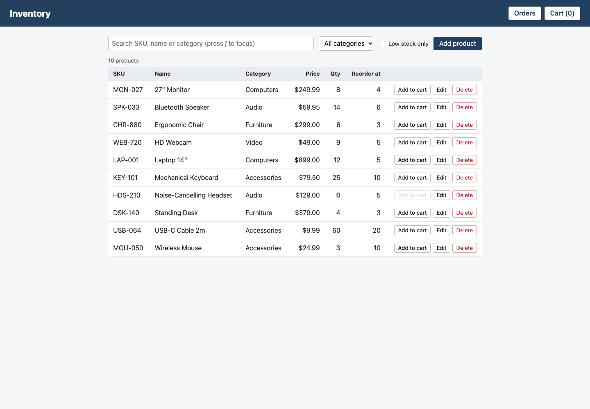
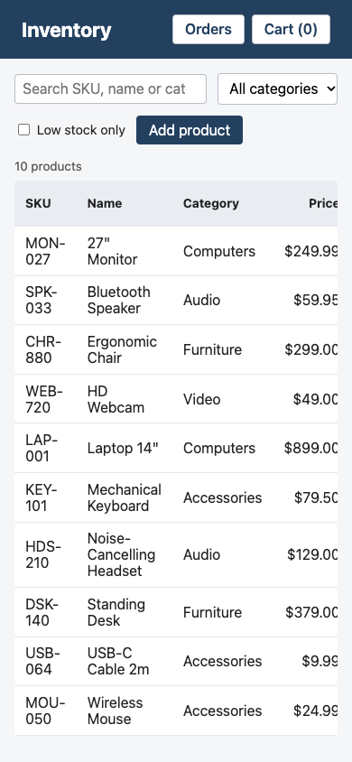
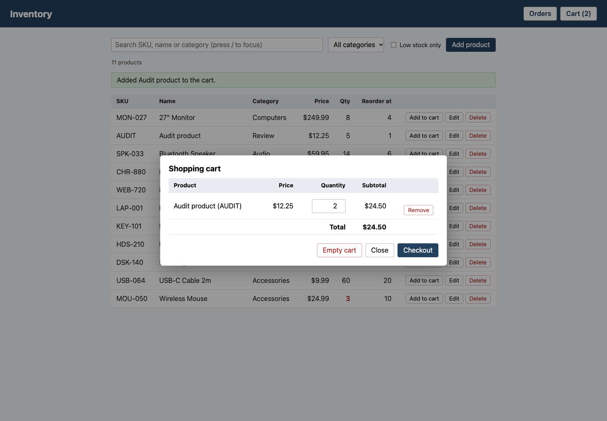
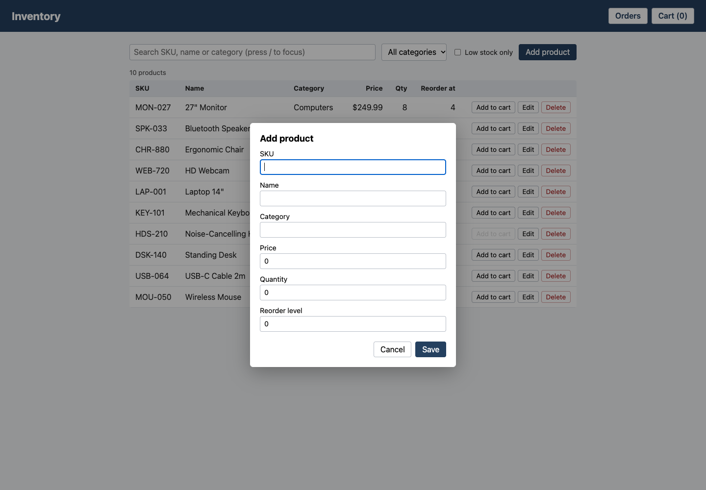
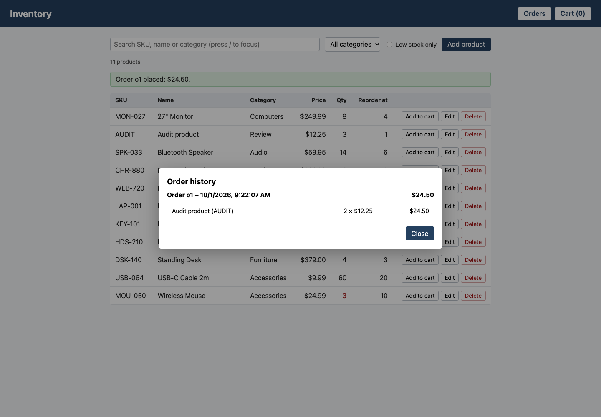
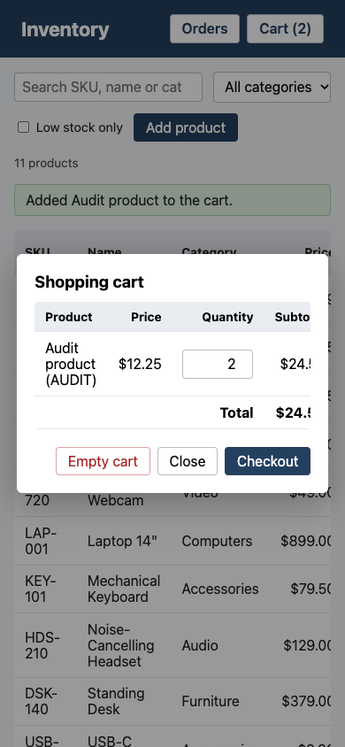

# Inventory website

A simple inventory manager built with HTML5 and vanilla JavaScript (no
frameworks or libraries). All data is persisted in the browser's
`localStorage`.

## Screenshots

Click any screenshot to open the [live app](https://axionomicai.github.io/AxBenchmark/anthropic-cloud-sonnet-5.5-medium/).

<a href="https://axionomicai.github.io/AxBenchmark/anthropic-cloud-sonnet-5.5-medium/"></a>

<a href="https://axionomicai.github.io/AxBenchmark/anthropic-cloud-sonnet-5.5-medium/"></a>
<a href="https://axionomicai.github.io/AxBenchmark/anthropic-cloud-sonnet-5.5-medium/"></a>
<a href="https://axionomicai.github.io/AxBenchmark/anthropic-cloud-sonnet-5.5-medium/"></a>
<a href="https://axionomicai.github.io/AxBenchmark/anthropic-cloud-sonnet-5.5-medium/"></a>
<a href="https://axionomicai.github.io/AxBenchmark/anthropic-cloud-sonnet-5.5-medium/"></a>

## Run

Open `index.html` in a browser. No build step or server is needed.

## Structure

```
index.html      Page markup
css/styles.css  Styles
js/storage.js   localStorage persistence layer (inventory)
js/cart.js      Shopping cart (localStorage)
js/orders.js    Checkout and order history (localStorage)
js/app.js       Application entry point
```

## Data layer

`js/storage.js` exposes a global `Storage` object. Products are stored as JSON
under the `inventory.items` localStorage key; on first run (key absent) 10
sample products are seeded.

Product: `{ id, sku, name, category, price, quantity, reorderLevel, createdAt, updatedAt }`

- `Storage.getAll()`, `Storage.get(id)`
- `Storage.add(fields)`, `Storage.update(id, fields)`, `Storage.remove(id)`
- `Storage.adjustStock(id, delta)` (stock cannot go below 0)
- `Storage.reset()` restores the sample data

Validation errors (missing SKU/name, negative numbers, duplicate SKU) are thrown
as `Error`s with a readable message.

## Lookup

The search box matches SKU, name and category. Multiple words are ANDed
(`usb black` finds products containing both), matches are highlighted, and
results are ranked: exact SKU, SKU prefix, name prefix, then the rest. A
category dropdown and a "Low stock only" checkbox narrow results further, and a
count shows how many products match. Press `/` anywhere to focus the search box;
`Esc` in the box clears it.

## Shopping cart

Each product row has an "Add to cart" button (disabled when out of stock or when
the whole stock is already in the cart). The "Cart (n)" button in the header
opens the cart: change quantities, remove lines, empty the cart and see
subtotals and the total. Quantities cannot exceed the stock on hand.

`js/cart.js` exposes a global `Cart`, persisted under the `inventory.cart` key as
`[{ id, quantity }]` (prices and names are read live from the inventory, and
lines for deleted or sold-out products are dropped automatically).
`Cart.add(id, qty)`, `Cart.setQuantity(id, qty)`, `Cart.remove(id)`, `Cart.clear()`,
`Cart.items()`, `Cart.count()`, `Cart.total()`. Errors are thrown as `Error`s.
The cart itself does not reduce stock; that happens at checkout.

## Checkout and order history

The cart's "Checkout" button completes the purchase: each line's quantity is
deducted from the product's stock, an order is recorded and the cart is emptied.
It is all-or-nothing: if any line exceeds the stock on hand, an error is shown
and nothing changes. The "Orders" button in the header lists past orders, newest
first, with their lines and total.

`js/orders.js` exposes a global `Orders`, persisted under the `inventory.orders`
key as `[{ id, createdAt, total, lines: [{ productId, sku, name, price, quantity, subtotal }] }]`.
Lines are snapshots of SKU, name and price at purchase time, so history is
unaffected by later edits or deletion of a product.
`Orders.checkout()` (returns the order; throws an `Error` if the cart is empty or
stock is short), `Orders.all()`, `Orders.get(id)`, `Orders.clearHistory()`.

## Status

Inventory management UI done: view products in a table, lookup (see above), add, edit
(dialog form) and delete (with confirmation). Products at or below their
reorder level are highlighted.
