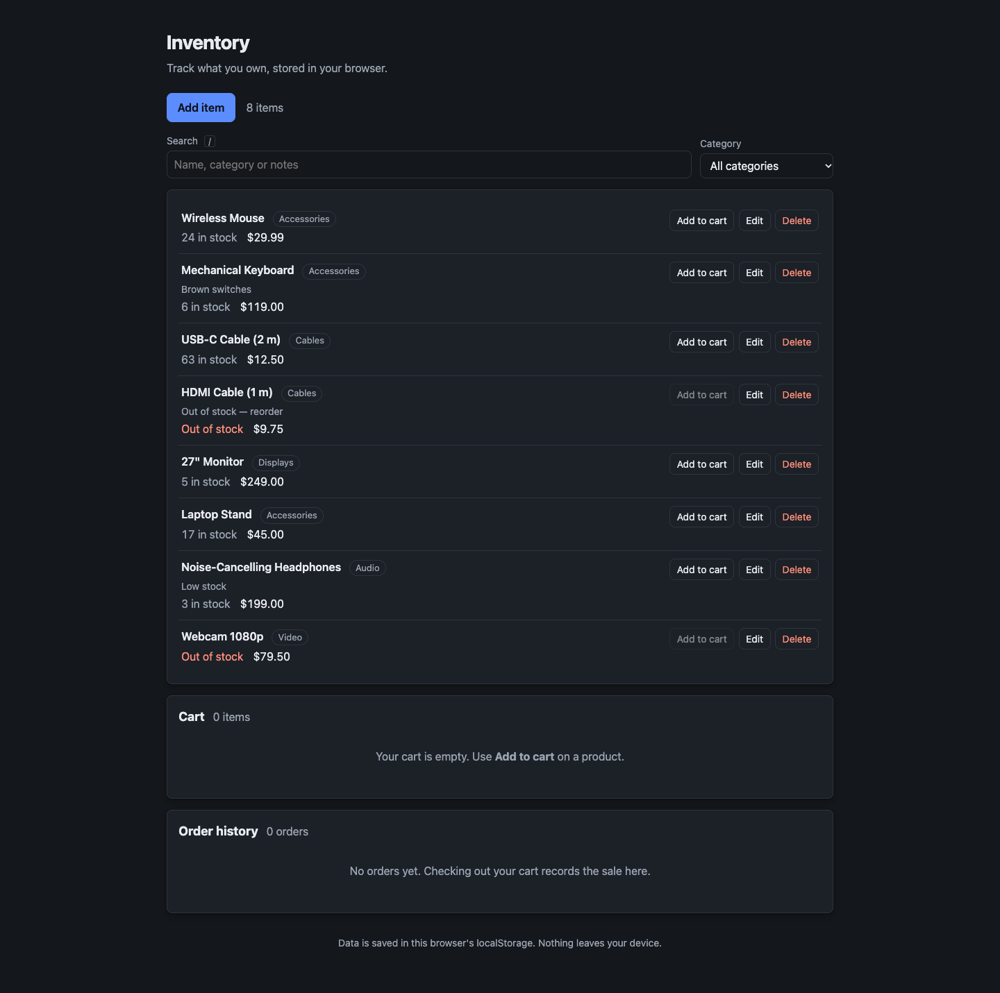
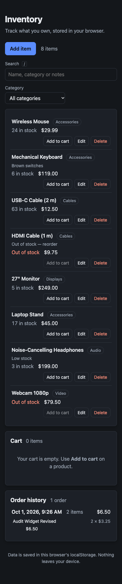
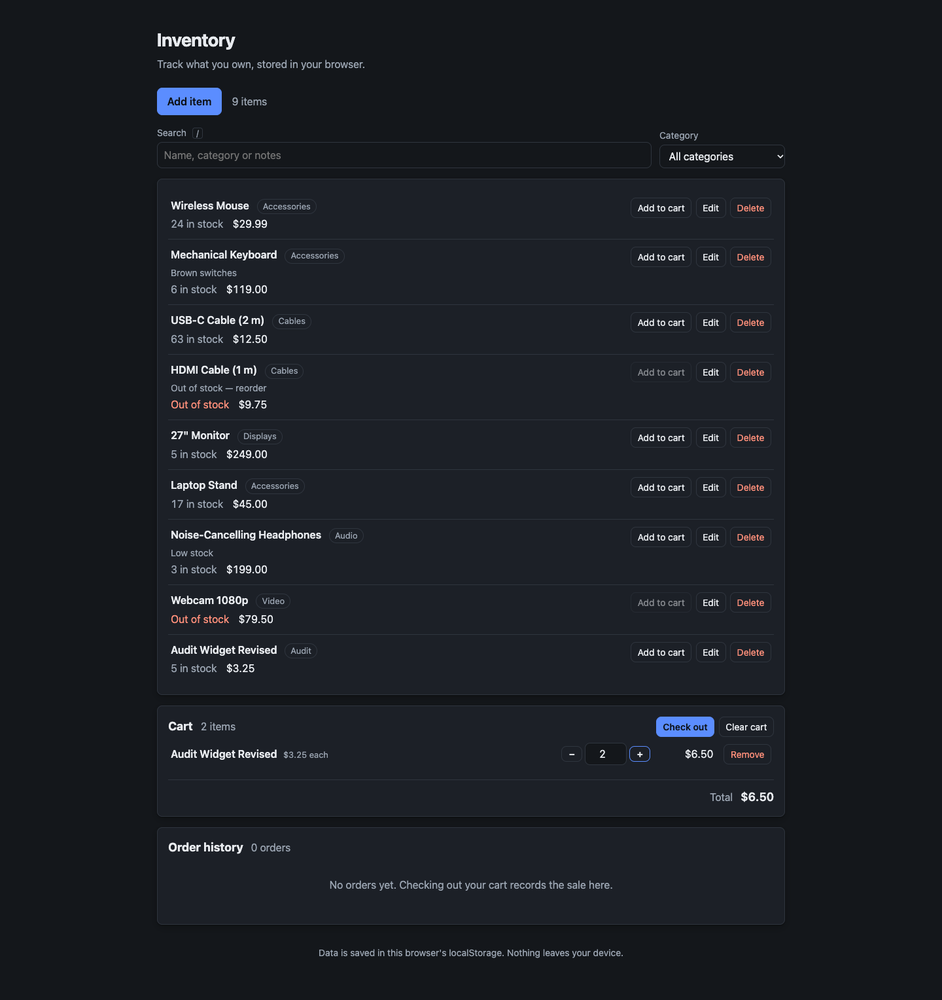
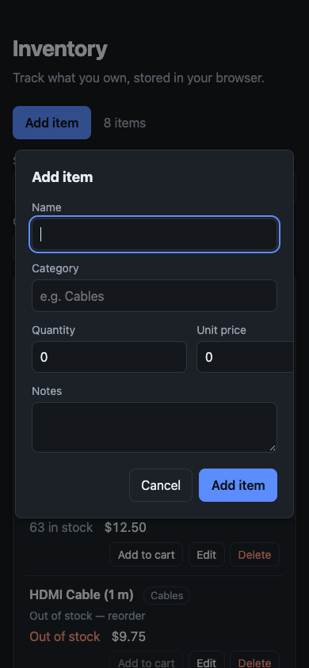

# Inventory

A small inventory tracker that runs entirely in the browser. No build step, no
server, no dependencies — open `index.html` and it works. Everything you enter is
saved to the browser's `localStorage`, so the data stays on the machine it was
entered on.

## Screenshots

Click any screenshot to open the [live app](https://axionomicai.github.io/AxBenchmark_Oct_26_v1/deepseek-cloud-deepseek-flash/).

<a href="https://axionomicai.github.io/AxBenchmark_Oct_26_v1/deepseek-cloud-deepseek-flash/"></a>

<a href="https://axionomicai.github.io/AxBenchmark_Oct_26_v1/deepseek-cloud-deepseek-flash/"></a>
<a href="https://axionomicai.github.io/AxBenchmark_Oct_26_v1/deepseek-cloud-deepseek-flash/"></a>
<a href="https://axionomicai.github.io/AxBenchmark_Oct_26_v1/deepseek-cloud-deepseek-flash/"></a>

## Running it

Open `index.html` in a browser:

```
open index.html          # macOS
xdg-open index.html      # Linux
```

That is the whole setup. There is nothing to install and nothing to compile.

## Project layout

```
index.html        Markup shell: toolbar, lookup controls, item list, cart,
                  order history, dialogs
css/styles.css    All styling, including a dark-mode variant
js/storage.js     localStorage read/write, schema versioning, failure handling
js/items.js       The product list: queries (including the lookup), mutations,
                  sample data
js/cart.js        The shopping cart: lines pointing into that list, mutations,
                  and the join that prices them
js/orders.js      The order history, and the checkout that fills it
js/app.js         Bootstrap, rendering, the add / edit / delete flows, lookup,
                  cart, checkout
test/smoke.mjs    Wiring, storage, data-layer, and UI-flow checks, run by hand
```

The scripts load in that order and pass data through one global,
`window.Inventory`.

## Tests

```
node test/smoke.mjs
```

No dependencies and no install — it stubs a minimal DOM and runs the real
scripts in a `node:vm` realm, then exits non-zero if anything fails. The script
list comes from `index.html` itself, so the checks run exactly what a browser
runs. It covers the wiring (every id `app.js` looks up exists in `index.html`,
every referenced asset path resolves, the scripts are classic rather than
modules, since modules would break over `file://`) and the storage and data
edge cases: first run, an emptied list, corrupt or unavailable storage, and
records with junk field types.

It also drives the add, edit, and delete flows the way a user does, by firing
the handlers the page registered: opening the form, submitting it, cancelling,
confirming a delete. The stub models the one piece of browser behaviour those
flows depend on — that a dialog's `close` event is queued rather than fired
inline — because getting that wrong is silent and destructive. See the note on
`close` under "How it works".

The lookup is covered the same way: typing into the search box, choosing a
category, clearing, and the keyboard shortcuts, plus what the matching rules do
to awkward input — accents, word order, numbers, and records with no category.

So is the cart: adding from a row, the steppers, typing a quantity, the cap at
the stock on hand, removing and clearing, the total, reloading with a cart
already stored, a product deleted out from under a line, junk in the stored
blob, and a write the browser refuses.

So is checkout, which is driven the same way: a cart taken off the stock, the
receipt filed and drawn, the two kinds of line that block a sale, and the
history reloaded. That last group covers a case worth spelling out — a browser
that accepts the receipt and refuses the stock change underneath it. It is the
one that tells a page reporting the whole of a checkout apart from one
reporting only the last of its writes, and it needs a storage stub that refuses
one key and takes the rest.

It asserts wiring and behaviour, not appearance. Visual changes still need a
browser.

## How it works

**No frameworks, no libraries.** Plain HTML5 and vanilla JavaScript.

**No ES modules.** The scripts are classic `<script src>` tags rather than
`<script type="module">`. Browsers block module loading over the `file://`
protocol under the same-origin policy, which would break the "just open the
file" requirement. The files communicate through a single global,
`window.Inventory`.

**Storage is best-effort, and failures are visible.** `localStorage` is not
always usable — Safari private mode throws on write, some browsers block it for
`file://` pages, and it can fill up. `js/storage.js` probes availability once and
reports failures through return values instead of throwing, and the page shows a
warning banner when storage is unavailable rather than silently discarding
edits.

**One module owns the data.** `js/items.js` holds the product list and every
operation that changes it — `add`, `update`, `remove`, `replaceAll`. Each one
writes the whole list to storage *before* it returns and then notifies
subscribers, so no call site can forget to save or forget to redraw. Callers get
back a result (`null` for a rejected change, `false` for a failed write) rather
than an exception.

**Fields are coerced, not trusted.** A record read out of storage is repaired
into shape: names are trimmed, stock counts become non-negative whole numbers,
prices are rounded to cents, timestamps fall back to now, and a duplicate id is
replaced with a fresh one. Records with no name at all are dropped, since there
is nothing to show. Quietly losing a stock count would be worse than showing a
row the user can correct.

**Stored data is validated on read.** The saved blob is wrapped in an envelope
(`{ version, items }`) and anything unparseable or the wrong shape is treated as
"no data". A corrupt or hand-edited entry degrades to an empty list instead of
breaking the page. The `version` field is there so a future format change can
migrate old data instead of dropping it.

**Sample data on first run.** A fresh browser opens on a small, plausible stock
list rather than an empty page. Seeding is keyed on there being no stored blob
at all, not on the list being empty — otherwise deleting every product would
resurrect the samples, and a blob that failed to parse would be silently
replaced by demo rows instead of showing as empty.

**Rendering uses DOM APIs, not `innerHTML`.** Product names and notes are user
input, so they are written with `textContent` into nodes built with
`createElement`. This sidesteps HTML injection entirely.

**One dialog for adding and editing.** The form is filled from the product
record rather than from the row that was clicked, so what it shows is what would
be saved. Editing the same product in two places is not possible — the dialog is
modal — so there is no stale-copy problem to solve.

**Nothing listens for the dialog `close` event.** Browsers *queue* that event
instead of firing it inline, so it can arrive after the dialog has been
reopened. An earlier version cleared the form's state there, which erased the
error message for a save that had just failed; clearing the same state's
`editingId` would have turned a save into a second product. The state is written
by `openForm()`, `closeForm()` and `closeConfirm()` instead — the paths in and
out — so a dismissed dialog leaves nothing behind for the next one to read.
Escape closing the dialog needs no handling of its own (the search box's Escape
is a different thing, handled on the field). `test/smoke.mjs` models the queued
event and holds a regression check on it.

**A change the browser refused to save says so.** `Inventory.items.add`,
`update`, and `remove` still take effect in the page when the write to
`localStorage` fails (quota exceeded, or access withdrawn mid-session), and the
subscriber callback is handed `{ saved }` along with the new list. The page
turns that into a visible, announced banner rather than letting an unsaved edit
pass for a saved one. A later write that succeeds clears it.

**Deleting asks first.** It is the one action that cannot be undone, so it goes
through a confirmation naming the product.

**A lookup narrows the view, never the data.** The search box and the category
picker decide what is drawn; neither writes anything, so there is no "filtered
inventory" to save and no way to empty the inventory by searching. The item
count keeps reporting the whole list — a search shows "Showing 2 of 8 items"
rather than redefining the count — and the page distinguishes the two ways the
list can be empty: nothing recorded yet, and nothing matching what was typed.

**What a search reads, and how.** Names, categories, and notes — not quantities
or prices, so typing "5" does not match everything with five in stock. Every
word typed has to appear somewhere in the product, in any order, so "cable usb"
finds the USB-C cable; matching ignores case and accents, so "cafe" finds
"Café". The rules live in `js/items.js` next to the data they describe, rather
than in a search handler, and they take the list as an argument so they can be
exercised without a page.

**The category picker offers what is in the list.** It is rebuilt from the
products on every redraw and keeps the choice already made; a category that has
gone — its last product deleted, or renamed into another category — falls back
to "All categories" instead of leaving the page filtered on something the
picker no longer shows and the user cannot undo by looking at it. The options
come from the whole list rather than the current matches, so typing in the
search box cannot make the selected category disappear out from under it.

**The query lives in the controls.** The current lookup is read back from the
input and the picker whenever the page redraws, rather than mirrored into a
variable that could drift from what the user sees. It is not stored, so a
reload starts from the whole list. Because a lookup change is not a change to
the inventory, it redraws without going through the store and leaves the
"not saved" warning alone.

**`/` searches, Escape clears.** The shortcut is only taken where a "/" could
not have been text: not while typing in a field, and not while a dialog is
open, where it would pull the caret out of a form mid-word.

**A cart line is a reference, not a copy.** `js/cart.js` stores `{ itemId,
quantity }` and nothing else. Names, prices, and stock are read back through
that reference every time the cart is drawn, so editing a price moves the total
and renaming a product renames it in the cart. Keeping a copy of the price would
mean a cart quietly quoting yesterday's numbers, and a second thing to keep in
sync.

**The cart is priced by a pure function.** `Inventory.cart.detail(lines,
products)` takes both lists as arguments rather than reading the stores, and
returns each line with its product, its subtotal, and whether the cart now holds
more of it than there is; plus the total, the count, and how many lines point at
nothing. All of the arithmetic is exercisable without a page, and app.js only
has to draw what comes back.

**A line whose product is deleted stays, and says so.** It would be easy to drop
it — the product is gone, so the line means nothing — but a cart that silently
loses a line is indistinguishable from one that never had it. The line stays
with "No longer in your inventory" in place of the name, contributes nothing to
the total, and carries a Remove button and a note above the list. Deleting every
product cannot make the total quietly wrong.

**Quantities are capped at the stock on hand.** A cart is what you would take
out of the inventory, so `add` and `setQuantity` both stop at `item.quantity`,
and a row's **Add to cart** disables itself once the cart holds all of it. The
cap is refused rather than clamped to a no-op, so the page can say which of the
three reasons it was — no such product, none in stock, or all of it already in
the cart. A product added when stock was higher and then edited down is not
renumbered behind the user's back: the number stays, the line says how many
there are ("Only 2 in stock", "Out of stock"), and it is theirs to fix.

**The quantity field commits on `change`, not `input`.** Capping on every
keystroke would fight the user halfway through typing "12". An emptied or
unreadable field is not a request for zero — it is a field someone cleared and
left — so the stored number goes back in the box rather than the line coming
out; `−` past one, or Remove, is how a line leaves. When a typed number *is*
capped, a note says so, because a number that comes back changed with no
explanation is worse than one that was refused.

**A redraw puts the caret back.** Every change replaces the nodes it draws, so a
stepper would drop focus on each click and cannot be used from the keyboard at
all. The control that was used registers itself under a key while it is drawn
and the render restores the caret to it.

A key is a list, tried in order, because the control that was pressed is not
always still there to take the caret back. One the redraw disabled is passed
over, which is what happens to the `+` that just reached the stock on hand and
to a row's **Add to cart** when that click was the one that filled the cart;
both land on the number they just changed instead. One the redraw drew away
entirely is passed over too — **Remove** takes its own line with it, and the
confirmed actions close a dialog over the change they make — so **Remove** falls
back to the product's row, where the button that reverses it is, and deleting,
emptying the cart, and checking out fall back to the toolbar. Nothing is ever
left on the body, where the next Tab would start the page again from the top.

**Emptying the cart asks first; taking one line out does not.** Clearing throws
away every line at once and there is no undo, so it goes through the same
confirmation dialog that deleting a product uses — the dialog takes its title,
question, button label, and whether the button is the red one from the caller,
so the several questions it now asks cannot drift apart. Checking out asks
through it too, and is the one of the three whose button is not red: a sale can
be undone by editing the stock back, where a deleted product cannot. Removing a
single line does not ask at all: putting it back is one click, and a
confirmation on every adjustment would be noise.

**An order is a receipt; a cart line is a reference.** `js/orders.js` records
what was sold rather than what is being sold: each line copies the name, the
price, and the count as they were at the time. That is the opposite of a cart
line, and deliberately so. A cart is priced from the live inventory so that it
cannot quote yesterday's price; an order is a record, and renaming a product or
editing its price this afternoon must not rewrite what was sold last week. So
deleting the product outright leaves the receipt standing — it holds everything
it needs of its own.

**A sale that cannot be completed is refused, not rounded down.** A cart can
hold two things that cannot be sold: a line whose product has been deleted, and
a line holding more of something than there is in stock, which happens when the
stock is edited down after the fact. Both are already drawn on the line itself.
Checkout refuses while either is there, and the note says what to do about it —
take the line out, or lower the number. The alternative, selling what happens to
be on the shelf and quietly dropping or shrinking the rest, would make the total
wrong in a way nothing on the page admits to. The rules live in
`Inventory.orders.plan(lines, products)`, a pure function taking both lists as
arguments so they can be exercised without a page; `checkout()` is the thin part
that applies them.

**A checkout is one sale, not three writes.** Checking out changes the
inventory, empties the cart, and appends the order. The stock change goes
through `Inventory.items.updateMany`, which writes the whole list once: six
products coming off the shelf is one change to the inventory, and a browser that
refused the fourth write of six would otherwise leave the stored list holding
half of it.

The three writes are then watched rather than assumed. Every store hands its
subscribers whether the write behind a change was accepted, so the checkout
listens for the duration of its own writes and passes the whole result — not
just its own — to the notification it sends last, which is the one the page
redraws from. Without that, a browser that took the receipt and refused the
stock change underneath it would leave the page reporting the sale as saved.
`test/smoke.mjs` holds that case down with a storage stub that refuses one key
and takes the rest.

**The history reads newest first and is stored oldest first.** Storing it the
other way would mean reversing the blob on every write, or keeping a position
that a hand-edited entry could contradict. The record is appended and the page
turns it round as it draws, so the stored blob stays a plain log and the sale
just made is the one at the top.

**Every stored collection is stored the same way.** The cart lives under
`inventory.cart` as `{ version: 1, lines: [...] }` and the history under
`inventory.orders` as `{ version: 1, orders: [...] }`, both written through
`Inventory.storage.collection(key, field)` — the same envelope, the same
availability probe, the same refusal-by-return-value that the inventory uses.
A cart or an order the browser refuses to save raises the same "not saved"
banner an unsaved product does, rather than passing for saved.

## Data model

A product is a plain object:

| Field       | Type   | Notes                                |
| ----------- | ------ | ------------------------------------ |
| `id`        | string | Unique, stable across edits          |
| `name`      | string | Product name; required               |
| `category`  | string | Free-form grouping, may be empty     |
| `quantity`  | number | Stock on hand; non-negative integer  |
| `price`     | number | Unit price, rounded to cents         |
| `notes`     | string | Optional free text, may be empty     |
| `createdAt` | string | ISO 8601 timestamp                   |
| `updatedAt` | string | ISO 8601 timestamp                   |

Stored under the key `inventory.items` as `{ version: 1, items: [...] }`.

A cart line is a plain object:

| Field      | Type   | Notes                                          |
| ---------- | ------ | ---------------------------------------------- |
| `itemId`   | string | The `id` of the product it points at           |
| `quantity` | number | How many; a positive integer, at most the stock |

Stored under the key `inventory.cart` as `{ version: 1, lines: [...] }`. A
product appears in at most one line; order is the order things were added.

An order is a plain object:

| Field     | Type   | Notes                                    |
| --------- | ------ | ---------------------------------------- |
| `id`      | string | Unique, stable                           |
| `at`      | string | ISO 8601 timestamp of the sale           |
| `entries` | array  | One per product sold, in cart order      |

and each entry in it is a plain object:

| Field      | Type   | Notes                                            |
| ---------- | ------ | ------------------------------------------------ |
| `itemId`   | string | The product it came off; may since have gone     |
| `name`     | string | That product's name at the time of the sale      |
| `price`    | number | Its unit price at the time, rounded to cents     |
| `quantity` | number | How many were sold; positive integer             |
| `subtotal` | number | `price × quantity`, rounded to cents             |

Stored under the key `inventory.orders` as `{ version: 1, orders: [...] }`,
oldest first. The count and the total are not stored: they are read off the
entries when the order is drawn, so there is no second number that can disagree
with the lines it is meant to be the sum of.

## Status

The inventory can be viewed, managed, and searched; products can be put in a
cart, counted, totalled, and checked out; and every completed sale is kept in an
order history. The page loads the stored data — or seeds sample stock on a first
run — and each row shows the name, category, notes, stock, and price.

- **Add** — the toolbar button opens a form for a new product.
- **Edit** — the row's button reopens the same form filled in, and saves back
  over that product.
- **Delete** — the row's button asks for confirmation, naming the product.
- **Find** — the search box narrows the list as you type, the category picker
  narrows it to one category, and the two combine. Each shows how much of the
  inventory is on screen, and a **Clear** button appears while either is on.
  Press <kbd>/</kbd> to jump to the search box, Escape to empty it.
- **Cart** — the row's **Add to cart** puts one more of a product in; the cart
  below the list shows what is in it, with `−` / `+` or a typed number to change
  how many, **Remove** to take a line out, and the running total. It survives a
  reload, and **Clear cart** empties it after asking.
- **Check out** — the cart's button takes what is in it off the stock, empties
  the cart, and files the sale in the order history, after asking and saying
  what the sale comes to. A cart holding a line whose product has been deleted,
  or more of something than there is in stock, is refused with a note saying
  what to fix rather than sold short.
- **Order history** — every completed sale, newest first: when it was, what it
  was made of, and what it came to. The lines are what was sold at the time, so
  renaming, repricing, or deleting the product afterwards leaves them alone.

Every change is written to `localStorage` before the page redraws, and a change
the browser refuses to save is reported rather than passing silently.

Still to come:

- [ ] Sort by name, quantity, or price
- [ ] Summary totals (item count, stock value)
- [ ] Import and export as JSON

## Browser support

Any current version of Chrome, Firefox, Safari, or Edge. Uses `replaceChildren`,
`Element.after`, `String.prototype.normalize`, `toLocaleString` with
`dateStyle`/`timeStyle` for the timestamps in the order history, and CSS custom
properties, all of which are long-since standard.
