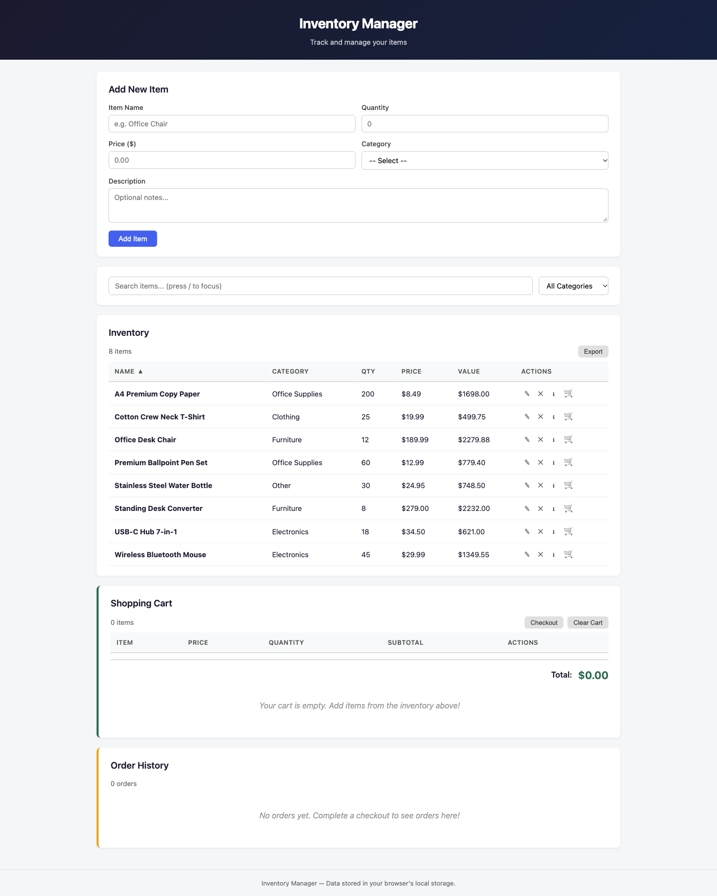
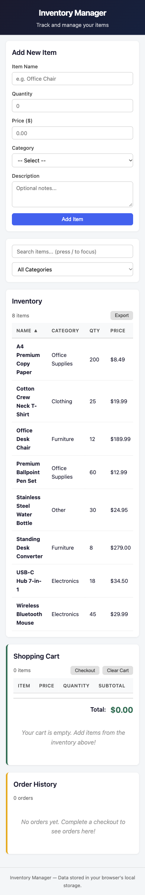
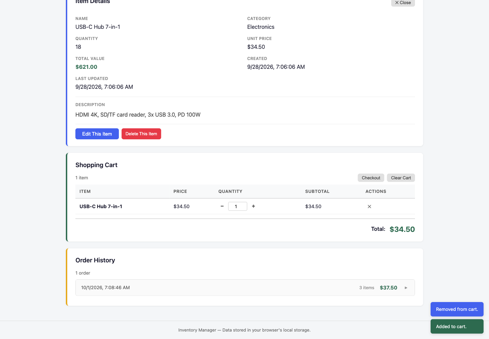
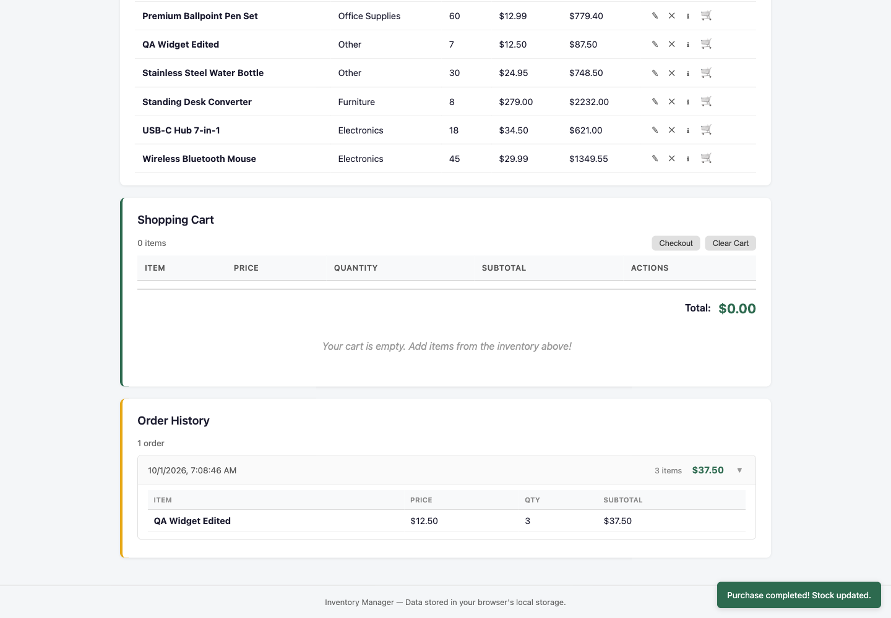

# Inventory Manager

A lightweight inventory management website built with **HTML5**, **CSS**, and **vanilla JavaScript**. All data is persisted in the browser's **localStorage** — no server or database required. Simply open `index.html` in any modern browser to start using it.

## Screenshots

Click any screenshot to open the [live app](https://axionomicai.github.io/AxBenchmark/4x-rtxpro6000-deepseek-v4-flash-q8kxl/).

<a href="https://axionomicai.github.io/AxBenchmark/4x-rtxpro6000-deepseek-v4-flash-q8kxl/"></a>

<a href="https://axionomicai.github.io/AxBenchmark/4x-rtxpro6000-deepseek-v4-flash-q8kxl/"></a>
<a href="https://axionomicai.github.io/AxBenchmark/4x-rtxpro6000-deepseek-v4-flash-q8kxl/"></a>
<a href="https://axionomicai.github.io/AxBenchmark/4x-rtxpro6000-deepseek-v4-flash-q8kxl/"></a>

## Features

- **Add, Edit, Delete** inventory items
- **Sortable table** — click any column header to sort
- **Search & filter** by name, description, or category with **live highlighting** of matched terms
- **Value column** — automatically calculated (Qty × Price)
- **Product detail panel** — click any row or the ℹ button to view full item details including timestamps
- **Quick actions** — edit or delete directly from the detail panel
- **Keyboard shortcuts** — press `/` to focus search, `Escape` to close the detail panel
- **Clear search** button to reset all filters at once
- **Export** inventory data as a JSON file
- **Persistent storage** — data survives page refreshes and browser restarts
- **Responsive** layout for desktop and mobile
- **Toast notifications** for all actions
- **Checkout** — complete a purchase to deduct stock from inventory
- **Order history** — collapsible order records showing date, items, quantities, and totals
- **Stock validation** — checkout verifies sufficient stock and rejects over-purchases

## Getting Started

1. Clone or download this repository.
2. Open `index.html` in your browser.
3. Start adding items to your inventory!

## Usage

| Field        | Description                               |
|-------------|-------------------------------------------|
| Item Name   | A descriptive name for the item           |
| Quantity    | How many units are in stock               |
| Price       | Unit price in dollars                     |
| Category    | Group the item under a category           |
| Description | Optional notes about the item             |

## Project Structure

```
.
├── index.html    # Main HTML page
├── styles.css    # Stylesheet
├── app.js        # Application logic
└── README.md     # This file
```

## License

MIT
