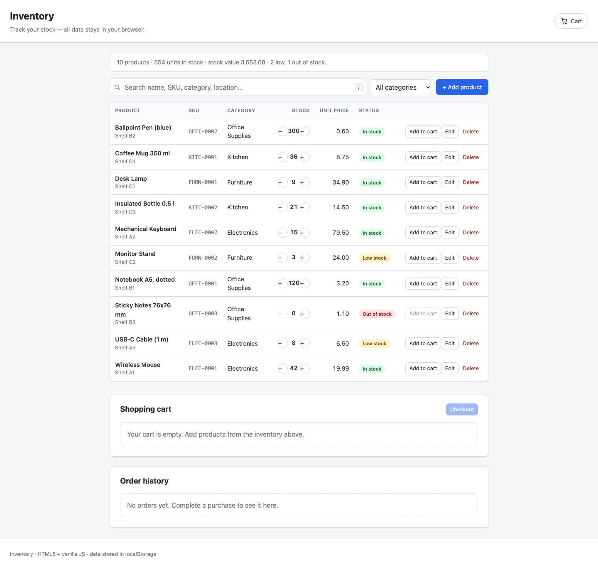
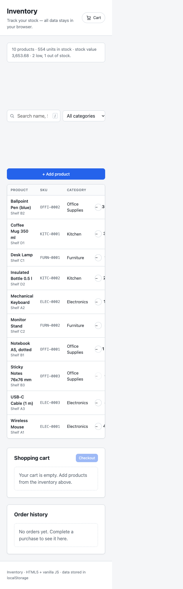
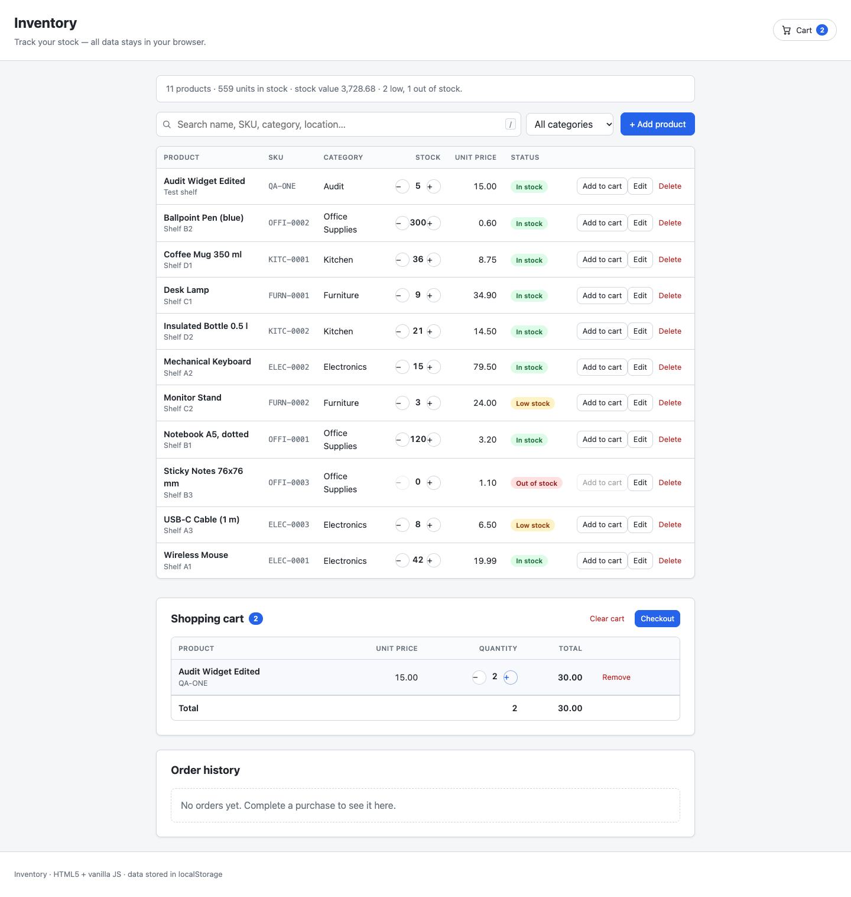
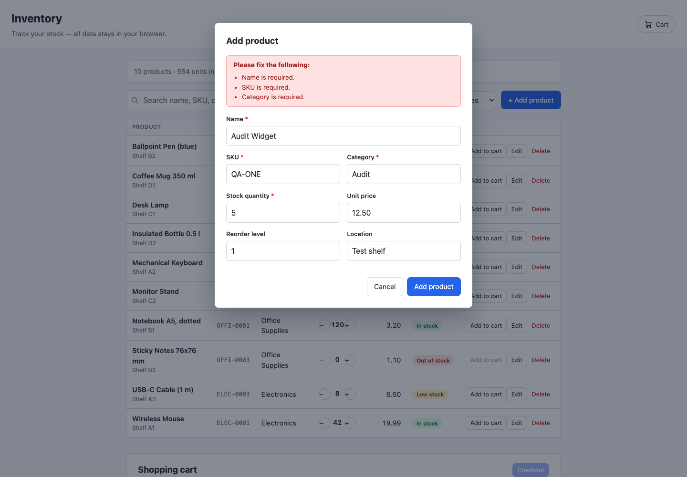
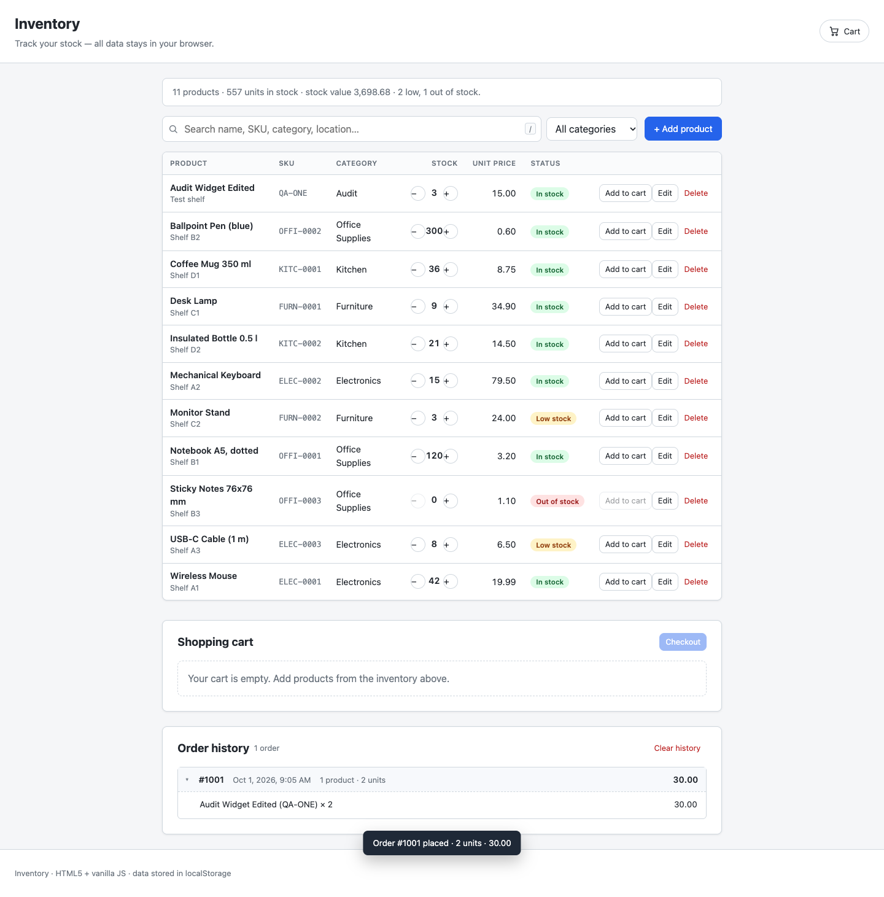

# Inventory Website

A simple inventory management website built with **HTML5** and **vanilla JavaScript** — no frameworks, no libraries, no build step.

All data is persisted in the browser's `localStorage`, so the site works entirely offline once loaded.

## Screenshots

Click any screenshot to open the [live app](https://axionomicai.github.io/AxBenchmark/4x-rtxpro6000-glm-5.3-flash-q4kxl/).

<a href="https://axionomicai.github.io/AxBenchmark/4x-rtxpro6000-glm-5.3-flash-q4kxl/"></a>

<a href="https://axionomicai.github.io/AxBenchmark/4x-rtxpro6000-glm-5.3-flash-q4kxl/"></a>
<a href="https://axionomicai.github.io/AxBenchmark/4x-rtxpro6000-glm-5.3-flash-q4kxl/"></a>
<a href="https://axionomicai.github.io/AxBenchmark/4x-rtxpro6000-glm-5.3-flash-q4kxl/"></a>
<a href="https://axionomicai.github.io/AxBenchmark/4x-rtxpro6000-glm-5.3-flash-q4kxl/"></a>

## Running the site

No installation or server is required:

1. Open `index.html` in any modern browser (double-click it, or use
   `File → Open` in your browser).
2. That's it — everything runs client-side.

## Project structure

```
.
├── index.html        # Entry point — the single page of the app
├── css/
│   └── styles.css    # All styling
├── js/
│   ├── storage.js    # Error-safe localStorage wrapper (JSON + key prefix)
│   ├── data.js       # Data layer: products, stock, CRUD, sample seed data
│   ├── cart.js       # Cart data layer: lines, stock caps, totals, sync
│   ├── orders.js     # Checkout transaction + order history (snapshots)
│   └── app.js        # Bootstrap: wires the data layers to the page
├── tests/
│   ├── data-layer.test.js  # Node smoke test for the data layer (no deps)
│   ├── cart.test.js        # Node smoke test for the cart data layer (no deps)
│   ├── orders.test.js      # Node smoke test for checkout & history (no deps)
│   └── ui.test.js          # jsdom UI test: management, lookup, cart, checkout
└── README.md
```

## Data model & persistence

All inventory data lives in `localStorage` under the key
**`inventory.data.v1`** as a JSON array of products:

| Field          | Type     | Notes                                    |
| -------------- | -------- | ---------------------------------------- |
| `id`           | string   | Generated unique id (`p_…`)              |
| `name`         | string   | Required, non-empty                      |
| `sku`          | string   | Required, unique (case-insensitive)      |
| `category`     | string   | Required                                 |
| `quantity`     | integer  | Units in stock, ≥ 0                      |
| `unitPrice`    | number   | ≥ 0, defaults to `0`                     |
| `reorderLevel` | integer  | ≥ 0; product is "low stock" when `quantity ≤ reorderLevel` |
| `location`     | string   | Optional shelf/bin label                 |
| `createdAt` / `updatedAt` | ISO string | Set automatically     |

Behavior:

- **First run:** if the storage key is missing (or unreadable), the app
  seeds ~10 sample products across several categories so the site is
  usable immediately.
- **Every change** (add / update / delete / stock adjustment) is written
  back to `localStorage` immediately.
- **Change events:** the data layer dispatches an `inventory:changed`
  event on `document` after every mutation, so the UI can re-render.
- **No localStorage** (e.g. blocked storage): the app still runs with
  sample data in memory and shows a warning that changes won't be saved.

The shopping cart is stored separately under
**`inventory.cart.v1`** as a JSON array of minimal lines:

```json
[{ "productId": "p_…", "quantity": 2 }]
```

Cart lines never copy product data — they are resolved against the live
inventory at render time. That means product edits are reflected
immediately, quantities can never exceed the current stock (adds are
rejected, stock reductions clamp the cart), and lines for deleted or
out-of-stock products are dropped automatically. Every cart mutation
persists and dispatches a `cart:changed` event.

Completed purchases are stored under **`inventory.orders.v1`** (plus an
`inventory.orders.seq.v1` counter that keeps order numbers monotonic).
Each order is a snapshot taken at checkout time:

```json
[{
  "id": "o_…",
  "number": 1001,
  "date": "2025-01-15T10:00:00.000Z",
  "items": [
    { "productId": "p_…", "sku": "ELEC-0001", "name": "Wireless Mouse",
      "unitPrice": 19.99, "quantity": 2, "lineTotal": 39.98 }
  ],
  "totalUnits": 2,
  "total": 39.98
}]
```

Checkout validates every cart line against the current stock, decreases
the stock, records the order, and empties the cart. Because orders are
snapshots (unlike cart lines), editing or deleting a product afterwards
never changes what a past order shows. The history keeps the 100 most
recent orders and dispatches an `orders:changed` event on every change.

### Using the data layer from the console

```js
Inventory.getAll();                       // list products
Inventory.addProduct({ name: 'Widget', sku: 'W-1', category: 'Misc', quantity: 5 });
Inventory.adjustStock(id, -2);            // remove 2 units
Inventory.getStats();                     // totals, low-stock counts, stock value
Inventory.resetToSample();                // wipe and reseed sample data

InventoryCart.add(id, 2);                 // add 2 units of a product
InventoryCart.setQuantity(id, 3);         // change a line quantity
InventoryCart.remove(id);                 // remove a line
InventoryCart.getLines();                 // [{ product, quantity, lineTotal }]
InventoryCart.getTotal();                 // cart total
InventoryCart.clear();                    // empty the cart

InventoryOrders.checkout();               // buy the cart: stock--, order recorded
InventoryOrders.getAll();                 // orders, newest first
InventoryOrders.getCount();               // number of stored orders
InventoryOrders.clearHistory();           // delete all orders
```

To start completely fresh, clear the site's data or run
`localStorage.removeItem('inventory.data.v1')` and reload.

## Development

The website itself needs nothing but a browser. There are two optional
Node test suites:

```sh
node tests/data-layer.test.js   # inventory data layer, no dependencies
node tests/cart.test.js         # cart data layer, no dependencies
node tests/orders.test.js       # checkout & order history, no dependencies
node tests/ui.test.js           # full UI flows; needs jsdom:
npm install --no-save jsdom@24  # dev-only, gitignored, site doesn't need it
```

`tests/ui.test.js` loads the real `index.html` into jsdom, runs the real
scripts, and simulates clicking, typing, and submitting the forms.

## Features

**Inventory management**

- **View** — all products in a sortable-by-name table with SKU, category,
  stock, unit price, and a status badge (`In stock` / `Low stock` /
  `Out of stock`), plus a summary bar (product count, total units, stock
  value, low/out-of-stock counts).
- **Add** — “+ Add product” opens a modal form (name, SKU, category with
  suggestions, stock quantity, unit price, reorder level, location).
  Invalid input is reported inline before anything is saved.
- **Edit** — the row’s *Edit* button opens the same form prefilled.
- **Delete** — the row’s *Delete* button asks for confirmation first.
- **Quick stock adjust** — small − / + buttons on each row change the
  stock by one unit (stored via the same validated data layer).

Everything is rendered with DOM APIs (`createElement` + `textContent`),
so product data is never interpreted as HTML.

**Inventory lookup**

- **Live search** — as you type, the table filters across product name,
  SKU, category, and storage location (case-insensitive), with every
  match highlighted via `<mark>`.
- **Category filter** — dropdown next to the search box; combines with
  the search text (AND).
- **Result count** — the summary bar shows “showing X of Y …” while a
  filter is active; a dedicated “No products match” state offers a
  one-click *Clear search & filters* reset.
- **Keyboard friendly** — press <kbd>/</kbd> anywhere to jump to the
  search box; <kbd>Esc</kbd> in the search box (or the ✕ button) clears
  it. Filters survive add/edit/delete re-renders, and a category filter
  resets itself if its category disappears.

**Shopping cart**

- **Add to cart** — every inventory row has an *Add to cart* button
  (disabled while the product is out of stock or already fully in the
  cart). A header badge shows the current cart count at a glance.
- **Change quantities** — − / + buttons per cart line, capped at the
  available stock; *Remove* deletes a line, *Clear cart* (behind a
  confirmation) empties it.
- **Totals** — per-line totals plus a cart footer with total units and
  total price; the header cart indicator scrolls to the cart.
- **Always coherent with the inventory** — cart lines reference products
  by id and are resolved live, so price/name edits show up in the cart;
  shrinking stock clamps line quantities, stock of 0 or deleted products
  remove their lines automatically.
- **Persisted** — the cart survives reloads (see data model below).

**Checkout & order history**

- **Checkout** — the *Checkout* button in the cart (disabled while the
  cart is empty) completes the purchase in one transaction: stock is
  decreased by the purchased quantities, the order is recorded, and the
  cart is emptied. A toast confirms the order number, units, and total.
- **Order history** — every purchase is kept below the cart as an
  expandable card (number, date, size, total; item list inside). Orders
  are **snapshots** of names, SKUs, and prices at purchase time, so later
  product edits or deletions never rewrite history.
- **Numbers** — human-friendly, monotonically increasing order numbers
  (#1001, #1002, …) that continue even after the history is cleared.
- **Clear history** — destructive, behind a confirmation. History is
  capped at the 100 most recent orders to bound storage.
- **Persisted** — orders survive reloads (see data model below).

## Notes on data persistence

Inventory data is stored under a key in `localStorage` belonging to the
origin the page is opened from. Clearing the browser's site data will
erase the inventory.

## Tech choices

- **HTML5** — semantic markup, single-page layout
- **Vanilla JavaScript (ES5+/ES6+)** — no dependencies
- **CSS** — plain stylesheet, no preprocessor
