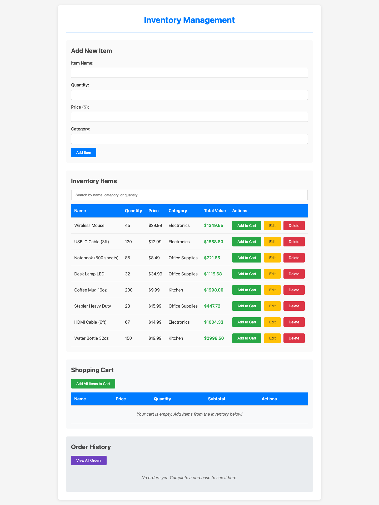
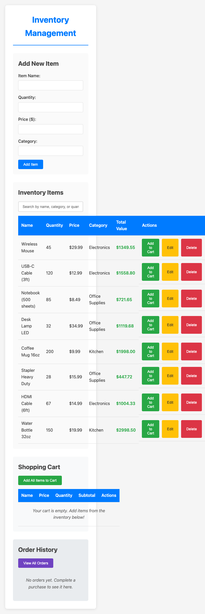
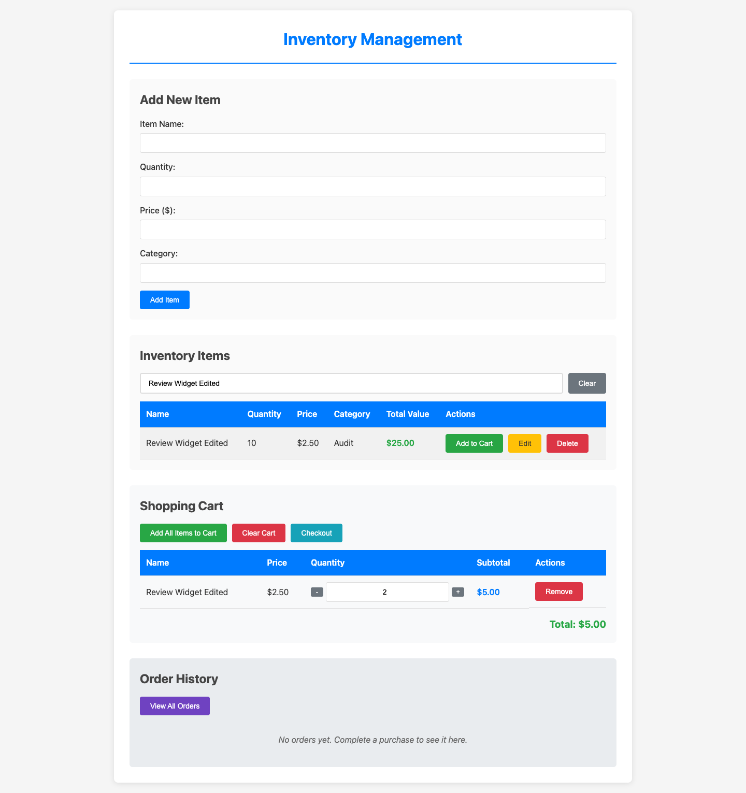
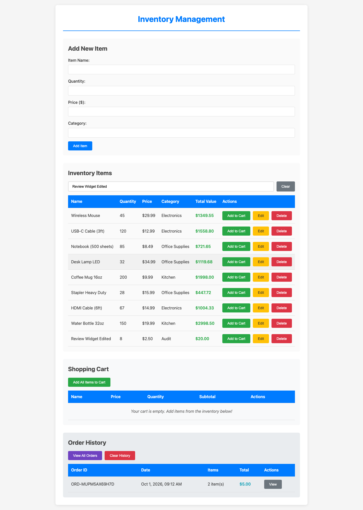

# Inventory Website

A simple inventory management website built with HTML5 and vanilla JavaScript. All data is persisted in the browser's localStorage.

## Screenshots

Click any screenshot to open the [live app](https://axionomicai.github.io/AxBenchmark/4x-rtxpro6000-qwen3.5-35b-a3b-q5kxl/).

<a href="https://axionomicai.github.io/AxBenchmark/4x-rtxpro6000-qwen3.5-35b-a3b-q5kxl/"></a>

<a href="https://axionomicai.github.io/AxBenchmark/4x-rtxpro6000-qwen3.5-35b-a3b-q5kxl/"></a>
<a href="https://axionomicai.github.io/AxBenchmark/4x-rtxpro6000-qwen3.5-35b-a3b-q5kxl/"></a>
<a href="https://axionomicai.github.io/AxBenchmark/4x-rtxpro6000-qwen3.5-35b-a3b-q5kxl/"></a>

## Features

- Add, edit, and delete inventory items
- View all items in a table format
- Shopping cart functionality (add items, update quantities, clear cart)
- **Checkout**: Complete purchases to update inventory stock
- **Order History**: View and manage past orders
- Data persists in browser localStorage
- No frameworks or libraries required

## Structure

```
.
├── index.html      # Main HTML file
├── css/
│   └── styles.css  # Stylesheet
├── js/
│   └── app.js      # Main application logic
└── README.md       # This file
```

## Usage

Simply open `index.html` in a web browser. No server or build process required.

## How It Works

### Shopping Cart
1. Click "Add to Cart" on any inventory item
2. Use the +/- buttons or input field to adjust quantities
3. Click "Add All Items to Cart" to add one of each inventory item
4. Click "Clear Cart" to remove all items

### Checkout
1. Review your cart and quantities
2. Click "Checkout" to complete the purchase
3. A confirmation dialog will appear
4. Upon confirmation:
   - Inventory quantities are reduced by the purchased amounts
   - An order record is created with order ID, date, items, and total
   - The cart is cleared
   - The order appears in Order History

### Order History
1. View recent orders in the Order History section
2. Click "View All Orders" to expand the order list
3. Click "View" on any order to see detailed item breakdown
4. Click "Clear History" to remove all order records
