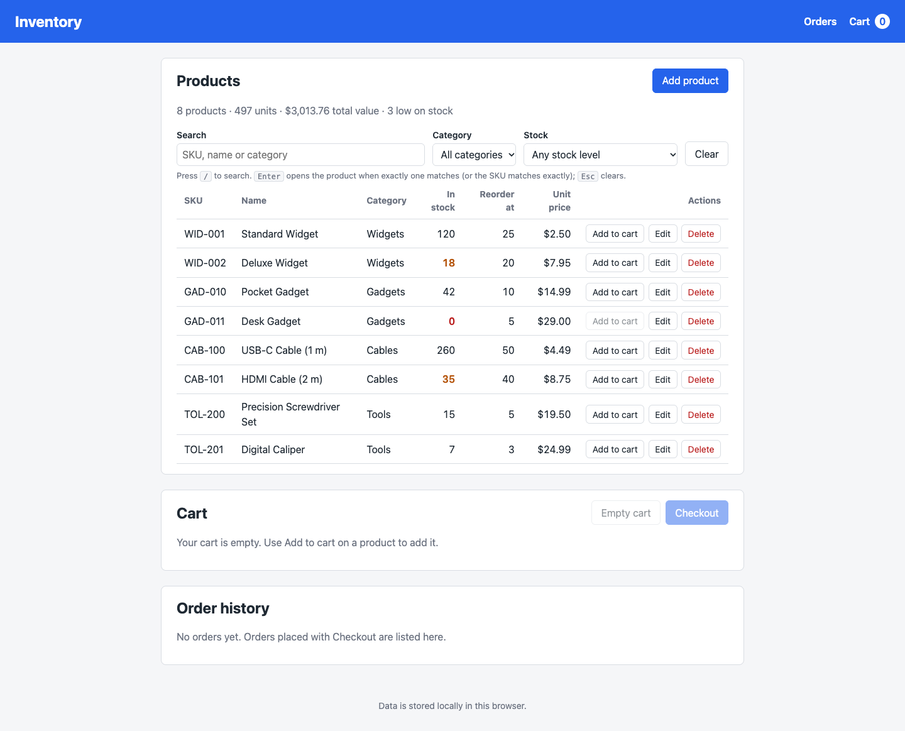
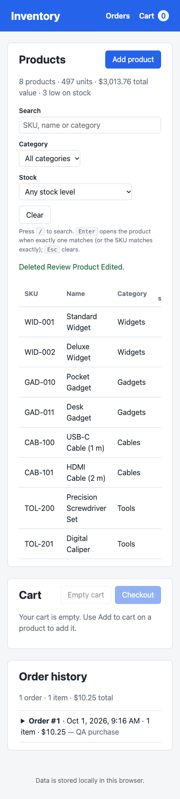
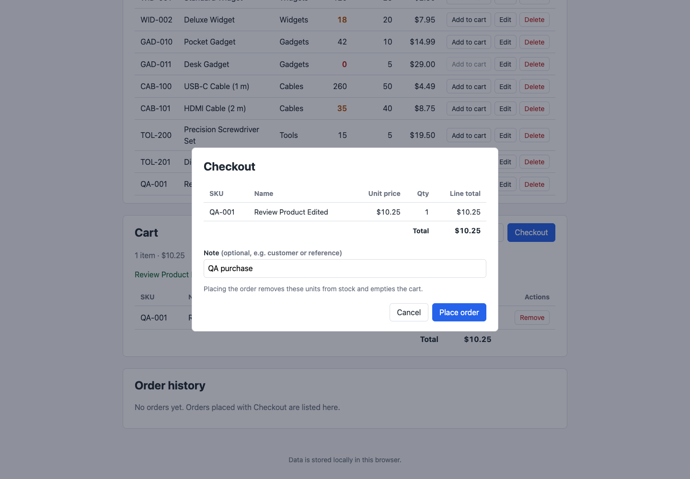
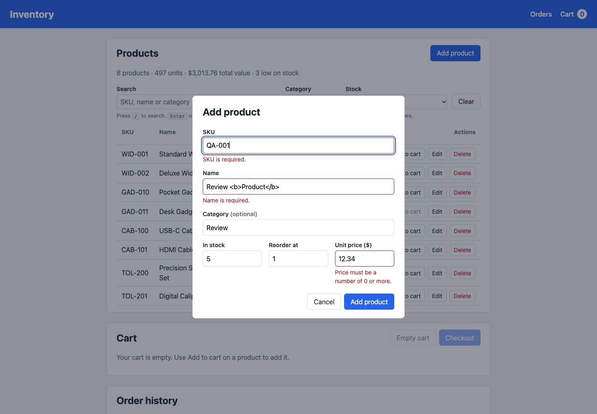
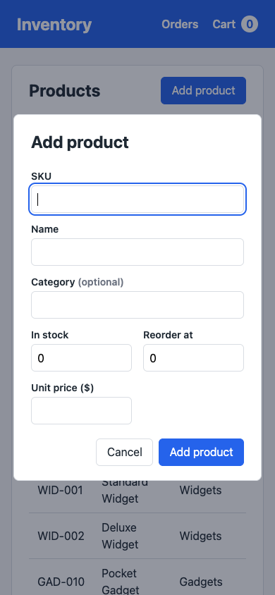

# Inventory

A simple inventory website built with HTML5 and vanilla JavaScript: no
frameworks, no libraries, no build step. All data is saved in the
browser's `localStorage`.

## Screenshots

Click any screenshot to open the [live app](https://axionomicai.github.io/AxBenchmark/anthropic-cloud-opus-5.5-medium/).

<a href="https://axionomicai.github.io/AxBenchmark/anthropic-cloud-opus-5.5-medium/"></a>

<a href="https://axionomicai.github.io/AxBenchmark/anthropic-cloud-opus-5.5-medium/"></a>
<a href="https://axionomicai.github.io/AxBenchmark/anthropic-cloud-opus-5.5-medium/"></a>
<a href="https://axionomicai.github.io/AxBenchmark/anthropic-cloud-opus-5.5-medium/"></a>
<a href="https://axionomicai.github.io/AxBenchmark/anthropic-cloud-opus-5.5-medium/"></a>

## Running

Open `index.html` in a web browser. No server is needed.

Data is stored per browser and per origin, so items saved while viewing the
file directly (`file://`) are not visible when the same files are served over
HTTP, and vice versa. Clearing site data in the browser deletes the inventory.

## Using the site

- The **Products** table lists every product with its stock, reorder level
  and price. Stock at or below the reorder level is highlighted (amber for
  low, red for out of stock).
- **Add product** opens a form for a new product. **Edit** on a row opens
  the same form filled in with that product. Invalid input (missing SKU or
  name, duplicate SKU, negative, fractional or over-limit numbers) is reported next to
  the field and nothing is saved.
- **Search** filters the table as you type. Every word must appear in the
  product's SKU, name or category (case-insensitive, any order), and matches
  are highlighted. It combines with the **Category** and **Stock** filters
  (low or out of stock, out of stock, or above the reorder level); **Clear**
  resets all three. A product whose SKU matches the search exactly is listed
  first.
- Keyboard: <kbd>/</kbd> jumps to the search box; <kbd>Enter</kbd> there opens
  the product whose SKU matches exactly, or the only matching product (so a
  barcode scanner that types a SKU and Enter opens that product);
  <kbd>Esc</kbd> clears the search text.
- **Delete** on a row asks for confirmation before removing the product.
- When the inventory is empty, a link restores the sample products.
- **Add to cart** on a row puts one unit of the product in the **Cart**
  (below the products; the **Cart** link in the header shows the number of
  items and jumps there). The button is disabled for products that are out
  of stock or whose whole stock is already in the cart.
- In the cart, change a quantity with **−** / **+** or by typing a number
  (0 removes the line), remove a line with **Remove**, or empty the whole
  cart with **Empty cart**. Each line shows its total and the cart shows the
  overall total. Prices come from the inventory, so editing a product's
  price updates the cart. Adding to the cart does not change stock levels;
  only checkout does.
- If a product's stock drops below the quantity in the cart, the line is
  flagged; deleting a product removes it from the cart.
- **Checkout** (in the cart) opens a summary of the order with an optional
  note (a customer name or reference, up to 200 characters). **Place order**
  records the order, removes the units from stock and empties the cart.
  Checkout is disabled while the cart is empty or any line is over the
  available stock; if stock changes while the dialog is open, the order is
  refused and the dialog shows the current cart.
- **Order history** (below the cart; the **Orders** link in the header jumps
  there) lists orders newest first with their number, date, item count,
  total and note. Click an order to see its lines. Orders keep the SKU,
  name and price at the time of purchase, so later edits or deletions of a
  product do not change past orders.
- Changes made in another tab of the same browser show up automatically. If
  a product being edited or deleted is deleted in another tab, the dialog
  closes and says so.

## Project structure

```
index.html      Page markup
css/styles.css  Styles
js/storage.js   localStorage persistence (global `InventoryStore`)
js/inventory.js Product data, validation and stock rules (global `Inventory`)
js/cart.js      Shopping cart (global `Cart`)
js/orders.js    Checkout and order history (global `Orders`)
js/app.js       Application logic and rendering
test/           Node tests for the data layer
```

Scripts are loaded as classic `<script>` tags rather than ES modules, because
browsers block module scripts loaded from `file://` URLs. Load order matters:
`storage.js`, then `inventory.js`, then `cart.js`, then `orders.js`, then
`app.js`.

## Data

Products are stored as a JSON array under the localStorage key
`inventory.products.v1`. Each product has:

| Field          | Type    | Notes                                   |
| -------------- | ------- | --------------------------------------- |
| `id`           | string  | Generated, unique                       |
| `sku`          | string  | Required, unique (case-insensitive)     |
| `name`         | string  | Required                                |
| `category`     | string  | Optional                                |
| `quantity`     | integer | Units in stock, 0 to 1,000,000,000      |
| `reorderLevel` | integer | Stock at or below this counts as low (0 to 1,000,000,000) |
| `price`        | number  | Unit price, rounded to cents (0 to 1,000,000,000) |
| `createdAt`    | string  | ISO timestamp                           |
| `updatedAt`    | string  | ISO timestamp                           |

On first run (the key does not exist) sample products are stored. An
inventory the user has emptied is kept empty; `Inventory.resetToSampleData()`
restores the samples. If the stored value cannot be parsed, it is copied to
`inventory.products.v1.corrupt` before anything overwrites it.

`Inventory.adjustStockMany([{ id, delta }, ...])` changes the stock of
several products in a single save and is all or nothing: if any product is
missing or would go below zero, nothing changes.

All changes go through `Inventory` (`add`, `update`, `remove`, `adjustStock`,
`setStock`, `adjustStockMany`), which validates input and returns `{ ok: true, product }` or
`{ ok: false, errors: { field: message } }`. In-memory state only changes if
the save to localStorage succeeded.

`Inventory.search({ query, category, stock })` returns copies of the
matching products; see the comment in `js/inventory.js` for the rules.

### Cart

The cart is stored as a JSON array under `inventory.cart.v1`, one entry per
product: `{ productId, quantity }` (`quantity` is a whole number, 1 or more).
Names and prices are not stored; they are read from the inventory. Unreadable
data is backed up to `inventory.cart.v1.corrupt`, like the products.

`Cart` (`add`, `setQuantity`, `remove`, `clear`) returns the same
`{ ok, ... }` / `{ ok: false, errors }` results as `Inventory` and only
changes state if the save succeeded. Quantities cannot exceed the stock at
the time they are set. `Cart.getLines()` joins the items with current
product data and `Cart.getTotals()` sums them (in whole cents, so totals do
not pick up floating-point error). `Cart.prune()` drops items whose product
was deleted.

### Orders

The order history is stored as a JSON array under `inventory.orders.v1`,
oldest first (unreadable data is backed up to `inventory.orders.v1.corrupt`).
Each order has:

| Field       | Type    | Notes                                              |
| ----------- | ------- | -------------------------------------------------- |
| `id`        | string  | Generated, unique                                  |
| `number`    | integer | 1, 2, 3 … in the order placed                      |
| `createdAt` | string  | ISO timestamp                                      |
| `note`      | string  | Optional, up to 200 characters                     |
| `lines`     | array   | `{ productId, sku, name, price, quantity, lineTotal }` |
| `unitCount` | integer | Sum of the line quantities                         |
| `total`     | number  | Sum of the line totals (computed in whole cents)   |

Line SKU, name and price are copied from the product when the order is
placed. Totals are recomputed from the lines when the history is loaded.

`Orders.checkout({ note })` places an order for the whole cart at current
prices. It fails without changing anything if the cart is empty, a product
no longer exists or a quantity is above the stock. Otherwise it saves, in
order: the order history, the stock (one `adjustStockMany` save) and the
empty cart. These are three localStorage keys, so if a later save fails the
earlier ones are undone and a storage error is returned. `Orders.getAll()`
returns orders newest first, and `Orders.getSummary()` the order count,
units and total.

## Tests

```
node test/inventory.test.js
node test/cart.test.js
node test/orders.test.js
```

The tests load the browser scripts into Node with an in-memory
`localStorage`; no dependencies are needed.
