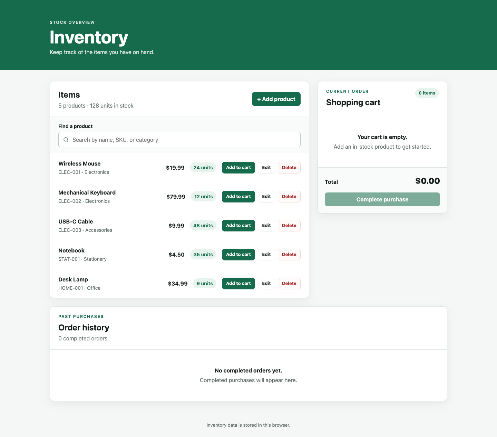
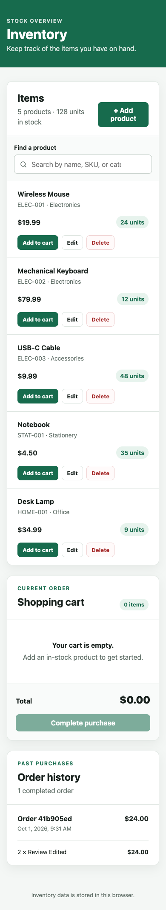
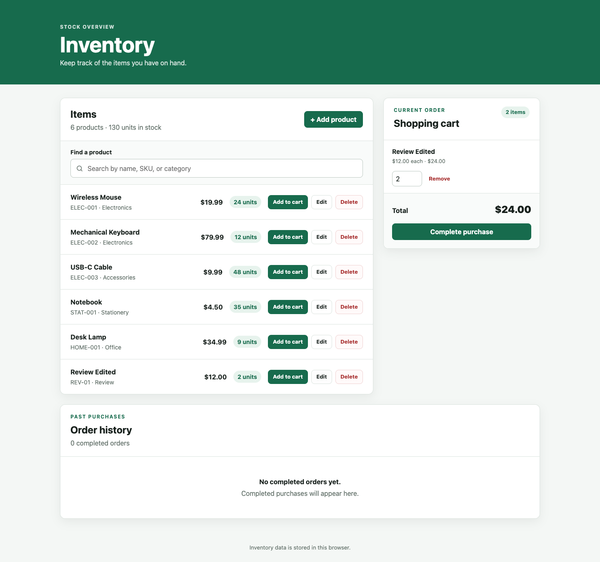
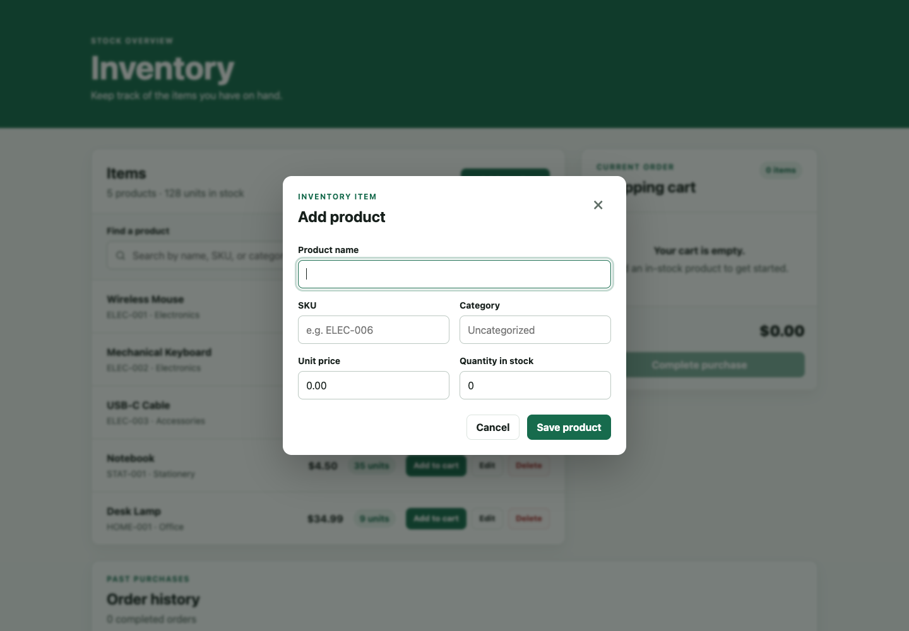
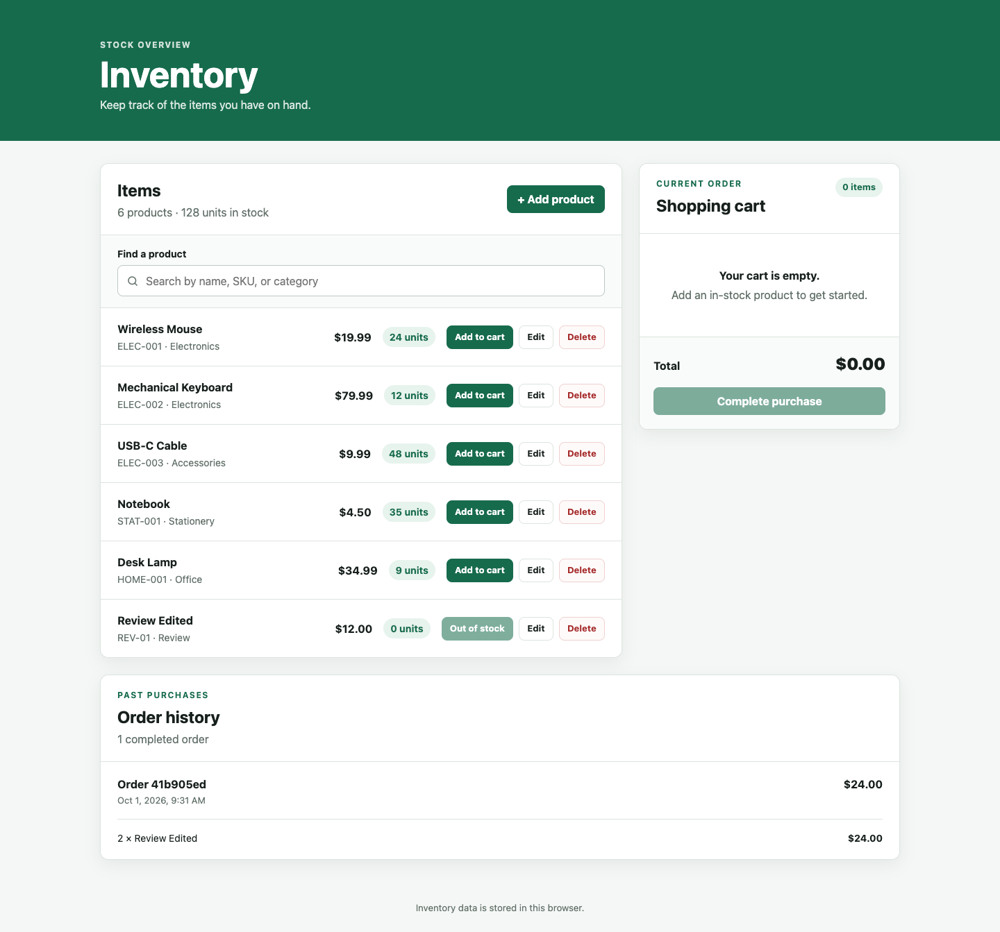
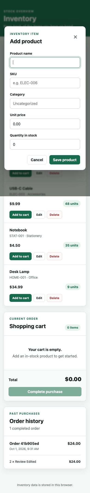

# Inventory website

A lightweight inventory website built with HTML5, CSS, and vanilla JavaScript. It runs entirely in the browser and uses `localStorage` as its data store.

Users can view stock totals, search by product name, SKU, or category, and add, edit, or delete products from the inventory. Products can also be added to a shopping cart, where quantities can be changed, items removed, and the order total reviewed. Completing a purchase deducts the bought quantities from stock, clears the cart, and adds a permanent snapshot to the on-page order history. All changes are saved in the current browser.

## Screenshots

Click any screenshot to open the [live app](https://axionomicai.github.io/AxBenchmark/openai-cloud-gpt-5.6-sol-medium/).

<a href="https://axionomicai.github.io/AxBenchmark/openai-cloud-gpt-5.6-sol-medium/"></a>

<a href="https://axionomicai.github.io/AxBenchmark/openai-cloud-gpt-5.6-sol-medium/"></a>
<a href="https://axionomicai.github.io/AxBenchmark/openai-cloud-gpt-5.6-sol-medium/"></a>
<a href="https://axionomicai.github.io/AxBenchmark/openai-cloud-gpt-5.6-sol-medium/"></a>
<a href="https://axionomicai.github.io/AxBenchmark/openai-cloud-gpt-5.6-sol-medium/"></a>
<a href="https://axionomicai.github.io/AxBenchmark/openai-cloud-gpt-5.6-sol-medium/"></a>

## Run locally

No build step or local server is required. Open `index.html` in a modern web browser.

## Project structure

```text
.
├── index.html       # Application markup
├── css/
│   └── styles.css   # Site styles
└── js/
    └── app.js       # Application behavior and storage access
```

## Data storage

Inventory data is scoped to the browser and profile where the site is opened. Clearing that browser's site data will remove the inventory.

On first run, the application saves five sample products under the `inventory.items` localStorage key. Each product has an `id`, `name`, `sku`, `category`, non-negative integer `stock`, and USD `price` value. Previously saved sample products receive their sample price automatically; other existing products without a price remain compatible and display as $0.00.

The cart is saved separately under the `inventory.cart` key. It stores product IDs and quantities; current names, prices, and stock limits always come from the inventory. Cart entries are removed or reduced automatically when their product is deleted, out of stock, or has less stock than the saved quantity.

Completed purchases are saved under `inventory.orders`. Each order records its completion time, total, and a snapshot of product names, SKUs, prices, and quantities, so its history remains accurate if the inventory changes later. Checkout revalidates the cart against current stock before saving.

The browser console can access the data layers through `InventoryStore`, `CartStore`, and `OrderStore`. Calling `OrderStore.checkout()` completes the current cart programmatically.
