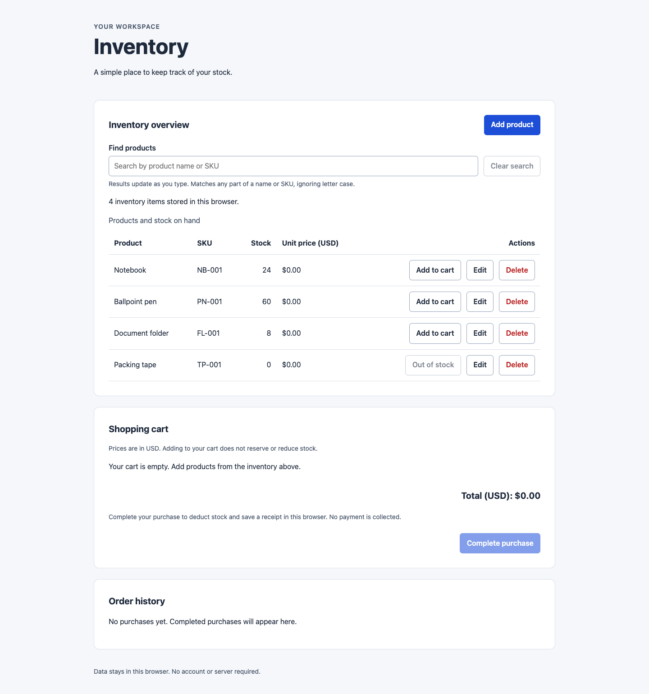
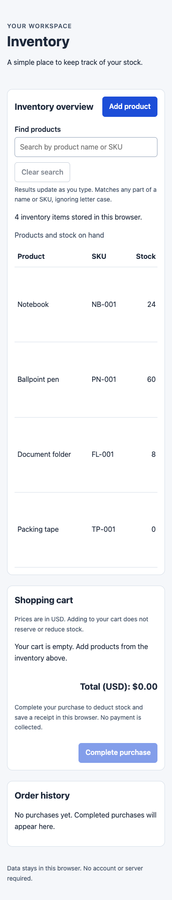
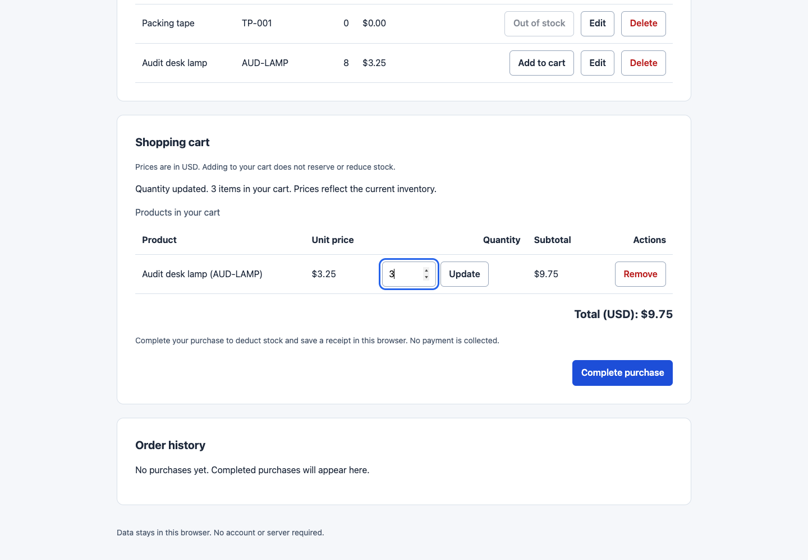
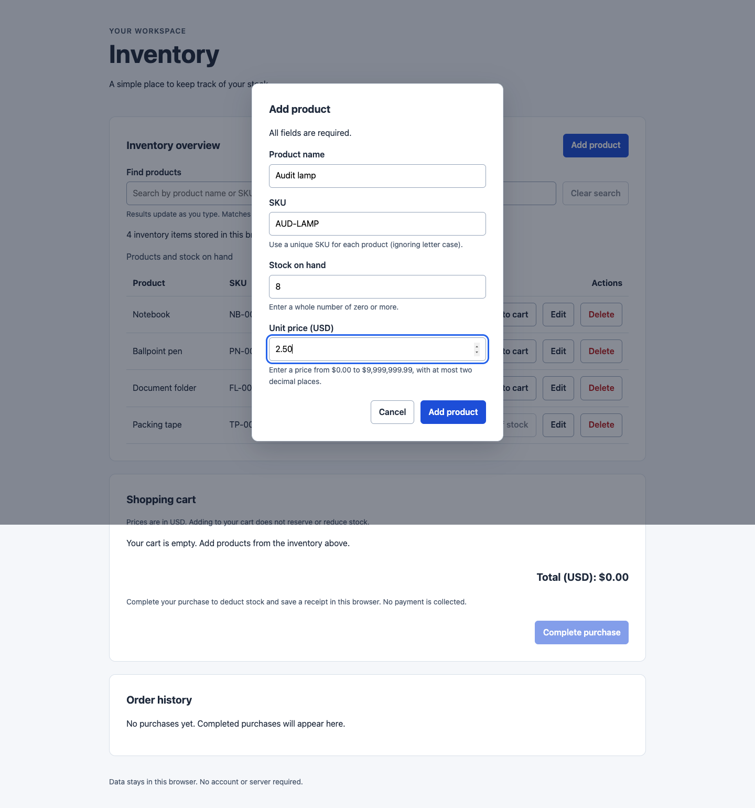
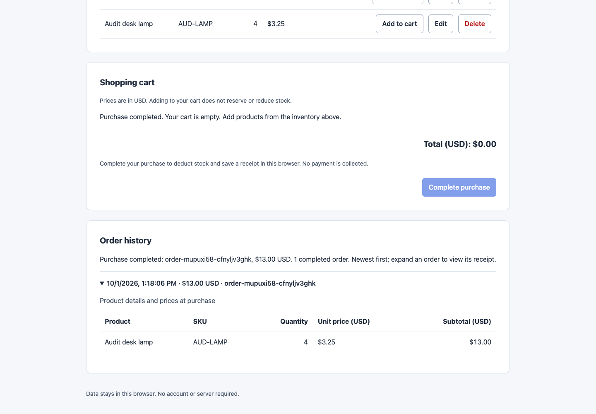
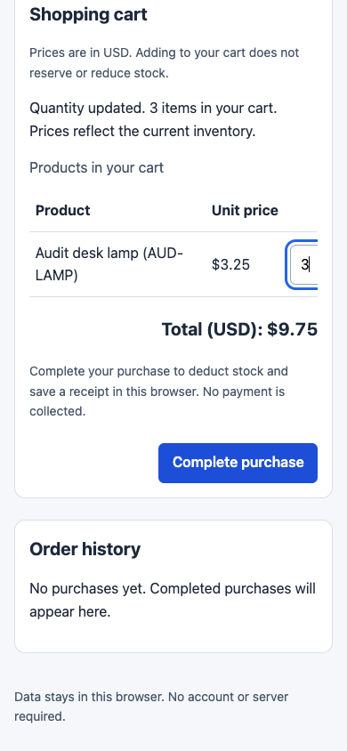
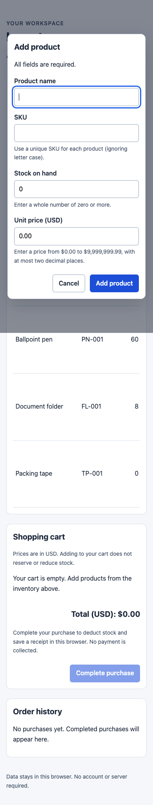
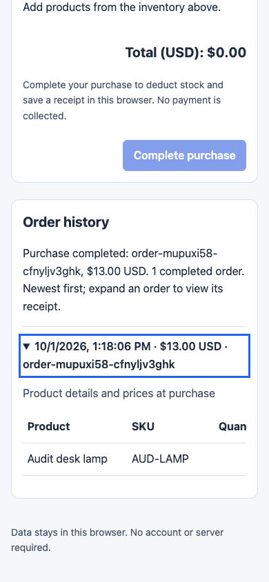

# Inventory website

A browser-based inventory website built with HTML5, CSS, and vanilla JavaScript.
No frameworks, libraries, backend, package installation, or build step are required.

## Screenshots

Click any screenshot to open the [live app](https://axionomicai.github.io/AxBenchmark/openai-cloud-gpt-6-astra-high/).

<a href="https://axionomicai.github.io/AxBenchmark/openai-cloud-gpt-6-astra-high/"></a>

<a href="https://axionomicai.github.io/AxBenchmark/openai-cloud-gpt-6-astra-high/"></a>
<a href="https://axionomicai.github.io/AxBenchmark/openai-cloud-gpt-6-astra-high/"></a>
<a href="https://axionomicai.github.io/AxBenchmark/openai-cloud-gpt-6-astra-high/"></a>
<a href="https://axionomicai.github.io/AxBenchmark/openai-cloud-gpt-6-astra-high/"></a>
<a href="https://axionomicai.github.io/AxBenchmark/openai-cloud-gpt-6-astra-high/"></a>
<a href="https://axionomicai.github.io/AxBenchmark/openai-cloud-gpt-6-astra-high/"></a>
<a href="https://axionomicai.github.io/AxBenchmark/openai-cloud-gpt-6-astra-high/"></a>

## Run locally

Open `index.html` directly in a browser with JavaScript and localStorage enabled.
The page and its assets work offline; no development server is needed.

## Project structure

```text
index.html       Semantic page structure and script entry points
css/styles.css   Responsive base styling
js/storage.js    Product/cart/order validation and atomic localStorage checkout
js/app.js        Inventory, shopping cart, checkout, and receipt interactions
tests/storage.test.cjs  Dependency-free data-layer tests (Node.js)
tests/browser.test.cjs  Real Chrome user-workflow regression tests (Playwright)
```

## Current scope

The inventory overview displays products, SKUs, and stock counts. On first run,
four sample products are saved, including one with zero stock.

- Select **Add product**, enter a name, unique SKU, stock count, and USD unit price, then save.
- Select **Edit** on a product to change its name, SKU, stock count, or price.
- Select **Delete** on a product and confirm to permanently remove it.
- Use **Cancel** or Escape to close a dialog without saving changes.
- Type in **Find products** to instantly search any part of a product name or SKU.
  Matching ignores letter case and leading/trailing search spaces. Results include
  stock counts, including zero stock, and show how many products match.
- Select **Clear search** (or empty the field) to show all products again. A search
  with no matches displays a message with guidance to change or clear the search.

The current search stays active while adding, editing, or deleting products;
results update after each successful save. Products that no longer match disappear
from the results. Search only changes the view and never alters saved inventory.
Reloading the page starts with all products visible.

## Shopping cart

- Select **Add to cart** on an inventory product. Repeated additions increase its
  quantity in the same cart row. Out-of-stock products cannot be added.
- Enter a positive whole quantity and select **Update** (or press Enter). The
  quantity cannot exceed current stock. Select **Remove** to delete a cart row.
- Unapplied quantity drafts survive other cart and inventory actions in the same
  page. They do not affect saved quantities or totals until **Update** succeeds;
  reloading discards drafts.
- Unit prices, line subtotals, and the USD total appear below the inventory.
  Cart changes save immediately and survive reloads, including an empty cart.
  Search does not hide or remove cart contents. Adding to the cart does not
  reserve or reduce stock; stock is deducted when you complete a purchase.

Existing products and samples start at $0.00; use **Edit** to set their prices.
Prices accept up to two decimal places, from $0.00 through $9,999,999.99. They are
also accepted without a leading zero (for example, `.50` means $0.50). Prices are
stored in whole cents, and totals use exact integer arithmetic. The cart uses
current inventory names and prices, so editing a product updates its cart row.
If stock drops below a cart quantity, a warning asks you to reduce or remove it;
the requested quantity remains saved and included in the total. Deleted products
remain visible as unavailable cart rows until removed and are excluded from the
total. These changes never silently discard your saved quantities.

Failed cart saves display an error and leave saved quantities and totals unchanged;
quantity drafts remain available to retry. Invalid saved data is preserved. Before
the first purchase, invalid cart data disables cart controls while inventory
editing remains available. After migration, invalid consolidated data disables
all changes (see Data storage below).

Names and SKUs are trimmed and must not be blank. SKUs are unique ignoring letter
case. Stock must be a whole number from 0 through 9007199254740991. Changes are
saved immediately to localStorage and appear in the table only after a successful
save. Failed saves show an error and keep the form open with your input intact so
you can retry. Deleting every product leaves an empty inventory, even after reload.

## Checkout and order history

1. Add products, set their quantities with **Update**, and review the USD total.
2. Select **Complete purchase**. This deducts the purchased quantities from stock,
   clears the cart, and records an order together. No payment is collected.
3. The newest receipt opens in **Order history**. Expand any order to see its ID,
   local date/time, product names and SKUs, quantities, purchase-time unit prices,
   subtotals, and total. Orders survive reloads; editing or deleting products later
   does not change their receipts.

Checkout is disabled for an empty cart, deleted products, insufficient stock, or
unavailable saved data. Unsaved quantity drafts must be applied with **Update**.
The purchase rechecks saved inventory and cart data; if either changed since the
page loaded, reload and review before purchasing. A failed save leaves stock,
cart, and order history unchanged and displays an error so you can retry.
A repeated submission cannot purchase the already-cleared cart again. Free
products are allowed, and totals remain exact even above JavaScript's safe
integer range.

Use one active window for changes. The stale-data check catches earlier edits in
other windows before inventory edits, cart changes, and checkout can overwrite
them. Reload and review when prompted. localStorage does not provide locking across simultaneously
writing tabs. This is a local inventory demo, not a payment or multi-user system.

## Data storage

Before the first purchase, inventory is a JSON array in localStorage under
`inventory.items.v1`. Each product has these required fields:

| Field | Value |
| --- | --- |
| `id` | Unique, stable, non-empty trimmed string |
| `name` | Non-empty trimmed product name |
| `sku` | Non-empty trimmed SKU, unique ignoring case |
| `stock` | Non-negative safe integer; zero means out of stock |
| `priceCents` | Integer from 0 through 999999999; optional for older data, where omitted means $0.00 |

Before the first purchase, cart data is a JSON array under `inventory.cart.v1`.
Each entry contains a unique `productId` referencing an inventory product and a
positive safe-integer `quantity`.
Product details are read from inventory rather than duplicated in cart storage.

The first successful purchase migrates the current products and cart to a single
JSON object under `inventory.state.v2`, containing `version: 2`, `items`, `cart`,
and `orders`. All subsequent inventory and cart edits use this object. One
localStorage write commits a complete purchase, so storage failure cannot save
only part of an order. The old keys remain as untouched backups and are ignored
once the new key exists. Do not edit the legacy keys to change current data.
Malformed consolidated data blocks loading and changes; it is never silently
replaced or restored from the older backups.

Each order has a unique `id`, an ISO UTC `createdAt`, `currency: "USD"`, `lines`,
and `totalCents`. Each line snapshots `productId`, `name`, `sku`, `quantity`,
`unitPriceCents`, and `subtotalCents`. Unit prices and quantities are integers;
subtotals and order totals are decimal strings of whole cents so JSON preserves
large exact totals. Orders are stored oldest first and displayed newest first.

The classic script exposes `window.InventoryStorage`:

- `initializeItems()` saves samples only if the storage key is absent, then returns
  the saved products. A saved empty inventory stays empty, including after migration.
- `loadItems()` returns validated products (or an empty array when the key is
  absent). Returned objects can be edited without changing saved data.
- `saveItems(items, expectedItems?)` validates and persists the complete array. Call it explicitly
  to save changes; it throws on invalid products or failed writes.
  Pass the previously loaded inventory to reject a stale edit without writing.
- `loadCart()` returns validated cart entries, or an empty array if no cart is saved.
- `saveCart(cart, expectedCart?, expectedItems?)` validates and persists all cart
  entries, including an empty array. Optional previously loaded cart/inventory
  snapshots reject stale changes. The UI supplies these snapshots on every save.
- `loadOrders()` returns validated purchase receipts, or an empty array before checkout.
- `checkout(expectedItems, expectedCart)` compares the caller's displayed data with
  saved data, validates stock, and commits the purchase. Returns the new `items`,
  empty `cart`, `orders`, and new `order`; throws without saving on failure. Pass
  arrays from `loadItems()` and `loadCart()` that match the user's reviewed cart.

For example, from the browser console:

```js
const items = InventoryStorage.loadItems();
items[0].stock = 10; // When at least one product exists
InventoryStorage.saveItems(items);
location.reload(); // Refresh the displayed inventory
```

Storage errors are surfaced on the page during initialization and saves. Invalid
saved data is not silently overwritten; editing controls stay disabled if loading
fails. Write failures, including storage being disabled or full, leave the displayed
and saved inventory unchanged.

Data belongs to the current browser profile and is not synced or backed up.
Clearing browser data removes the inventory, cart, and order history. Browser
behavior for localStorage on `file://` URLs varies; use the same browser and file
location consistently.

## Development

Edit the source files and reload `index.html`. Keep assets local and use classic
scripts rather than JavaScript modules or fetched local files so direct file
opening continues to work.

Run `node --test tests/storage.test.cjs` for first-run seeding, reload persistence,
empty inventory preservation, prices, cart persistence, checkout migration,
stock deduction, receipt snapshots, stale/repeated purchases, exact totals,
corrupt data, and atomic storage failure checks. Node.js is
only needed to run these development tests, not to use the website.

Run the automated browser suite with Node.js, Google Chrome, and a development-only
Playwright installation outside the project:

```sh
inventory_test_tools=$(mktemp -d)
npm install --prefix "$inventory_test_tools" playwright
NODE_PATH="$inventory_test_tools/node_modules" node --test tests/browser.test.cjs tests/storage.test.cjs
# Optional: show the Chrome window while running the browser suite.
HEADED=1 NODE_PATH="$inventory_test_tools/node_modules" node --test tests/browser.test.cjs
```

The suite opens `index.html` via `file://` in fresh, isolated browser contexts.
It never uses your normal browser profile. It covers CRUD, validation, search,
cart drafts/totals, checkout, receipt history, reloads, failed/blocked storage,
corrupt data, stale tabs, keyboard navigation, and 320–1280px layouts. No server,
application dependencies, or CI/CD are needed. See [the Task 7 test report](tests/TEST_REPORT.md).

For browser regression checks, open `index.html` directly in a fresh browser profile:

1. Confirm the four sample products appear. Add a product with stock 0, then reload
   and confirm it remains. Names containing HTML markup should display as text.
2. Attempt blank/whitespace names and SKUs, an existing SKU with different letter
   case, and blank, negative, fractional, or unsafe stock values. None should save.
3. Edit all four fields, save, and reload. Verify changes persist. Cancel another
   edit and confirm the product stays unchanged.
4. Cancel a deletion, then confirm it. Delete the remaining products and reload;
   the inventory should stay empty. Add a product from this empty state.
5. Check keyboard focus, Escape and Cancel in both dialogs, and a narrow viewport.
6. To simulate storage write failures in DevTools, temporarily replace
   `Storage.prototype.setItem` with a function that throws. Attempt an edit and
   deletion: errors should appear, drafts should remain available, and inventory
   should not change. Restore the original function before retrying or reload.
7. Search for `  nOtE  `, `nb-`, and `TP-001`; verify the matching names/SKUs,
   counts, and zero stock. Search for an unknown SKU, then clear the search; all
   products should return. Blank or whitespace-only searches show all products.
8. With a search active, add matching and nonmatching products, edit a result so
   it stops matching, and delete a result. Confirm counts update, focus remains
   usable, and clearing the search reveals every remaining product. Reload to
   verify the complete inventory was saved, including hidden products.
9. Set two product prices to $0.10 and $0.20. Add the first product twice and the
   second once: expect two cart rows and $0.40. Update the first quantity to 3:
   expect $0.50. Reload and verify quantities, prices, and total persist.
10. Try blank, zero, negative, fractional, and above-stock cart quantities. None
    should save. At the stock limit, adding more is disabled. Reduce the quantity
    and confirm adding is enabled again. Out-of-stock products stay disabled.
11. Change a cart product's price and name, lower its stock below the cart quantity,
    and delete it. Verify updated details, the low-stock warning, and the deleted
    product warning/exclusion from totals. Remove all cart rows and reload; the
    cart should stay empty with a $0.00 total.
12. Simulate storage write failures as in step 6, then add, update, and remove cart
    items. Confirm saved cart data and totals remain unchanged. Restore storage
    writes and retry. In an isolated browser profile before any purchase, save
    malformed JSON under `inventory.cart.v1` and reload: cart data must stay intact
    and an error appear.
13. Check cart quantity labels, Enter to update, keyboard focus after adding,
    updating, and removing, and horizontal table scrolling on narrow screens.
14. Set two products to $0.10 and $0.20. Buy 3 of the first and 2 of the second:
    expect a $0.70 receipt, each stock count reduced by the purchased quantity,
    an empty cart, and disabled checkout. Reload; verify all three persist.
15. Rename/reprice a purchased product, then delete it. The original receipt must
    retain its name, SKU, quantity, prices, and total. Complete another purchase;
    confirm its receipt appears first with a different order ID.
16. Lower stock below a cart quantity or delete a cart product: checkout must be
    disabled. Fix/remove the problem line. Type a new quantity without **Update**
    and try checkout: it should ask you to apply the draft before buying.
17. Simulate failed storage writes as in step 6 during checkout, both before and
    after the first successful purchase. Stock, cart, and order history must stay
    unchanged; restore writes and retry to save exactly one order. Double-click
    **Complete purchase** and verify stock is deducted only once.
18. Change saved stock or prices through the console after loading the cart, then
    try checkout. It should ask you to reload and review. In an isolated profile,
    corrupt `inventory.state.v2` and reload: preserve the invalid value and show
    errors, with checkout disabled.
19. Verify the receipt opens and receives keyboard focus after checkout, collapses
    and expands with the keyboard, displays markup in product names as plain text,
    and scrolls horizontally inside its panel on narrow screens.

No CI/CD is configured.
