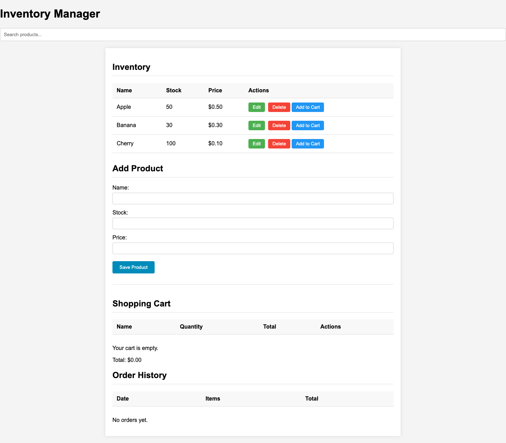
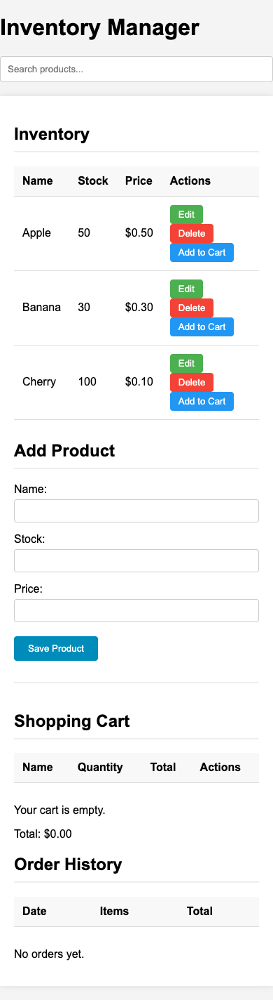
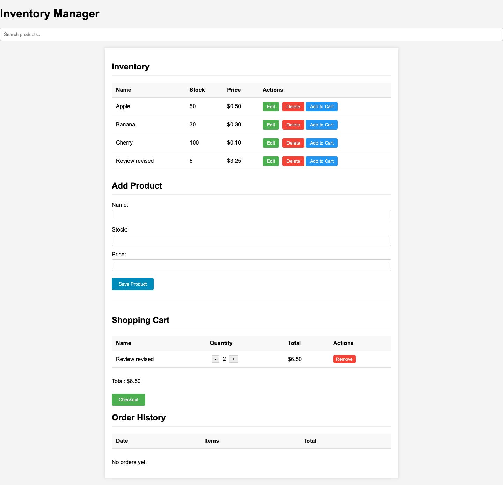

# Inventory Manager

A simple inventory management website built with HTML5 and vanilla JavaScript.

## Screenshots

Click any screenshot to open the [live app](https://axionomicai.github.io/AxBenchmark_Oct_26_v1/ryzen7-8745hs-gemma4-26b/).

## Features
- Add, edit, and delete inventory items.
- Shopping cart with checkout functionality.
- Order history tracking.
- Data is persisted in the browser's `localStorage`.
- No frameworks or libraries used.

## How to use
Simply open `index.html` in any modern web browser.
