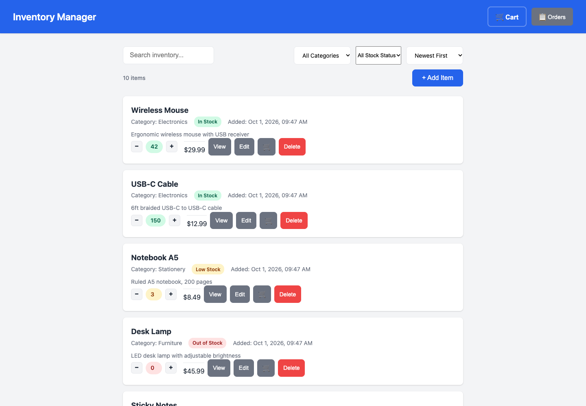
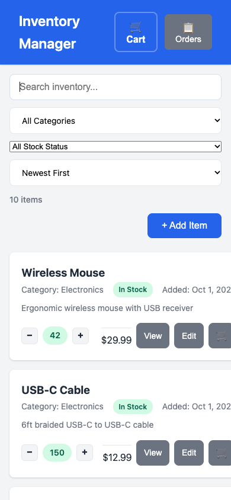
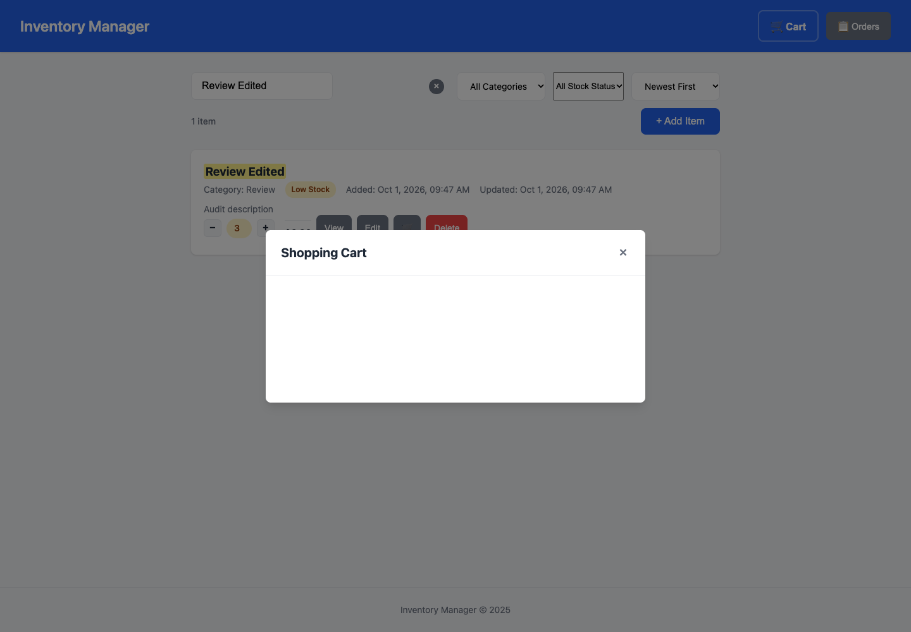
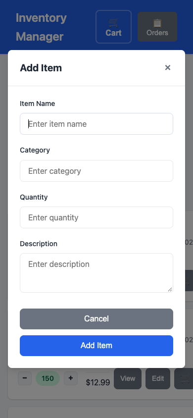

# Inventory Website

A simple inventory management website built with HTML5 and vanilla JavaScript. All data is persisted in the browser's `localStorage`.

## Screenshots

Click any screenshot to open the [live app](https://axionomicai.github.io/AxBenchmark_Oct_26_v1/ryzen7-8745hs-qwen36-35b/).

<a href="https://axionomicai.github.io/AxBenchmark_Oct_26_v1/ryzen7-8745hs-qwen36-35b/"></a>

<a href="https://axionomicai.github.io/AxBenchmark_Oct_26_v1/ryzen7-8745hs-qwen36-35b/"></a>
<a href="https://axionomicai.github.io/AxBenchmark_Oct_26_v1/ryzen7-8745hs-qwen36-35b/"></a>
<a href="https://axionomicai.github.io/AxBenchmark_Oct_26_v1/ryzen7-8745hs-qwen36-35b/"></a>

## Features

- Add, edit, and delete inventory items
- Search, filter, and sort items
- Shopping cart with quantity management
- Checkout process with stock deduction
- Order history tracking
- Data persistence via `localStorage`
- Responsive design

## Getting Started

Simply open `index.html` in any modern web browser. No server or build step required.

### Prerequisites

- A modern web browser (Chrome, Firefox, Safari, Edge)

### Usage

1. Open `index.html` in your browser
2. Add your first inventory item using the "Add Item" button
3. Manage your inventory by editing or deleting items as needed
4. Use the search bar to quickly find items
5. Add items to your cart and click the cart icon to review
6. Complete checkout to deduct stock and record the order
7. View your order history via the "Orders" button in the header
8. All data is automatically saved to your browser's `localStorage`

## Project Structure

```
├── index.html          # Main HTML file
├── css/
│   └── styles.css      # Stylesheet
├── js/
│   └── app.js          # Application logic
└── README.md           # This file
```

## Tech Stack

- **HTML5** - Markup
- **CSS3** - Styling
- **Vanilla JavaScript** - Application logic
- **localStorage** - Data persistence

## License

MIT
