# AxBenchmark TUI navigation graph · M01–M18

Terminal UI for [SPEC.md](../../SPEC.md), built with Python **Textual**. This set covers
[M01 · Template library and immutable identity](../../modules/01-template-library-identity.md),
[M02 · Retained results and comparability](../../modules/02-retained-results-comparability.md),
[M03 · Environment readiness](../../modules/03-environment-readiness.md),
[M04 · Model catalog](../../modules/04-model-catalog.md),
[M05 · Headless execution and isolation](../../modules/05-harness-execution-isolation.md) and
[M06 · Weighting, eligibility and rankings](../../modules/06-scoring-rankings.md),
[M07 · Run configuration and launch validation](../../modules/07-run-configuration.md),
[M08 · Acceptance verification and evidence](../../modules/08-verification-evidence.md) and
[M09 · Default seven-task inventory benchmark](../../modules/09-default-inventory-benchmark.md),
[M10 · Execution measurements and cost accounting](../../modules/10-measurements-cost.md),
[M11 · Run scheduling and persistent lifecycle](../../modules/11-run-orchestration.md),
[M12 · Independent quality judging](../../modules/12-quality-judging.md),
[M13 · Standalone interactive HTML report](../../modules/13-standalone-html-report.md) and
[M14 · Command-line and unattended access](../../modules/14-command-line-interface.md),
[M15 · Terminal user interface](../../modules/15-terminal-interface.md),
[M16 · Custom template planning and baseline capture](../../modules/16-custom-template-planning.md),
[M17 · Portable ZIP exchange and validation](../../modules/17-zip-exchange.md) and
[M18 · Optional CPU and GPU monitoring](../../modules/18-hardware-monitoring.md), plus the shared design system.
Each module has its own canvas page; compact frames share one page. M13 also includes a low-fidelity wireframe of the
generated HTML file, and M14 frames are plain terminal output on the same character grid.

Node IDs match the artboards in the [wireframe preview](preview/preview.html). Each frame is a fixed character grid at
**120×40** (reference) and, for primary screens, **80×24** (compact reflow, suffix `-80x24`). The design is proposed,
not implemented. Example data is fictional, except the inventory task titles and prompts, which are quoted from
[`benchmark/tasks/`](../../../benchmark/tasks/).

## Design system in one screen

| Rule | Decision |
|---|---|
| Grid | One cell = 1ch × 1 line, JetBrains Mono. Nothing between cells; panes sized in `fr` or fixed cells. |
| Color | Grayscale plus one accent, named only by Textual variables: `$background`, `$surface`, `$panel`, `$foreground`, `$primary` (= `$accent` in low fidelity). `$success`/`$warning`/`$error` stay grayscale and are carried by ✓ ▲ ✗ plus wording. |
| Text effects | bold, dim, italic, underline, reverse only. |
| Borders | `─ │ ┌ ┐ └ ┘ ├ ┤` for panes; `╭ ╮ ╰ ╯` (`border: round $primary`) only for ModalScreen dialogs. Widgets draw their own borders, so borders never join. |
| Focus | Tab follows DOM order. Panes: `:focus-within` → `border: solid $primary`. DataTable/Tree cursor `$primary` when focused, blurred cursor otherwise. Buttons: reverse bold. Inputs: `$primary` tint and reverse caret. |
| Reflow | `App.on_resize` sets `Screen.-compact` below 100 columns or 30 rows. Compact hides secondary panes (`#detail-pane`, `#revisions-pane`) and shows a summary strip or a key. |
| Keys | Every screen has a Footer with its bindings. Unavailable bindings are dimmed through `check_action`, never hidden. Every binding is also a command-palette entry. |
| States | Every data widget sits in a `ContentSwitcher`: `#x`, `#x-loading`, `#x-empty`, `#x-error`. |
| Modals | `ModalScreen[T]`, `align: center middle`, `background: $background 60%`, fixed dialog width (72–86 cells, `max-width: 100%`), `padding: 1 2`, actions right-aligned, Esc dismisses without changes. |
| Identity | Full SHA-256 is 64 cells. It appears in full wherever identity is the subject; elsewhere as 8 cells or `first16…last8`. |

The `DesignSystem` artboard shows the tokens, text effects, a rendered widget catalogue, glyphs, file layout and a TCSS
foundation. Every screen artboard has a legend listing its widget tree, ids/classes with TCSS rules, key bindings and
focus order. Inside a frame, **tab · next focus** cycles the focused widget and **show widget outlines** draws each
widget's bounds labelled with its Textual class and selector.

## 1 · Browse the library

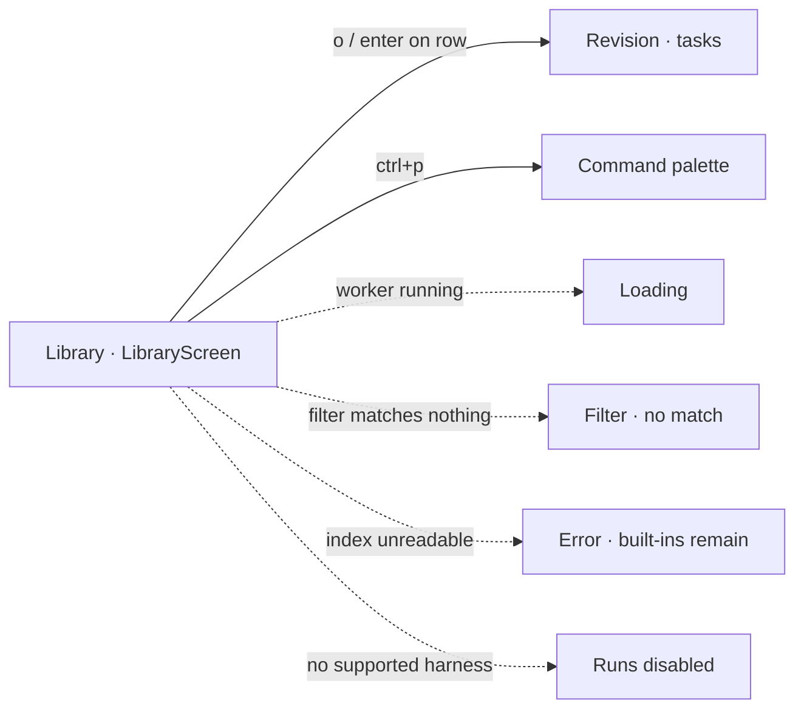

- The built-in seven-task inventory benchmark r1 is the default selection and runs without a planner call.
- Rows show name, project type, source, task count, revision, SHA-256, saved configurations and results; the description is in the detail pane (wide) or summary strip (compact).
- `#env-bar` shows harness readiness and the active run, reattachable with `ctrl+r`.
- With no harness: planning and runs are dimmed; browsing, ZIP exchange and saved results stay available.

## 2 · Inspect a template revision

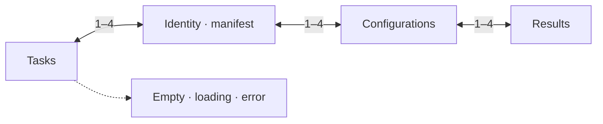

- `TemplateScreen` is per revision. The `#revisions` tree (hidden when compact; `r` opens a picker) switches revisions; lineage is navigation only.
- Identity lists exactly what the hash covers and, separately, what it does not (harness/model/effort, environment mode, concurrency, judge, pricing, weights, machine, display name, ZIP order).
- Configurations are scoped to the revision. Results list only runs bound to this exact SHA-256; historical README runs stay preserved and unlinked.

## 3 · Create a template

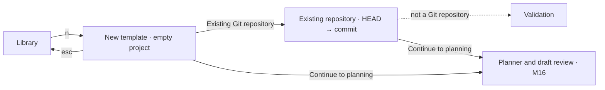

- Multiline prompt, frontend/backend/fullstack, empty project or committed repository revision.
- `HEAD` resolves immediately to a commit the template pins. Uncommitted changes are counted and excluded; the repository is only read.

## 4 · Duplicate and revise

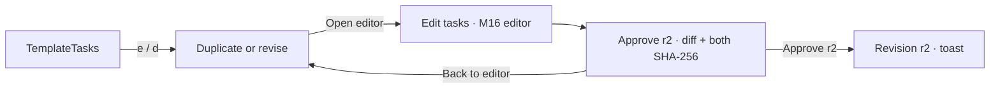

- Any change to tasks, order, checks, baseline or rubric produces a new revision and digest. Renaming alone does not.
- r1 stays approved with its configurations and results. Copying configurations to r2 is an explicit checkbox.

## 5 · Exchange templates

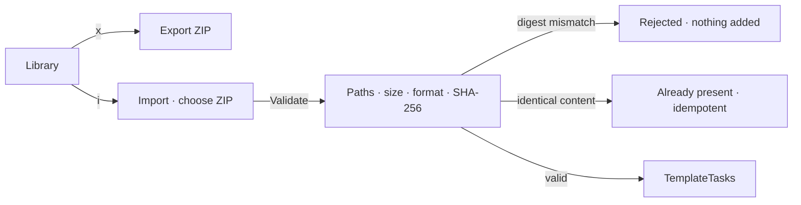

- Import is a data operation: no scripts, installs or model calls. The SHA-256 is recomputed from extracted files before registration. Package validation details belong to M17.
- Mismatches show the declared and computed identities in full (stacked on 80 columns).

## 6 · Launch identity check

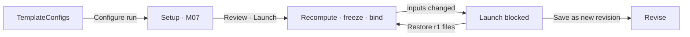

- The template, the run configuration and the original weights are frozen separately before launch.
- A run whose inputs changed never claims the approved identity and is never silently relabelled.

## 7 · M02 · Compare retained results

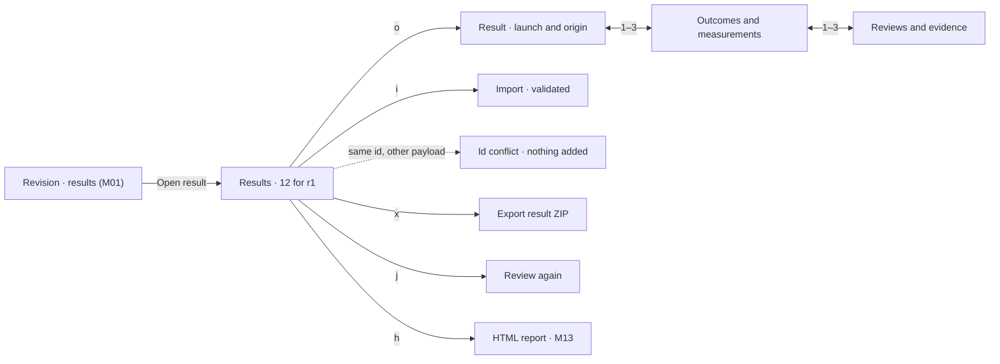

- Only results with r1's SHA-256 are listed; filters cover machine, configuration, environment policy, concurrency and judge.
- Imported results show ↓ and their machine, and are labelled validated, not certified.
- Process outcome, acceptance checks (✓ ✗ ? ○) and grades are separate columns. Unverified means the check could not run.
- Re-review is explicit, keeps the original review and records judging cost separately. Reports always show their path.

## 8 · M03 · Environment readiness

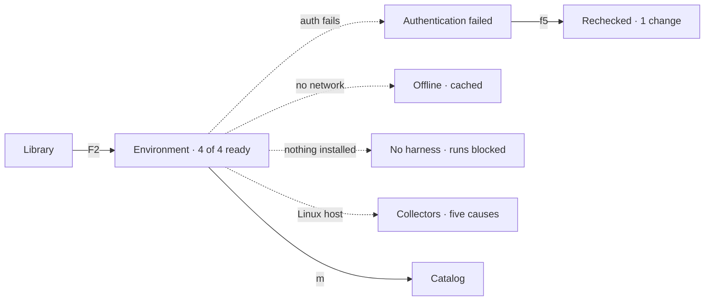

- Each harness reports executable, version, authentication, models and headless probe separately. Found is not authenticated; offline is not rejected.
- Collector failures name one of five causes (permission, driver, collector failure, unsupported hardware, missing tool) and never block a run.
- Recheck repeats the checks; it never installs tools or changes permissions.

## 9 · M04 · Models and efforts

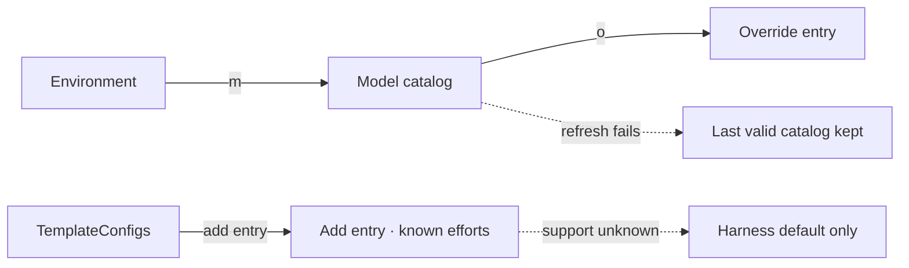

- Entries are keyed by harness, version, provider or endpoint, account and model. Each value shows its source: override › discovered › bundled.
- Unknown stays unknown. Unknown effort support offers only harness default, which passes no effort argument.

## 10 · M05 · Headless execution and isolation

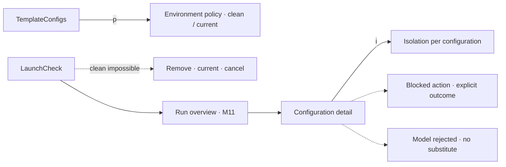

- One process and conversation per task; state carries only through workspace files.
- Requested and effective settings are side by side; an effort the harness does not expose stays unverified.
- Each configuration gets its own baseline copy, workspace, ports, test data and browser context.

## 11 · M06 · Rankings and weights

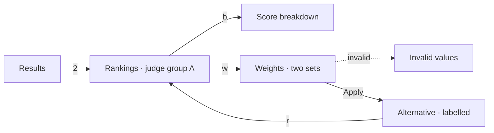

- All scores are computed in `src/results-data.mjs` from the 12 results shown in M02, using the M06 formulas. The M06 acceptance fixture (A 76⅔, B 83⅓, B alone 100) reproduces with the same code.
- With verified $0 as the minimum cost, verified $0 entries get the full cost points and positive costs get 0 (R101). In the example this puts the local Pi run first.
- Failed and excluded entries stay in the full table with their reasons. Judge groups never merge.

## 12 · M07 · Setup and launch

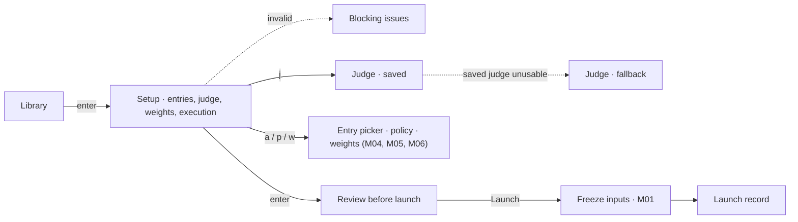

- Configurations are YAML per revision and pin its SHA-256; several entries per harness are allowed. The built-in benchmark reuses its tasks without a planner call.
- Judge preselection order: a valid saved judge, then the planner configuration, then the first usable entry. Each is checked against readiness; the judge is chosen independently of the entries.
- Presets resolve into actual weights at launch. Template binding, resolved configuration and original weights are frozen as separate records, with machine and catalog metadata and no credentials.

## 13 · M08 · Verification and evidence

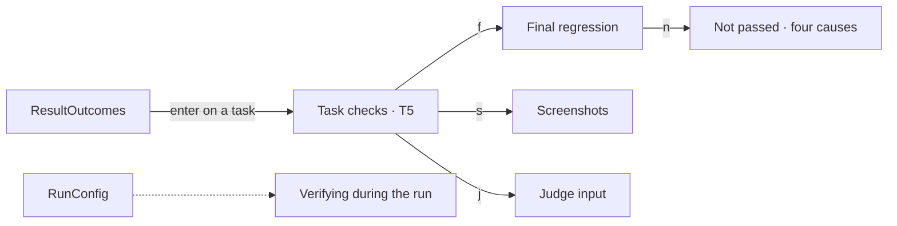

- Checks run on a disposable copy of the task snapshot, with tooling outside the workspace and no repairs. Each is passed, failed or unverified.
- Not passed has four causes that stay distinct: application failure, missing prerequisite, verifier error, not run.
- The final regression runs every check on the delivered artifact; both columns are kept. The judge gets the evidence without the measured statistics.
- The 21 check titles live in `src/checks-data.mjs` and are shared with the M01 task tab.

## 14 · M09 · Default inventory benchmark

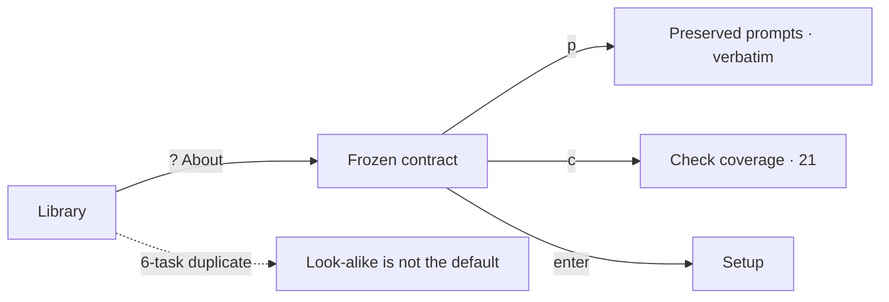

- The prompts are read from `benchmark/tasks/` when the wireframes are built, so the frame always shows the preserved text.
- Choices the prompts leave open (product attributes, lookup matching, currency, stock conflicts, order structure) are listed and not checked.

## 15 · M10 · Measurements and cost

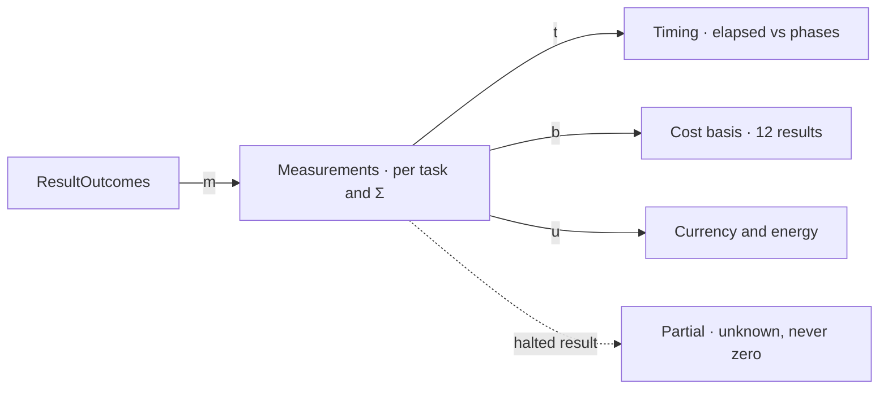

- Every task and the configuration total show wall time, input, cached, output and reasoning tokens, cost, checks and status, each with source and coverage. Reasoning ⊂ output and cached ⊂ input are shown apart and never added.
- Benchmark elapsed is the sum of task processes; queue, planning, verification and judging are separate, and the experiment duration is clock time.
- Reported cost wins; otherwise an API-equivalent estimate from known usage and recorded rates, always labelled. Subscriptions and missing prices are never $0. COP needs a supplied, recorded rate; energy keeps its measured scope and is never split across concurrent configurations.
- Numbers agree with `src/results-data.mjs` and the M02 Outcomes tab (R-0928a-3, R-0925b-2, run 2026-09-28-a).

## 16 · M11 · Run orchestration

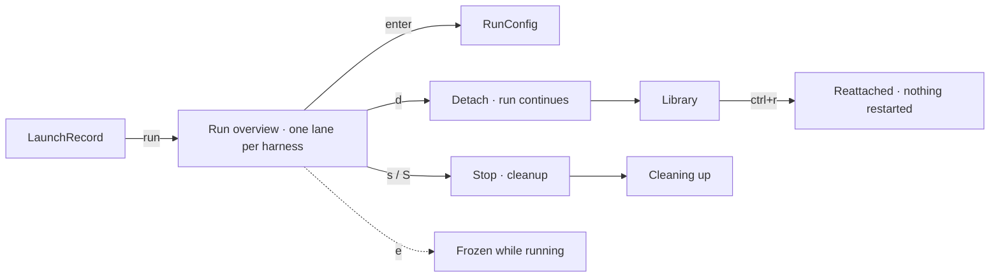

- Default: one configuration per harness at once, up to four; more entries of one harness queue in its lane (`RunQueued`). `--jobs 1` runs one at a time (`RunSequential`). Tasks are always sequential.
- `RunFailures`: an authentication failure halts only its configuration; a timeout or ordinary failure continues from the resulting workspace with no rerun; harness-internal retries are recorded.
- Detaching or closing only stops observing. Stop is the one action that ends work and it cleans up processes, services, browser contexts and ports.

## 17 · M12 · Quality judging

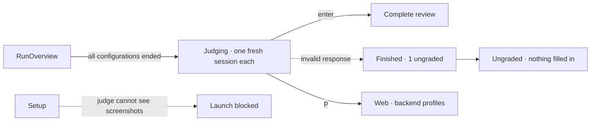

- Sequential reviews, anonymous labels, no cost/time/other reviews in the input, and the judge never repairs anything.
- A review needs a 0.5-step grade and evidence for every category plus the required comments; otherwise it stays ungraded and out of quality rankings.

## 18 · M13 · HTML report

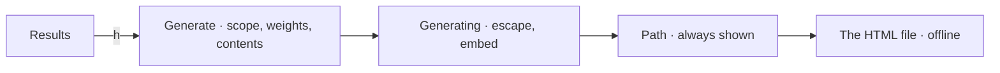

- `ReportPage` is a wireframe of the generated file: full SHA-256, filters, both weight sets with apply/reset/export, three top-five charts, the log-cost scatter, the stacked combined ranking, both tables, task evidence and hardware timelines. Its numbers come from `src/results-data.mjs`.

## 19 · M14 · Command line

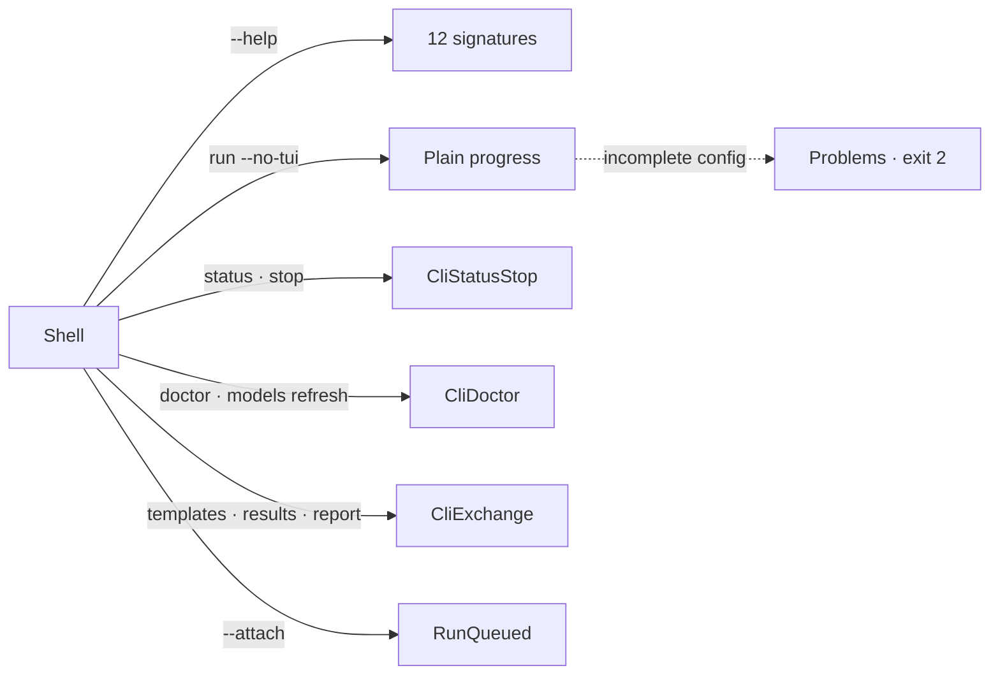

- Unattended runs validate and freeze like the TUI, print plain progress and never ask a question. Ctrl-C stops watching only.
- Exit codes on `CliHelp` are a proposal; the spec defines behaviour, not numbers.

## 20 · M15 · Terminal interface

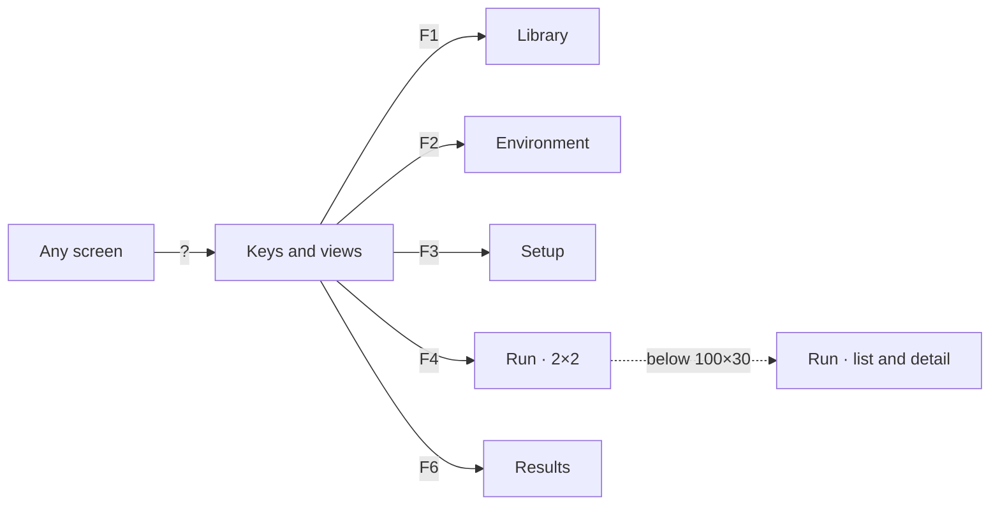

- The five views are the module screens; M15 adds the global keys, mouse rules and the small-terminal run layout. View keys are a proposal: F5 stays Recheck/Refresh.
- From 100×30 the run shows four panels in a 2×2 grid; below that, a configuration list with the selected one's tasks and searchable log. No tmux.

## 21 · M16 · Custom template planning

```mermaid
flowchart LR
    NewTemplateRepo -->|Continue to planning| PlannerPicker["Planner · fallback order"]
    PlannerPicker --> PlanningProgress["Capture HEAD → a41f9c2 · plan"]
    PlanningProgress --> PlanReview["Draft · not approved"]
    PlanningProgress -.->|planner fails| PlanningFailed["Nothing saved"]
    PlanReview -->|4| PlanServices["Setup · start · stop"]
    PlanReview -->|e| PlanEdit["Edit a task"]
    PlanReview -->|r| PlanRegenerate["Regenerate"]
    PlanReview -->|a| PlanApprove["Approve r1 · SHA-256"]
    PlanApprove --> TemplateTasks
```

- Planner preselection: a valid previous choice, else the first usable of Claude Code, Codex, Grok, Pi with discovered defaults.
- The snapshot is the committed revision; uncommitted work is left out and the repository is never touched. Later runs and imports never resolve HEAD again.
- Seven tasks by default, the last one final verification and fixes. Generation is not approval; the approved r1 is the Library's “Billing service refactor”.

## 22 · M17 · ZIP exchange

```mermaid
flowchart LR
    Results -->|i| ResultPackage["Result package · contents and provenance"]
    ResultPackage --> ResultImport
    ResultPackage -.->|template differs| ResultMismatch["Expected vs received"]
    ResultMismatch --> ResultEmbedded["Own revision · atomic"]
    ImportTemplate -.->|unsafe paths or links| ImportUnsafe
    ImportTemplate -.->|missing content| ImportIncomplete
```

- Five ordered steps: safe boundary, definition, result compatibility, existing identities, registration. Any failure adds nothing; nothing runs, installs or calls a model.
- A relay machine never replaces a result's origin. Mismatched results can join only a separately validated embedded revision, never r1.

## 23 · M18 · Hardware monitoring

```mermaid
flowchart LR
    Setup -->|execution pane| MonitoringSettings["Automatic · off · 1 s"]
    MonitoringSettings -->|Guidance| CollectorGuide["Guidance · you run it"]
    CollectorGuide -->|f5| EnvironmentCollectors
    ResultOrigin -->|telemetry| Telemetry["One experiment · lab-linux-4090"]
    Telemetry -->|e| EnergyDetail["Counters, gaps, overlaps"]
    Telemetry -->|w| SequentialEnergy["Windows · background included"]
```

- Only confirmed metrics are collected; the rest name one of five causes. Nothing is installed or changed, and no sensor is required.
- Process trees are attributed per configuration; a separate model server is not, and cloud models are measured on the client only. Shared energy is never split across concurrent configurations.

## Files

- `index.html` redirects to `preview/preview.html`.
- `preview/` holds the generated canvas index `canvas.json`, one `.dc.html` per artboard and the flat `preview.html` (theme and size selectable). The canvas entry `Main.dc.html` is the navigation map. Suffixes: none = 120×40, `-80x24` = 80×24.
- `src/` is the generator: `node src/build.mjs`. `lib.mjs` is the character-grid renderer and Textual widget drawers (it throws when a footer or table does not fit its cells), `theme.mjs` the tokens and CSS, `screens.mjs` the M01 frames and copy, `boards.mjs` the M01 artboards and legends, `system.mjs` the design system, navigation map and widget-state matrix.
- M02–M09: `screens-results.mjs` (M02 and M06), `screens-readiness.mjs` (M03 and M04), `screens-execution.mjs` (M05), `screens-setup.mjs` (M07), `screens-verify.mjs` (M08), `screens-inventory.mjs` (M09), `checks-data.mjs` (the 21 checks), `results-data.mjs` (the shared result fixture and the M06 scoring contract) and `boards-modules.mjs` (their pages, groups and legends).
- M10–M18: `screens-measure.mjs` (M10), `screens-run.mjs` (M11), `screens-judging.mjs` (M12), `screens-report.mjs` (M13, including the report page and its CSS), `screens-cli.mjs` (M14), `screens-tui.mjs` (M15), `screens-planning.mjs` (M16), `screens-exchange.mjs` (M17), `screens-telemetry.mjs` (M18) and `boards-later.mjs` (their pages, groups and legends). A board whose only size is 80×24 (`RunListDetail`) sits on its module page.
- Add later modules by adding screen functions and a group with a `page` in `boards-later.mjs`; the design system, legends and canvas layout are shared.
