# AxBenchmark TUI navigation graph · M01–M18

Terminal UI for [SPEC.md](../../SPEC.md), built with Python **Textual**. This set covers
[M01 · Template library and immutable identity](../../modules/01-template-library-identity.md),
[M02 · Retained results and comparability](../../modules/02-retained-results-comparability.md),
[M03 · Environment readiness](../../modules/03-environment-readiness.md),
[M04 · Model catalog](../../modules/04-model-catalog.md),
[M05 · Headless execution and isolation](../../modules/05-harness-execution-isolation.md) and
[M06 · Weighting, eligibility and rankings](../../modules/06-scoring-rankings.md),
[M07 · Run configuration and launch validation](../../modules/07-run-configuration.md),
[M08 · Acceptance verification and evidence](../../modules/08-verification-evidence.md) and
[M09 · Default seven-task inventory benchmark](../../modules/09-default-inventory-benchmark.md),
[M10 · Execution measurements and cost accounting](../../modules/10-measurements-cost.md),
[M11 · Run scheduling and persistent lifecycle](../../modules/11-run-orchestration.md),
[M12 · Independent quality judging](../../modules/12-quality-judging.md),
[M13 · Standalone interactive HTML report](../../modules/13-standalone-html-report.md) and
[M14 · Command-line and unattended access](../../modules/14-command-line-interface.md),
[M15 · Terminal user interface](../../modules/15-terminal-interface.md),
[M16 · Custom template planning and baseline capture](../../modules/16-custom-template-planning.md),
[M17 · Portable ZIP exchange and validation](../../modules/17-zip-exchange.md) and
[M18 · Optional CPU and GPU monitoring](../../modules/18-hardware-monitoring.md), plus the shared design system.
Each module has its own canvas page; compact frames share one page. M13 also includes a low-fidelity wireframe of the
generated HTML file, and M14 frames are plain terminal output on the same character grid.

Node IDs match the artboards in the [wireframe preview](preview/preview.html). Each frame is a fixed character grid at
**120×40** (reference) and, for primary screens, **80×24** (compact reflow, suffix `-80x24`). The design is proposed,
not implemented. Example data is fictional, except the inventory task titles and prompts, which are quoted from
[`benchmark/tasks/`](../../../benchmark/tasks/).

## Design system in one screen

| Rule | Decision |
|---|---|
| Grid | One cell = 1ch × 1 line, JetBrains Mono. Nothing between cells; panes sized in `fr` or fixed cells. |
| Color | Grayscale plus one accent, named only by Textual variables: `$background`, `$surface`, `$panel`, `$foreground`, `$primary` (= `$accent` in low fidelity). `$success`/`$warning`/`$error` stay grayscale and are carried by ✓ ▲ ✗ plus wording. |
| Text effects | bold, dim, italic, underline, reverse only. |
| Borders | `─ │ ┌ ┐ └ ┘ ├ ┤` for panes; `╭ ╮ ╰ ╯` (`border: round $primary`) only for ModalScreen dialogs. Widgets draw their own borders, so borders never join. |
| Focus | Tab follows DOM order. Panes: `:focus-within` → `border: solid $primary`. DataTable/Tree cursor `$primary` when focused, blurred cursor otherwise. Buttons: reverse bold. Inputs: `$primary` tint and reverse caret. |
| Reflow | `App.on_resize` sets `Screen.-compact` below 100 columns or 30 rows. Compact hides secondary panes (`#detail-pane`, `#revisions-pane`) and shows a summary strip or a key. |
| Keys | Every screen has a Footer with its bindings. Unavailable bindings are dimmed through `check_action`, never hidden. Every binding is also a command-palette entry. |
| States | Every data widget sits in a `ContentSwitcher`: `#x`, `#x-loading`, `#x-empty`, `#x-error`. |
| Modals | `ModalScreen[T]`, `align: center middle`, `background: $background 60%`, fixed dialog width (72–112 cells, `max-width: 100%`), `padding: 1 2`, actions right-aligned, Esc dismisses without changes. |
| Shared dialogs | `ConfirmScreen` (`#confirm`, `#cancel`, `#ok`) for consent (Verify now), budget warnings (more than 5 trials) and destructive steps; `PromptScreen` (`#prompt`, `#prompt-label`, `#prompt-input`, `#prompt-error`, `#cancel`, `#ok`) for one typed value. A typed error keeps the prompt open and shows in `#prompt-error`. |
| Measured values | Unknown reads “unknown” or “—”, never 0; partial carries ▲ and its coverage; estimates name their price source and date. A partial or unknown value never ranks where it carries weight. With N trials, every trial is a row, then the mean and the min–max range. Money is computed and ranked in USD and shown in the run's frozen display currency; a missing rate reads “unknown · no_rate_conversion”; a billing kind the user declared reads “declared by user”. |
| Identity | Full SHA-256 is 64 cells. It appears in full wherever identity is the subject; elsewhere as 8 cells or `first16…last8`. |

The `DesignSystem` artboard shows the tokens, text effects, a rendered widget catalogue, glyphs, file layout and a TCSS
foundation. Every screen artboard has a legend listing its widget tree, ids/classes with TCSS rules, key bindings and
focus order. Inside a frame, **tab · next focus** cycles the focused widget and **show widget outlines** draws each
widget's bounds labelled with its Textual class and selector.

## 1 · Browse the library

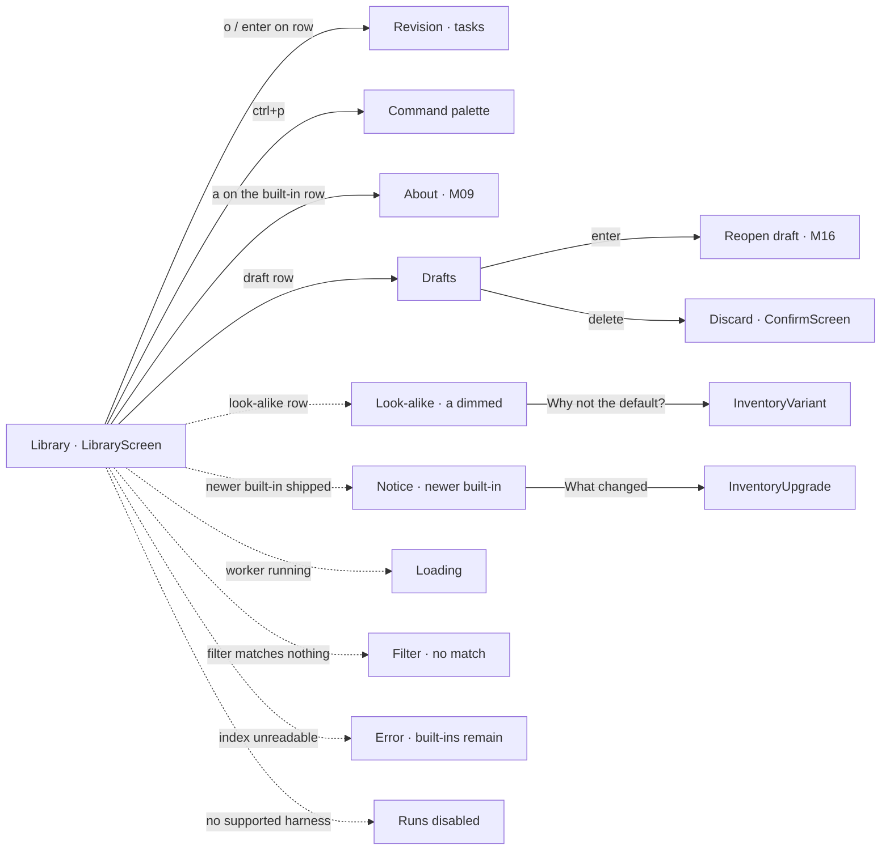

- The built-in seven-task inventory benchmark r1 is the default selection and runs without a planner call.
- Rows show name, project type, source, task count, revision, SHA-256, saved configurations and results; the description is in the detail pane (wide) or summary strip (compact).
- `#env-bar` shows harness readiness and the active run, reattachable with `ctrl+r`.
- With no harness: planning and runs are dimmed; browsing, ZIP exchange and saved results stay available.
- `a` opens the inventory About screens and is enabled only on the built-in inventory row; elsewhere it is dimmed. `?` stays the app-wide Help.
- Unfinished planning drafts (`~/.axbenchmark/drafts/`) are listed below the templates, marked ◇, with state (planning, ready for review, failed) and last update. `enter` reopens a draft where it was left; `delete` discards it after a ConfirmScreen.
- When an upgrade ships a newer built-in revision and the current default has results, `#default-notice` offers what changed, says the two revisions' results can't be compared, and can make the newer one the default (ConfirmScreen). The decision text names r2; in this fixture r2 is the user's custom revision, so the shipped built-in is r3.

## 2 · Inspect a template revision

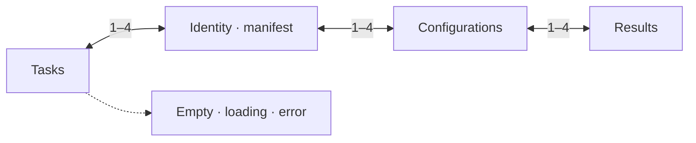

- `TemplateScreen` is per revision. The `#revisions` tree (hidden when compact; `r` opens a picker) switches revisions; lineage is navigation only.
- Identity lists exactly what the hash covers and, separately, what it does not (harness/model/effort, environment mode, concurrency, judge, pricing, weights, machine, display name, ZIP order).
- Configurations are scoped to the revision. Results list only runs bound to this exact SHA-256; other revisions and look-alikes never appear here.
- `n` renames the lineage display name through PromptScreen (M15) without changing identity; it is dimmed for built-ins.

## 3 · Create a template

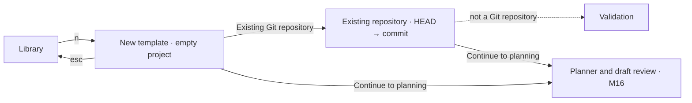

- Multiline prompt, frontend/backend/fullstack, empty project or committed repository revision.
- `HEAD` resolves immediately to a commit the template pins. Uncommitted changes are counted and excluded; the repository is only read.

## 4 · Duplicate and revise

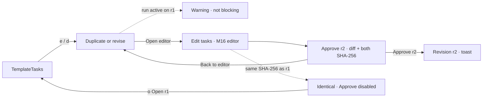

- Any change to tasks, order, checks, baseline or rubric produces a new revision and digest. Renaming alone does not.
- r1 stays approved with its configurations and results. Copying configurations to r2 is an explicit checkbox.
- With a run active on the revision, `#revise-active-run` warns that the run continues on r1 and its results will not be comparable with the new revision.
- Content identical to an existing revision cannot be approved: “Identical to r1 — nothing to approve”, with `#open-existing` (`o`).

## 5 · Exchange templates

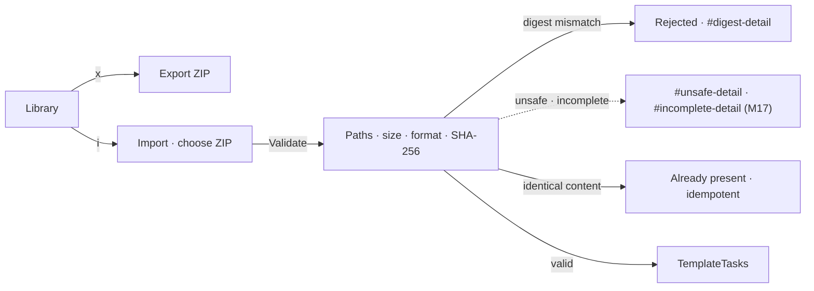

- Import is a data operation: no scripts, installs or model calls. The SHA-256 is recomputed from extracted files before registration. Package validation details belong to M17.
- Mismatches show the declared and computed identities in full (stacked on 80 columns).
- `#import-rejected` holds the ContentSwitcher `#rejection-detail` (`#unsafe-detail`, `#incomplete-detail`, `#digest-detail`, `#other-detail`) shared with M17.

## 6 · Launch identity check

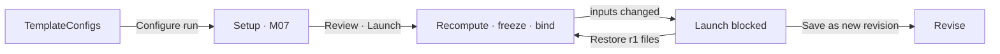

- The template, the run configuration and the original weights are frozen separately before launch.
- A run whose inputs changed never claims the approved identity and is never silently relabelled.

## 7 · M02 · Compare retained results

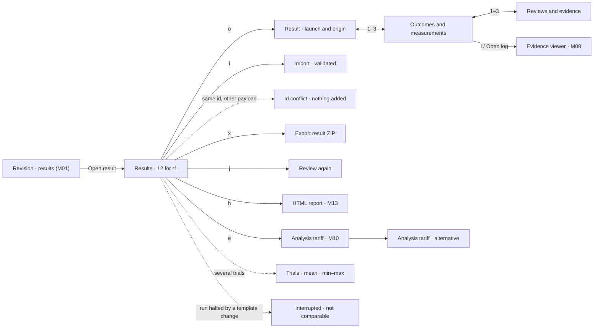

- Only results with r1's SHA-256 are listed; filters cover machine, configuration, environment policy, concurrency and judge.
- Imported results show ↓ and their machine, and are labelled validated, not certified.
- Process outcome, acceptance checks (✓ ✗ ? ○) and grades are separate columns. Unverified means the check could not run.
- Re-review is explicit, keeps the original review and records judging cost separately. Reports always show their path.
- Each trial is its own result; a configuration's trials are followed by a mean row and a min–max row (`ResultsTrials`, Orders REST API r3 fixture).
- Every cost shows its basis: reported, price-table estimate with source and date, or energy estimate. Unknown and partial costs are never $0 (▲ marks partial).
- `e` sets an analysis electricity tariff, labelled “analysis tariff · alternative”; records keep the frozen tariff.
- Costs show in each run's frozen display currency (all USD in this fixture). When the listed runs froze different display currencies, values show in USD and the table says so. There is no currency switch in Results or Rankings; rankings compute in USD.
- Results of a run halted by a template change are interrupted, “template identity invalidated”, listed last and never compared.

## 8 · M03 · Environment readiness

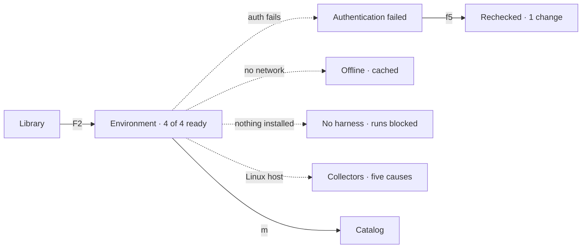

- Each harness reports executable, version, authentication, models and headless probe separately. Found is not authenticated; offline is not rejected.
- Collector failures name one of five causes (permission, driver, collector failure, unsupported hardware, missing tool) and never block a run.
- Recheck repeats the checks; it never installs tools or changes permissions.

## 9 · M04 · Models and efforts

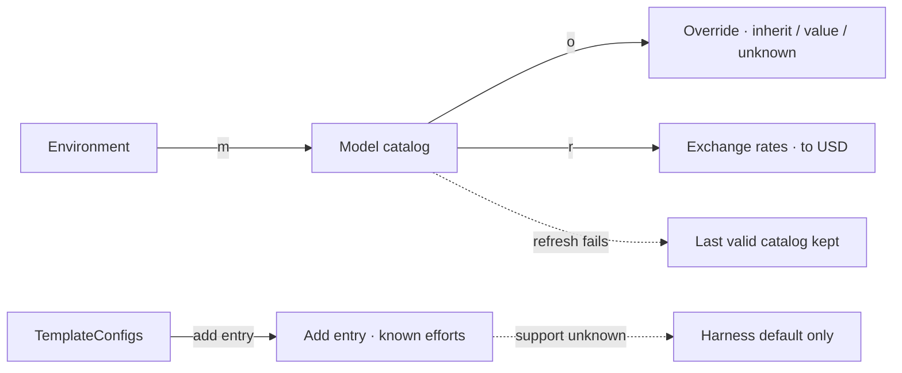

- Entries are keyed by harness, version, provider or endpoint, account and model. Each value shows its source: override › discovered › bundled.
- Unknown stays unknown. Unknown effort support offers only harness default, which passes no effort argument.
- Override fields are tri-state (Inherit · Value · Unknown); Unknown stops resolution with source “override”. Prices come from per-provider price sources during refresh, with source URL and date.
- The harness's own default model is labelled in the catalog and the entry picker but never preselected for a competitor entry.
- Billing kind (api, subscription, local, unknown) is per account: read from the harness status by M05's probe, or declared in the override form (`#override-billing`, Inherit · Value · Unknown) and labelled “declared by user”. It is frozen at launch and shown with the cost basis (M10); unknown never yields a verified $0.
- `r` opens `CatalogRates`: rates to USD collected only during an explicit refresh, each with source and date. A rate you supply overrides the collected one and is labelled “supplied by you”. A failed refresh keeps the last valid rates. A currency without a rate converts to unknown (`no_rate_conversion`).

## 10 · M05 · Headless execution and isolation

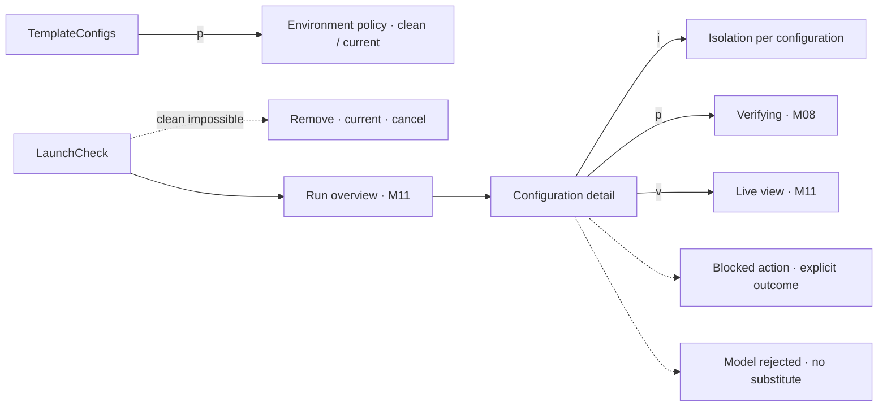

- One process and conversation per task; state carries only through workspace files.
- Requested and effective settings are side by side; an effort the harness does not expose stays unverified.
- Each configuration gets its own baseline copy, workspace, ports, test data and browser context.

## 11 · M06 · Rankings and weights

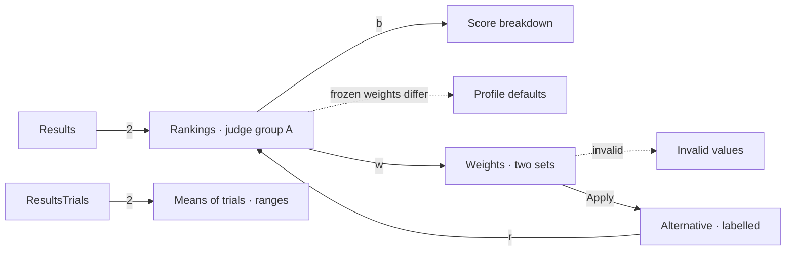

- All scores are computed in `src/results-data.mjs` from the 12 results shown in M02, using the M06 formulas. The M06 acceptance fixture (A 76⅔, B 83⅓, B alone 100) reproduces with the same code.
- Verified $0 needs a reported $0 with complete coverage and no subscription; then $0 entries get the full cost points and positive costs get 0 (R101).
- Failed and excluded entries stay in the full table with their reasons. Judge groups never merge.
- Unknown or partial cost excludes an entry from cost-weighted rankings (“cost partial · covers 5 of 7 tasks”); a local endpoint in a parallel run has unknown cost. With trials, configurations rank by their means, show per-trial ranges, and are excluded as “trial ineligible” when any trial fails a gate.
- When frozen weights differ within a judge group, the original ranking uses the profile defaults, labelled “Profile defaults: original weights differ across results”; each result's original weights stay selectable.
- Save preset… and Export configuration ask for a name or path in the shared PromptScreen (M15).

## 12 · M07 · Setup and launch

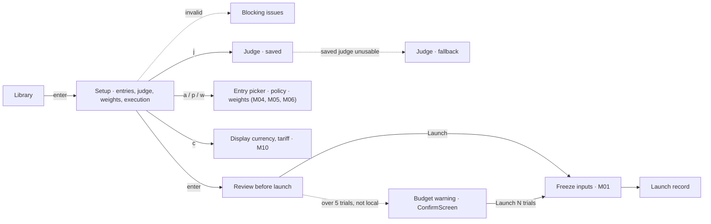

- Configurations are YAML per revision and pin its SHA-256; several entries per harness are allowed. The built-in benchmark reuses its tasks without a planner call.
- Judge preselection order: a valid saved judge, then the planner configuration, then the first usable entry. Each is checked against readiness; the judge is chosen independently of the entries.
- Presets resolve into actual weights at launch. Template binding, resolved configuration and original weights are frozen as separate records, with machine and catalog metadata and no credentials.
- The execution pane sets trials (`#trials`, default 1, no upper limit), the hardware sampling interval (`#sampling-interval`, 0.5–10 s, default 1 s), the display currency (`#display-currency`, default USD) and shows the electricity tariff (`c`). All are frozen at launch; none is part of the template identity. Launch also freezes a RateSnapshot (rates for every price currency and the display currency) beside the PriceSnapshot.
- When launch validation returns `trial_budget_warning` (more than 5 trials for any configuration not on a local endpoint), Launch opens `TrialBudgetWarning`, the shared ConfirmScreen. It states that the extra trials consume budget and subscription usage and shows the totals: task runs = configurations × trials × tasks, judge sessions = configurations × trials. It is not shown when all such configurations are on local endpoints. `run --no-tui` prints the warning and continues.

## 13 · M08 · Verification and evidence

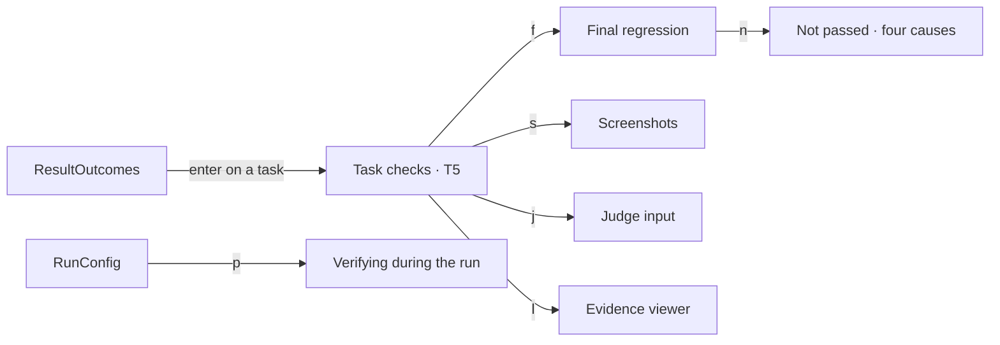

- Checks run on a disposable copy of the task snapshot, with tooling outside the workspace and no repairs. Each is passed, failed or unverified.
- Not passed has four causes that stay distinct: application failure, missing prerequisite, verifier error, not run.
- The final regression runs every check on the delivered artifact; both columns are kept. The judge gets the evidence without the measured statistics, including the screenshots from the final regression (inventory: 14, one desktop and one mobile per task area). Per-task screenshots stay in evidence, results and the report.
- `EvidenceViewer` shows retained logs, snapshots and evidence read-only (`#evidence-files`, `#evidence-text`, paged); `o` opens externally, `f` reveals the folder.
- The 21 check titles live in `src/checks-data.mjs` and are shared with the M01 task tab.

## 14 · M09 · Default inventory benchmark

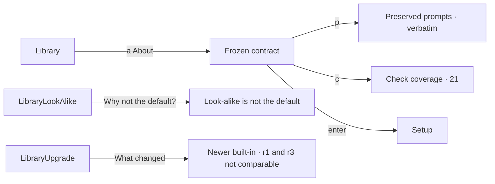

- The prompts are read from `benchmark/tasks/` when the wireframes are built, so the frame always shows the preserved text.
- Choices the prompts leave open (product attributes, lookup matching, currency, stock conflicts, order structure) are listed and not checked.
- A newer built-in revision never replaces a default that already has results; the Library offers it with a notice.

## 15 · M10 · Measurements and cost

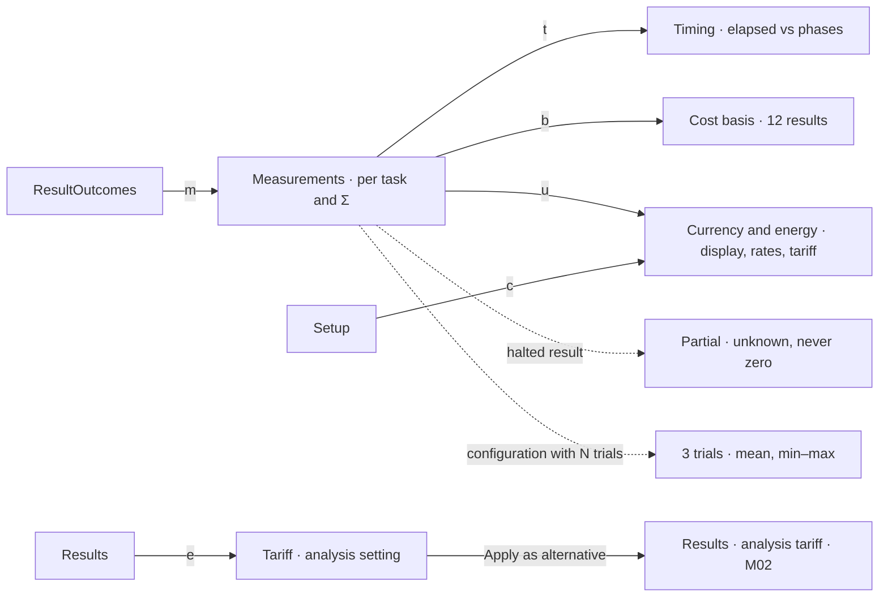

- Every task and the configuration total show wall time, input, cached, output and reasoning tokens, cost, checks and status, each with source and coverage. Reasoning ⊂ output and cached ⊂ input are shown apart and never added.
- Benchmark elapsed is the sum of task processes; queue, planning, verification and judging are separate, and the experiment duration is clock time.
- Cost bases (D4): reported · verified $0 (reported $0, complete usage, not a subscription) · estimate (known usage × the price table recorded at launch, labelled with its price source and retrieval date) · energy estimate · unknown with its reason. Subscriptions, unknown billing and missing prices or rates are never $0.
- Billing (R3-1): `CostBasis` shows each result's billing kind frozen at launch (api, subscription, local, unknown), read from the harness status output (“api · harness status”) or declared per account in the catalog and labelled “declared by user” (R-0928a-1). Unknown billing never yields a verified $0.
- Currencies (R3-2): costs are computed, aggregated and ranked in USD. A price in another currency converts to USD with the run's frozen rate; without one the estimate is unknown with `no_rate_conversion` (shown in `CostBasis` as an example; every r1 price is in USD). Values display in each run's frozen display currency (all four r1 runs froze USD); a view spanning runs with different display currencies shows USD and says so. There is no display currency to choose at analysis time.
- A local endpoint in a sequential run is costed as an energy estimate: kWh in its execution windows × the frozen tariff, labelled with its measured scope (CPU package + GPU). In a parallel run shared energy is never divided, so its cost stays unknown (reason `parallel_energy_shared`) and it leaves cost-weighted rankings. In the fixture the Pi results of runs with jobs 2–4 are unknown and R-0919lab-1 (jobs 1) is $0.01.
- `CurrencyEnergyScreen` has two modes. Setup (`c` in Setup) holds the display currency (`#display-currency`, default USD), shows the catalog's exchange rates to USD with source and date (`#rate-table`, collected by M04 during an explicit refresh; a user-supplied rate is labelled “supplied by you”), states what launch freezes as the `RateSnapshot` beside the price snapshot (every price currency, the display currency and the tariff currency; a missing rate is frozen as missing and its values show `no_rate_conversion`) and holds the electricity tariff (`#tariff-per-kwh`, `#tariff-currency`). Analysis (`e` in Results, `TariffAnalysis`) changes only the tariff, as an alternative with “Reset to recorded” (`#reset`); only energy estimates are recalculated.
- Partial measurements (D11) keep ▲ and their coverage (“covers 5 of 7 tasks”) in every table and count as missing in any ranking where they carry weight.
- Trials (D7): default 1; with N, each trial is a separate result shown as its own row, followed by `#trial-summary` (mean of cost, time and quality, min–max range). Rankings use the means; a configuration is eligible only when every trial is. Fixture: Orders REST API r3, run 2026-09-27-t (`TRIAL_CONFIGS`).
- Numbers agree with `src/results-data.mjs` and the M02 Outcomes tab (R-0928a-3, R-0925b-2, run 2026-09-28-a).

## 16 · M11 · Run orchestration

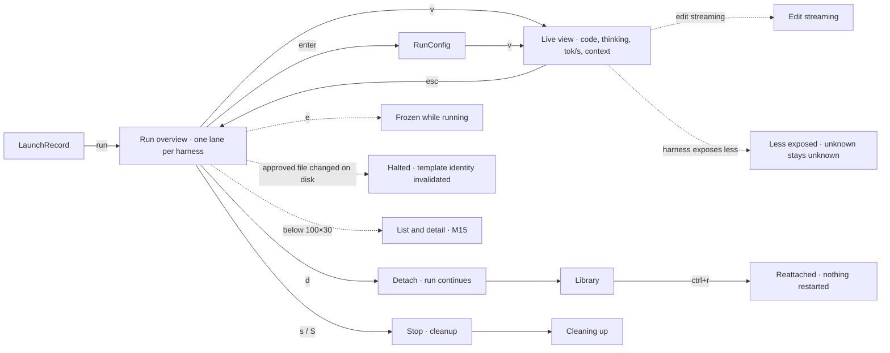

- Default: one configuration per harness at once, up to four; more entries of one harness queue in its lane (`RunQueued`). `--jobs 1` runs one at a time (`RunSequential`). Tasks are always sequential.
- `RunFailures`: an authentication failure halts only its configuration; a timeout or ordinary failure continues from the resulting workspace with no rerun; harness-internal retries are recorded.
- Detaching or closing only stops observing. Stop is the one action that ends work and it cleans up processes, services, browser contexts and ports.
- `RunHalted` (D9): approved revision files are read-only on disk; the first detected change halts the whole run with explicit-stop cleanup. Every configuration is recorded as interrupted with reason “template identity invalidated”, the approved and computed SHA-256 and the changed paths; evidence is kept, nothing is rebound or compared. `status` shows the same reason (`CliHalted`).
- `RunOverview` is drawn at 120×40 only; below 100×30 the run is `RunListDetail` (W6). There is no compact lanes table.
- `HarnessLive` (`v` on a lane, in `RunConfig` or in the compact list): one configuration's current task process. A one-line task header (task, model, effort as requested and as observed), output tok/s with a 60 s sparkline, context used of the model's window, the code being written as a live diff of the workspace, and the thinking and actions beside it. Read-only: it never sends input, and leaving it changes nothing in the run.
- Each live value names its source (reported by the harness or endpoint, or measured from the stream). Thinking is shown only as the harness exposes it and labelled when summarized; a harness that reports no context or reasoning shows `?` and a dimmed `t` (`HarnessLiveLimited`). Context restarts with every task, because each task is a new conversation.

## 17 · M12 · Quality judging

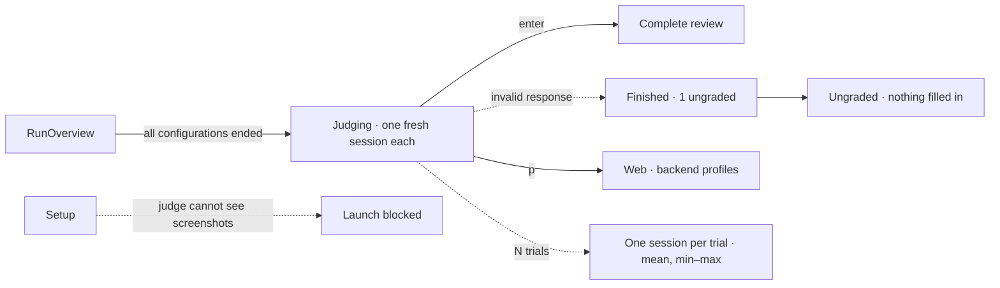

- Sequential reviews, anonymous labels, no cost/time/other reviews in the input, and the judge never repairs anything.
- A review needs a 0.5-step grade and evidence for every category plus the required comments; otherwise it stays ungraded and out of quality rankings.
- Screenshots given to the judge (D12) are the 14 of the final regression on the delivered artifact, at 1440×1000 and 390×844; per-task screenshots stay in evidence, results and the report.
- `JudgingTrials` (D7): each trial is its own artifact and fresh session; `#trial-quality` shows the mean and min–max per category and of Q.

## 18 · M13 · HTML report

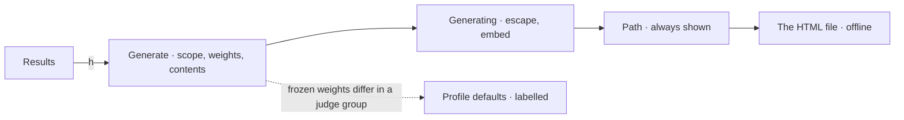

- `ReportPage` is a wireframe of the generated file: full SHA-256, the frozen display currency (USD for all four runs; a report spanning runs with different display currencies shows USD and says so, and has no currency option), filters, both weight sets and the electricity tariff (an analysis setting labelled alternative) with apply/reset/export, three top-five charts, the log-cost scatter, the stacked combined ranking, both tables (with cost basis, price source and trial), task evidence and hardware timelines. Its numbers come from `src/results-data.mjs`.
- Unknown and partial costs are left off the log axis and out of cost-weighted rankings, with the reason (“cost covers 5 of 7 tasks”, “local endpoint, parallel run”).
- D13: when the results of a judge group froze different weights, its original ranking uses the profile defaults, labelled “Profile defaults: original weights differ across results”; each result’s own weights stay selectable.

## 19 · M14 · Command line

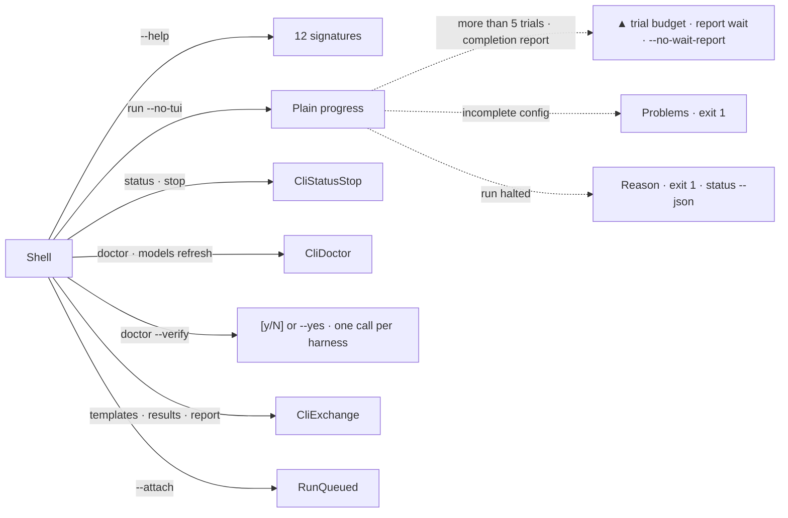

- Unattended runs validate and freeze like the TUI (the frozen records include the price and rate snapshots with the display currency), print plain progress and never ask a question. Ctrl-C stops watching only.
- Trial budget (R3-7): when M07 returns `trial_budget_warning` (more than 5 trials for a configuration not on a local endpoint), `run --no-tui` prints it as a ▲ line with the totals (5 configurations × 6 trials × 7 tasks = 210 task runs, 30 judge sessions) and continues without reading stdin (`CliRunReport`). The TUI shows the same totals in the shared `ConfirmScreen` (`TrialBudgetWarning`, M07).
- Report wait (R3-3): after a completed run, `run --no-tui` waits for the completion report and prints its path and open attempt; a failed report prints its error and `axbenchmark report RUN_ID` and still exits 0; `--no-wait-report` exits after the outcome and prints the regeneration command.
- Exit codes (D1, W8): 0 success, including a run that completed with failed or unverified tasks · 1 typed error (rejected package, not found, incomplete configuration, a followed run that was stopped or interrupted, with the reason printed) · 2 usage · 3 engine unreachable or incompatible. `status` exits 0 whatever the run state; scripts read task failures from `status RUN_ID --json`.
- `doctor` reports an insufficient collector permission with the fix from the collector guide; it never suggests `sudo` and has no root mode (D5). `doctor` also lists approved revision folders whose read-only modes (files 0444, folders 0555) were changed, with expected and found modes and the restore remedy; it never offers `chmod` or `sudo` (R3-6). `doctor --verify` (R3-4) shows a `[y/N]` prompt on a terminal listing the harnesses and that each makes one minimal model call (default No); `--yes` consents without a prompt; without a terminal and without `--yes` it exits 2 naming `--yes` and sends nothing. Each consented call is recorded in readiness (D15). `models refresh` prints one price line per provider (first-version sources: Anthropic, OpenAI, xAI) with source and retrieval date, or “kept last valid prices”, and one rate line per rate source (source, source date, retrieval date, currencies collected to USD), with user-supplied rates listed as kept and labelled.

## 20 · M15 · Terminal interface

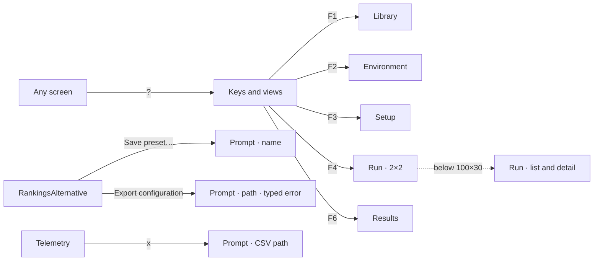

- The five views are the module screens; M15 adds the global keys, mouse rules and the small-terminal run layout. View keys are a proposal: F5 stays Recheck/Refresh.
- From 100×30 the run shows four panels in a 2×2 grid; below that, a configuration list with the selected one's tasks and searchable log (`RunListDetail`, the only compact run layout). No tmux.
- `PromptScreen` is the shared one-value dialog (W2): Save preset… (name), Export configuration (path) and Export CSV on Telemetry (path). A typed error keeps it open with the message in `#prompt-error`; esc returns nothing.
- `v` opens the live view of the selected configuration in both layouts; at 80×24 it shows the code pane and a three-line thinking box, and `a` overlays the actions.

## 21 · M16 · Custom template planning

```mermaid
flowchart LR
    NewTemplateRepo -->|Continue to planning| PlannerPicker["Planner · fallback order"]
    PlannerPicker -.->|no default model| PlannerUnknownModel["Model field empty · required"]
    PlannerPicker -.->|nothing usable| PlannerNoUsable["No confirmed-usable harness"]
    PlannerNoUsable -->|v Verify now| PlannerVerify["ConfirmScreen · one call per harness"]
    PlannerVerify -->|verified| PlannerPicker
    PlannerPicker --> PlanningProgress["Capture HEAD → a41f9c2 · plan"]
    PlanningProgress --> PlanReview["Draft · not approved"]
    PlanningProgress -.->|planner fails| PlanningFailed["Nothing saved"]
    PlanReview -->|4| PlanServices["Setup · start · stop"]
    PlanServices -->|e| PlanServiceEdit["Edit a service row"]
    Library -->|enter on a draft| PlanReopened["Draft reopened · ready for review"]
    Library -->|enter on a failed draft| PlanningInterrupted["Failed · interrupted"]
    PlanApprove -.->|SHA-256 already exists| PlanApproveIdentical["Identical · nothing to approve"]
    PlanReview -->|e| PlanEdit["Edit a task"]
    PlanReview -->|r| PlanRegenerate["Regenerate"]
    PlanReview -->|a| PlanApprove["Approve r1 · SHA-256"]
    PlanApprove --> TemplateTasks
```

- Planner preselection (D15, D17): a valid previous choice, else the first usable of Claude Code, Codex, Grok, Pi, with the catalog's default model for that harness and account (read from its settings or status output at refresh, with source and date). Undetermined harnesses are never preselected or run. With no default model the field stays empty and must be picked; with no usable harness the picker shows an error with `#verify-now`, which asks for consent through `ConfirmScreen`.
- The review screen has `#draft-name`, prefilled from the planner and editable until approval; it becomes the lineage display name (W9). `e` on the Setup · start · stop tab opens `ServiceEditScreen` with command, working directory, port and readiness check, each validated on its own.
- Drafts persist under `~/.axbenchmark/drafts/` (D10) and appear in the Library as planning, ready for review or failed (W10); enter reopens them where they were left. A planning session that ended with the engine is failed with reason “interrupted”.
- Approving a duplicate whose SHA-256 already exists is blocked with “Identical to <label> — nothing to approve” and `#open-existing` (D6).
- The snapshot is the committed revision; uncommitted work is left out and the repository is never touched. Later runs and imports never resolve HEAD again.
- Seven tasks by default, the last one final verification and fixes. Generation is not approval; the approved r1 is the Library's “Billing service refactor”.

## 22 · M17 · ZIP exchange

```mermaid
flowchart LR
    Results -->|i| ResultPackagePick["Choose ZIP · #zip-path + #zip-browser"]
    ResultPackagePick -->|Inspect| ResultPackage["Result package · contents and provenance"]
    ResultPackage --> ResultImport
    ResultPackage -.->|template differs| ResultMismatch["Expected vs received"]
    ResultMismatch --> ResultEmbedded["Own revision · atomic"]
    ImportTemplate -.->|unsafe paths or links| ImportUnsafe
    ImportTemplate -.->|missing content| ImportIncomplete
```

- Five ordered steps: safe boundary, definition, result compatibility, existing identities, registration. Any failure adds nothing; nothing runs, installs or calls a model.
- A relay machine never replaces a result's origin. Mismatched results can join only a separately validated embedded revision, never r1.
- The result-package picker reuses M01's `#zip-path` and `#zip-browser` (W3).

## 23 · M18 · Hardware monitoring

```mermaid
flowchart LR
    Setup -->|execution pane| MonitoringSettings["Automatic · off · interval 0.5–10 s"]
    MonitoringSettings -->|Guidance| CollectorGuide["Guidance · you run it"]
    CollectorGuide -->|f5| EnvironmentCollectors
    ResultOrigin -->|telemetry| Telemetry["One experiment · lab-linux-4090"]
    Telemetry -->|e| EnergyDetail["Counters, gaps, overlaps"]
    Telemetry -->|w| SequentialEnergy["Windows · background included"]
    Telemetry -->|x| PromptExportCsv["Export CSV · path"]
```

- Only confirmed metrics are collected; the rest name one of five causes. Nothing is installed or changed, and no sensor is required.
- Process trees are attributed per configuration; a separate model server is not, and cloud models are measured on the client only. Shared energy is never split across concurrent configurations.
- The sampling interval (`#sampling-interval`, D18) is a run-configuration setting, 0.5–10 s, default 1 s, frozen at launch and outside the template identity. A collector that cannot sample that fast uses its own minimum; each collector's actual interval is recorded and shown, never the requested one.
- In a sequential run the windows' energy × tariff is the local configuration's cost for rankings, labelled “energy estimate” with its scope (D4).

## Files

- `index.html` redirects to `preview/preview.html`.
- `animation.html` is an animated walkthrough of the preloaded inventory benchmark from the shell prompt to the opened HTML report (13 chapters, about 1:45, play/pause, chapter scrubber, speed and theme). It is generated by `node src/animation.mjs` from the same screen functions, plus the in-between states (typing, freezing, run time-lapse, judging, report writing).
- `preview/` holds the generated canvas index `canvas.json`, one `.dc.html` per artboard and the flat `preview.html` (theme and size selectable). The canvas entry `Main.dc.html` is the navigation map. Suffixes: none = 120×40, `-80x24` = 80×24.
- `src/` is the generator: `node src/build.mjs`. `lib.mjs` is the character-grid renderer and Textual widget drawers (it throws when a footer or table does not fit its cells), `theme.mjs` the tokens and CSS, `screens.mjs` the M01 frames and copy, `boards.mjs` the M01 artboards and legends, `system.mjs` the design system, navigation map and widget-state matrix.
- M02–M09: `screens-results.mjs` (M02 and M06), `screens-readiness.mjs` (M03 and M04), `screens-execution.mjs` (M05), `screens-setup.mjs` (M07), `screens-verify.mjs` (M08), `screens-inventory.mjs` (M09), `checks-data.mjs` (the 21 checks), `results-data.mjs` (the shared result fixture and the M06 scoring contract) and `boards-modules.mjs` (their pages, groups and legends).
- M10–M18: `screens-measure.mjs` (M10), `screens-run.mjs` (M11), `screens-judging.mjs` (M12), `screens-report.mjs` (M13, including the report page and its CSS), `screens-cli.mjs` (M14), `screens-tui.mjs` (M15), `screens-planning.mjs` (M16), `screens-exchange.mjs` (M17), `screens-telemetry.mjs` (M18) and `boards-later.mjs` (their pages, groups and legends). A board whose only size is 80×24 (`RunListDetail`) sits on its module page. `screens-tui.mjs` also holds the shared `PromptScreen` drawer.
- Add later modules by adding screen functions and a group with a `page` in `boards-later.mjs`; the design system, legends and canvas layout are shared.
