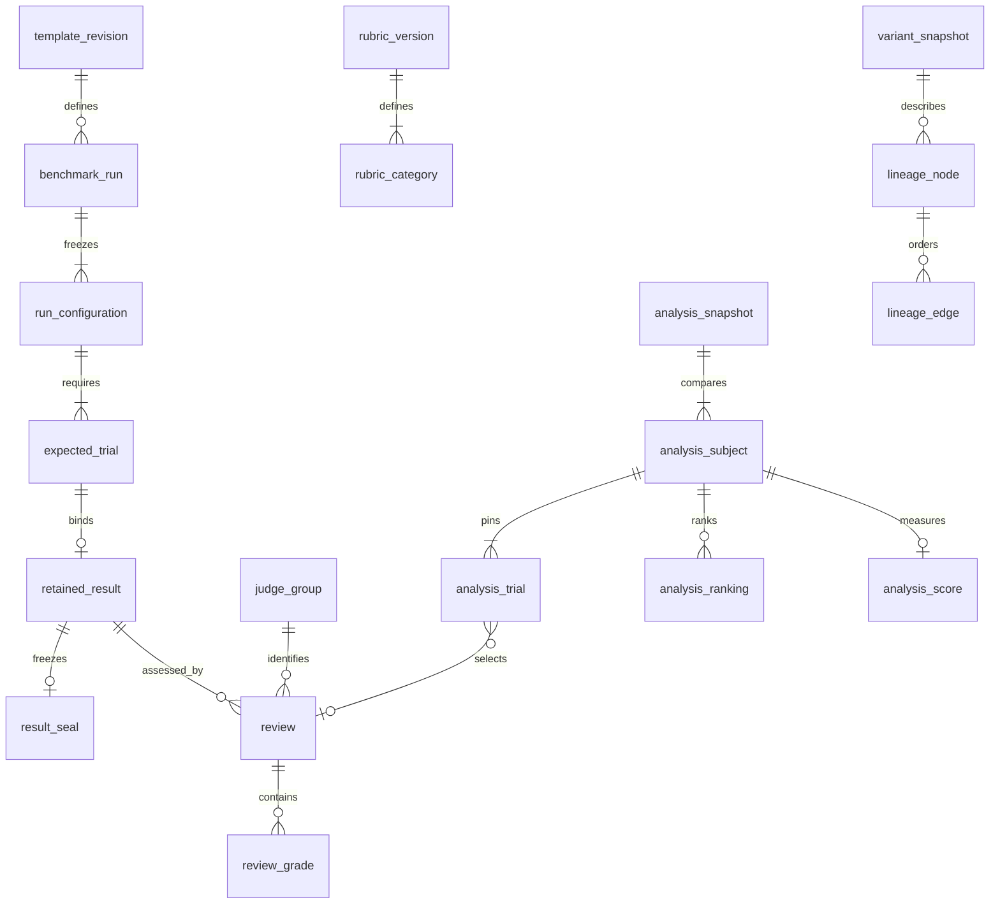

# Normalized SQLite results and analysis

Status: binding implementation supplement, requirement **R191**, with normalized retention for **R192–R194**. This is a proposed storage and query contract; no application database or working benchmark engine is created by this document. It extends existing delivery children without adding a dependency node.

Build the solution from scratch against an empty SQLite database. There is no import/backfill of an older AxBenchmark installation, filesystem-results migration, dual-read fallback or compatibility requirement for obsolete record formats. Every retained result, measured statistic, quality grade and saved score analysis belongs in this one authoritative database. Users can open it read-only with ordinary SQLite tools, join stable views, and build graphs without parsing result JSON files. Large source snapshots, screenshots, logs and raw responses remain immutable content-addressed files; the database stores their identifiers, digests, safe relative locations and scope. Model manifests describe weights without copying those weights into result storage.

[results-v1.sql](sqlite/results-v1.sql) defines the concrete schema, constraints, indexes and public views. [analysis-examples.sql](sqlite/analysis-examples.sql) supplies twelve executable query examples. [validate-schema.py](sqlite/validate-schema.py) checks the proposed DDL and queries in disposable databases. These artifacts are specification companions, not a migration runner or solution implementation.

The retained domain contracts remain [M02](reference/modules/02-retained-results-comparability.md), [M06 scoring](reference/modules/06-scoring-rankings.md), [benchmark statistics](BENCHMARK-STATISTICS.md), [model variants](MODEL-VARIANTS.md), [context monitoring](CONTEXT-MONITORING.md), [same-model harness comparisons](CROSS-HARNESS-COMPARISON.md) and [quality judging](reference/modules/12-quality-judging.md). This supplement replaces filesystem JSON as the authority for structured results. It changes no metric formula, rubric, required-check gate, template identity, trial policy or model-comparison rule.

## Ownership and boundaries

| Owner | Required implementation |
|---|---|
| M11.1 shared foundation | SQLite connection/version capability checks and shared publication/operation-receipt transaction primitives. The connection and publication authority exist before M02.2; no dependency cycle. |
| M02.1 | Typed relational mapping and lossless domain reconstruction, exact-number encoding, immutable fact/review/analysis identities and error vocabulary. |
| M02.2 | Database repository, migrations, writer coordination, normalized rows, indexes/views, evidence references, analysis sink, read snapshots, backup and forward schema evolution. Replace the proposed `fs_repository.py` with `sqlite_repository.py`; retain the evidence file adapter. |
| M06.1 | Pure exact calculations, eligibility/exclusion details, selected review/weight/population provenance, per-trial Q, subject scores and all specialized ranking outputs. M02 persists these values; SQL never becomes a competing scorer. |
| M03/M04/M05/M07 | M03 owns diagnostic qualification outcomes; M04 owns editable access catalog and versioned native-effort contracts; M05 supplies scoped request evidence; M07 freezes complete matrices and resolved access bindings. M02 retains sanitized immutable copies, not local credentials or mutable drafts. |
| M10/M12/M18 | Existing measurement, review and telemetry producers supply validated scoped values; M02 owns their retained representation. Human drafts/credentials remain M12.5 working state, not scores. |
| M17.2 | Validates canonical portable packages and stages participants. Its final publisher uses the shared live SQLite transaction; an imported SQLite file is not accepted as executable schema or an alternative import format. |
| M02.3/M06.2/M13/M14 | Expose saved analysis references/freshness, preserve offline use, and provide database discovery/snapshot actions without direct operational SQL writes. |

Default canonical location: `~/.axbenchmark/results/results.sqlite3`, resolved through the configured data root. The engine is the only supported writer. TUI/CLI operational features continue through engine APIs; external analysis has a deliberate read-only exception to the engine-only storage access rule. SQL read access exposes retained local data, so database, WAL, SHM, staging and evidence permissions remain private to the user.

M01 immutable template files, M07 reusable configuration YAML, M11 lifecycle/job checkpoints and M12 private human drafts/session/immutable submission-intent journals may remain file-backed working state. M16 planning drafts and M10/M18 producer journals retain the same boundary. Frozen result/launch copies, measured values, committed reviews, scores and their analytical provenance are relational authority. The current canonical JSON/YAML contracts remain interchange and raw-provenance formats; they are not a second mutable source. Raw source envelopes may be retained as evidence, but no required score, measurement, grade, creator/date or comparison field may be available only inside a blob.

## Relational structure and grain

Portable RunUid, ConfigurationId, ResultId and ReviewId preserve their existing meanings. A configuration subject is **(RunUid, ConfigurationId)**; it is never just a model label, variant, configuration name or machine label. Internal `expected_trial_id`, exact-value IDs and database publication sequences are storage keys, not new portable benchmark identities. A result binds one unique expected trial; all expected trials exist even before their result is retained.



The DDL is the column-level dictionary. This map identifies the grain and normal join direction; children inherit run/trial identity through parents instead of repeating labels and facts everywhere.

| Relations | Grain and purpose |
|---|---|
| `schema_migration`, `publication`, `operation_receipt`, `outbox_event` | Applied migration; atomic publication; durable idempotent operation; logical notification. No event-body secrets. |
| `exact_value` | One interned canonical rational pair; immutable numeric values reused by typed semantic columns. This is a number representation, not an arbitrary property/value facts store. |
| `source_observation`, `evidence_artifact` | One safe source retrieval and one unique retained content artifact. Paths never supply identity. |
| `rubric_version`, `rubric_category`, `rubric_criterion`, `rubric_anchor` | Frozen rubric, six ordered categories, their criteria, and anchored grade text. All six current families retain their exact frozen keys. |
| `template_revision`, `template_task` | Exact canonical template SHA and ordered task identities; prompt/source bytes stay referenced artifacts. |
| `machine_snapshot`, `machine_component`, `harness_release` | Immutable machine/OS facts and individually identified components; a captured harness/adapter release. |
| `model_checkpoint`, `artifact_manifest`, `model_artifact_file` | Source-qualified pinned checkpoint and versioned file manifest entries; manifest completeness stays explicit. |
| `variant_snapshot`, `lineage_node`, `lineage_edge`, `variant_root`, `variant_adapter` | Descriptor snapshot, transformation node, ordered parent edge, complete/partial root set, ordered active adapter composition and exact scales. Cycles fail. |
| `quantization_claim`, `precision_claim` | Typed native quantization parameters per node and separate stored/runtime/compute/cache precision facets. Unknown is not unquantized; training precision stays on its lineage node. |
| `creator`, `creator_claim`, `creator_claim_value`, `date_claim`, `date_claim_value`, `variant_annotation` | Role-specific creator/date claim slot, separately sourced values/alternatives and append-only corrected descriptor references. No comma-separated creator lists. |
| `benchmark_run`, `run_configuration`, `configuration_control`, `run_factor_weight`, `run_category_weight` | Immutable launch, subject, typed frozen comparison controls, original factor directions/weights and category weights. Jobs/concurrency and launch schema remain explicit. |
| `expected_trial`, `retained_result`, `result_seal`, `run_retention` | Complete required roster, observed result identity, execution freeze/receipt and full-roster terminal retention barrier. Missing result is distinguishable from absent roster. |
| `domain_evidence_plan`, `domain_evidence_binding`, `evidence_observation` | Frozen template/rubric plan, ordered requirement/criterion/check bindings, and one scoped tagged observation per result-evidence item. |
| `delivered_snapshot`, `delivered_snapshot_entry` | One immutable pre-seal final manifest per result and one safe inventory entry per path; retained bytes are referenced artifacts. |
| `variant_observed_control` | One typed effective control claim per scoped variant observation/key, separately from requested configuration controls. |
| `result_evidence`, `task_attempt`, `task_commit`, `check_result` | Scoped artifact binding, task execution attempt, ordered commit evidence and independent acceptance/infrastructure outcomes. |
| `judge_assessment` | Immutable pre-dispatch automated assessment identity: actual result/JudgeGroup, original/additional purpose, reserved ReviewId and identity digest. Reservation is not a committed review or terminal outcome. |
| `inference_call`, `call_counter`, `generation_interval`, `trial_measurement`, `source_file_inventory` | Scoped call, native/detail counter, paired generation timing, sealed normalized trial summary and individual included/excluded file/LOC evidence. |
| `billing_snapshot`, `price_snapshot`, `price_rate`, `currency_rate`, `cost_observation`, `cost_component` | Frozen billing basis, dated price table/rates, run-frozen currency conversion, scoped charge/estimate and contributing quantities. |
| `hardware_series`, `hardware_sample` | Explicit host/trial/device/metric series and individual sample; shared host consumption never silently attributed to a competitor. |
| `context_capture`, `context_segment`, `context_snapshot`, `context_membership`, `context_count`, `context_gap` | Raw sanitized capture, segment, occupancy gauge, membership assertion, independently sourced count and coverage gap. |
| `context_analysis`, `context_classification` | Append-only decision-analysis identity and per-segment category; classification cannot manufacture native counts or membership. |
| `judge_group`, `review`, `review_grade`, `review_comment`, `review_evidence`, `review_deficiency`, `review_limitation`, `review_finalization` | Exact backend/group identity, one assessment, one valid category grade, three comment axes, admitted supporting references, typed deficiencies, limitations and shared-validator finalization. |
| `original_disposition`, `additional_disposition`, `run_invalidation`, `effective_variant_observation`, `variant_exclusion` | Durable judgment outcomes/pending originals, independent additional outcomes, run-wide invalidation and invocation/result-scoped served-identity evidence/exclusion. |
| `resource_revision`, `analysis_dependency` | Append-only source revision and the exact revision of each dependency selected by an analysis. |
| `analysis_snapshot`, `analysis_factor`, `analysis_category_weight`, `analysis_subject`, `analysis_trial` | Immutable request/input/algorithm policy, eight factors, six category weights, complete selected subjects and each subject's full expected trial roster with selected review IDs. |
| `analysis_trial_score`, `analysis_score`, `analysis_component`, `analysis_cost_projection`, `analysis_ranking`, `analysis_exclusion`, `analysis_finalization` | Per-trial Q, aggregate Q/combined score, raw/normalized/contribution values, currency/cost basis projections, each ranking kind's official rank/tie key, field/trial-specific exclusions and validated snapshot closure. |
| `access_evidence_set`, `access_evidence_item`, `access_evidence_seal` | Closed, digest-bound set of individual sanitized source/artifact references, reused by frozen access and request evidence. |
| `api_access_profile`, `api_access_role`, `api_route_hop`, `api_access_profile_seal` | One exact profile ID/version/digest; allowed role; ordered transport hop; immutable profile closure. Gateway and inference locality remain independent. |
| `access_model_binding`, `effort_contract` | Profile-scoped alias/upstream checkpoint/variant binding; model-native versioned effort meaning with exclusive native level, token budget or disabled form. |
| `harness_effort_mapping`, `harness_effort_setting`, `harness_effort_mapping_seal` | One release/distribution/binding-specific mapping; individual ordered launch/upstream settings; closure. Several settings may implement one native effort contract. |
| `harness_route_capability`, `harness_capability_limitation`, `harness_route_capability_seal`, `route_qualification` | Exact installed/versioned capability and closed limitations; separate diagnostic JobId, bounded qualification inputs, conformance, accounting reference and settlement outcome. No fabricated result/call keys. |
| `harness_registry_member`, `harness_comparison`, `harness_comparison_control`, `harness_comparison_freeze` | Versioned six-harness order; frozen one-run comparison; typed common controls; complete selected entry/trial closure. |
| `configuration_access_binding`, `harness_comparison_cell`, `harness_comparison_cell_issue` | One frozen competitor configuration **or** actual harness-review JudgeGroup binding, with disjoint keys; one registry cell including omitted/blocked harnesses; individually queryable reasons/limitations. Only a selected ready cell has a ConfigurationId. |
| `request_route_observation`, `request_effort_observation`, `request_route_hop_observation`, `request_route_finalization`, `request_route_exclusion` | Call-scoped source fact or later annotation; requested/emitted/effective effort separately; ordered observed hops; closed evidence; append-only mismatch exclusion. |
| `comparison_analysis_link`, `comparison_analysis_cell` | Saved M06 analysis/comparison policy and outcome; complete six-cell classification/subject mapping. Harness axis is independent of variant matching. |
| `existing_agent_profile_snapshot`, `existing_agent_profile_role`, `existing_agent_profile_seal` | Exact immutable launcher ID/version/sanitized digest, identified underlying harness release/distribution, inspection/source/precedence provenance, permitted role, and closed snapshot. An alias does not create a harness registry entry. |
| `existing_agent_profile_control`, `existing_agent_profile_asset` | Ordered typed source declaration or binding-owned reviewed transformation; qualified behavioral asset at a safe relative binding. Null binding means source snapshot; a non-null binding identifies one resolved treatment, never a mutation of shared source settings. |
| `configuration_existing_agent_binding` | One frozen competitor configuration, **or** one actual harness-review JudgeGroup. The disjoint scope is explicit: configuration keys and JudgeGroupId cannot coexist. Exact source ref, treatment/reproduction, effective/override/plan/qualification digests and optional route/effort references. |

Most relations store facts once at their own key; dimensions and multivalued relationships are separate. `trial_measurement` is an intentional M10-normalized summary alongside raw receipts. `analysis_*` values are intentional immutable M06 materializations with complete input provenance, not independent mutable facts. The closed `configuration_control` vocabulary is a typed extension point for serving controls, not an unbounded metric EAV table: each key has an owner-defined value type/unit, required known/unknown slot and normalization version. New semantic fields require a reviewed schema/codec migration.

Foreign keys and composite keys express existence, rubric scope and subject membership. Scope triggers reject cross-template tasks, cross-result evidence/reviews, cross-configuration trials and lineage cycles. Append-only triggers reject update/delete of retained facts; separate finalization guards reject new execution rows after sealing and new review/analysis children after finalization. All child rows and their finalization marker are committed together. Direct writable SQLite access is unsupported and cannot replace domain validation.

## Integrated evidence and role mappings

M02.1 owns `serialization/relational_codec.py`; its mapping must reconstruct each current owner DTO losslessly while preserving existing canonical export/input bytes. `template_revision` stores the versioned benchmark/project type and derived `target_mode=from_scratch|modify` plus commit-policy ref for analysis; these projections never redefine template identity. `check_result.origin` distinguishes authored and protocol outcomes and `suite_schema` retains acceptance.v1/v2 dispatch.

`domain_evidence_plan` pins the template/rubric, plan version/digest, suite schema and safe canonical policy artifact. Ordered `domain_evidence_binding` rows retain requirement/criterion/check, target/case, modality, source role, coverage, selector and mode. Owner M08 codecs enforce versioned domain semantics and full reference closure; SQL scope checks alone do not validate a plan. `evidence_observation` retains observation.v1/v2 and the web/backend/native_mobile/devops/agentic/specification discriminant, final manifest digest, target/build/case, observation mode, source role, required modality and coverage. Full sanitized capture/report context stays an immutable evidence artifact; essential comparison facts cannot exist only in that JSON. Domain modes and source roles are M08-versioned values, not SQL-inferred truth. Preserve supplied authority versus candidate source and simulated/replayed/live distinctions.

`delivered_snapshot`/`delivered_snapshot_entry` normalize the immutable manifest, result/template/baseline/delivered-scope digests and safe entry inventory with retained-byte references. `ArtifactSnapshots.pin_final(rid, view=None) -> DeliveredSnapshotLease` can read these durable rows/files before result sealing; M10 needs this to calculate Files/LOC before its finalization receipt. The lease exposes `manifest`, `read_file(RelPath)`, `aclose()` and async context lifetime; it cannot scan a live workspace or follow links. M10 classification/counting adds its separately normalized source inventory/statistics; completeness of file membership does not imply text readability. SQL forbids post-seal inventory additions; codecs verify complete manifest/file/digest closure at publication.

Context capture rows preserve task/invocation/session/agent/parent-agent/window/request/phase plus native or adapter-synthetic identity basis and source digest. Full TrialRef derives through ResultId; foreign task/call scope rejects. Classification retains all eleven `context-labels/1` labels, including separate thinking/thinking_summary and tool_definition/tool_call/tool_result. Native labels/source/version live on their captured segments independently of classifier rows. The public context view includes native-only rows with null analysis and preserves accepted native-label precedence, never requiring a decision engine merely to expose occupancy. `context_analysis_id` identifies an immutable stored cutoff snapshot; separate portable `analysis_id`, `through_entry_id`, `ledger_digest`, status and selected artifact reference preserve multiple pins of the same logical analysis without mutating earlier snapshots. Inference rows can retain real invocation, DecisionCall or artifact-evaluation identifiers without fabricating one for another backend; role-specific owner codecs enforce exclusivity and provenance.

Variant snapshots are unique by `(variant_id, descriptor_revision)` as well as content digest. `variant_annotation` is tagged claim_correction/effective_observation/attribution_exclusion with exactly one corresponding normalized payload reference, explicit descriptor/result subject and deferred operation-receipt FK committed in the same transaction. Effective evidence retains invocation/request/interval, source_fact versus annotation, and typed `variant_observed_control` known/unknown claims. Cross-result calls, annotations and exclusions reject. Post-seal source facts reject; late annotations and mandatory exclusions append without changing facts_digest and advance affected dependencies atomically. M02 validates annotation subject/prior revision/digest, full trial/control scope, evidence closure and immutable operation replay; SQL is not a substitute for these checks.

Backend-tagged JudgeGroups preserve role/profile/form-policy versions/digests. Harness-review groups additionally pin `selected_access_binding_id`, `selected_existing_agent_binding_id` and `selected_effort_contract_id` when selected. Deferred reciprocal composite foreign keys require the selected bindings to belong to that same group and close in one publication. M12 includes the selected portable route/profile/model/effort/mapping/capability/qualification refs and semantic digests, source treatment, override/effective-control/resolved-plan digests in canonical `group_digest`/policy identity; SQL does not calculate a replacement fingerprint. Hash the independent selected semantic snapshots/plan digests, excluding derived owner IDs, relational binding keys and receipt/publication IDs; this avoids a circular group-ID/binding-ID digest. The reciprocal keys enforce the relational projection of that identity. A new choice produces a new group. Human and native System One decision groups cannot select these generic harness-route/profile fields. Reviews enforce matching frozen rubric and commentary provenance for harness_review/model_authored, decision_rubric/code_composed_from_decisions and human_review/human_authored. Half-step grades, comments, deficiencies, evidence, finalization, disposition, receipt and outbox remain one committed unit. HumanRecoveryPending is a working lifecycle state, never a manufactured terminal review; file-backed human draft/session/intent storage is deliberately not added to the results schema.

## Exact values, missing data and semantic validation

`exact_value.numerator` is canonical signed decimal integer text; `denominator` is canonical positive decimal integer text. No plus signs, whitespace, leading zeroes, exponents or negative zero; zero is `0/1`. The engine reduces by GCD and interns the unique pair. SQL checks lexical form and nonzero denominator; arbitrary-precision reduction and semantic ranges are engine checks. SQLite numeric `REAL` values are approximate, so neither money nor official scoring uses them as authority. [SQLite floating-point documentation](https://sqlite.org/floatingpoint.html)

Token/file/LOC counts and trial counts/indices use canonical nonnegative/positive integer text to avoid an artificial signed-64-bit business limit. SQL ordering of such counts uses `ORDER BY length(value), value` for positive values; official rank ordering uses the retained exact ordinal and tie key, never approximate score sorting. Storage IDs/sequences and six-category ordinals remain SQLite integers. Exact values can represent negative hardware temperatures or a signed declared control; M06/M10 validators separately require nonnegative prices, weights, counts, durations and scores where their contracts require it.

Raw category grades use integer half-step units **2 through 10**: grade 4.5 is 9. They are not percentages. All six valid grades remain mandatory even at zero weight. `review_comment` preserves `code_quality`, the recorded `usability` or `developer_experience` key, and `specification`; the engine validates exactly those three axes without renaming the current domain fields. Explicit partial/unparseable review parts remain safe raw evidence plus structured deficiencies; an off-grid raw grade is never inserted as a valid `review_grade`.

Known zero has a stored value and complete coverage. File count and LOC have independent coverage/value slots: known file count can coexist with unavailable LOC. Unknown/unavailable/not-applicable has null value and an appropriate reason; partial retains the observed value plus partial coverage. Storage `complete` maps to the existing domain metric `known` state without changing canonical codecs. Never use `COALESCE(metric, 0)` in comparison math. The reference views return conservative null plotting projections outside their documented range instead of overflow/infinity; arbitrary-precision exact values remain queryable.

The following are mandatory engine transaction validators in addition to executable SQL constraints:

- Validate canonical ID/hash/UTC timestamp forms, positive full roster indices/counts and exactly one result binding; check every call, cost, hardware and evidence reference against its full owner scope and frozen template. Digest strings in the DDL are references, not proof that bytes were checked.
- Verify all frozen launch/control values, sanitized configuration/billing information, known six-category rubric/criterion signatures and source-normalization policies. Retain canonical policy definitions as referenced versioned artifacts while storing queryable values relationally. No digest alone substitutes for required retained configuration values.
- Enforce canonical rational reduction; owner-specific units/ranges; all eight factor entries; finite nonnegative weights with positive total; existing `lower`/`higher` directions, including nullable directions for disabled new factors and required directions when enabled. Use current defaults and all M06 exact test vectors.
- Require six grades, exact comment axes, substantive rationale, admitted evidence, explicit limitations and the complete M12 validator before review finalization; do not promote SQL row counts into proof of quality validity. Human pending/draft states are not failed/ungraded scores, and human groups have no fabricated model/call fields.
- Validate descriptor claim alternatives, creator roles/date precision, complete roots, immutable adapter/manifests, normalization policies and effective proof. Unknown controls do not match other unknown controls. Keep date precision/timezone and created/published/uploaded/observed distinct; generic SQL string date ranges cannot establish definite overlap for partial dates.
- Verify complete expected roster, sealed receipt/digests, required checks, original disposition settlement and all contribution relationships. Summary coverage must reconcile with raw receipts. Native detail counters included in their parent are not added twice; all-trial token/source means preserve incomplete members.
- Validate every analysis rank against its ranking kind and full M06 eligibility. Per-trial or aggregate Q can exist for a subject without an eligible combined rank. Pending/ineligible/failed snapshots have explicit typed exclusions and absent unavailable scores; no placeholder zero/rank.
- Validate all normalized rows/closure markers against their canonical digests before publication. Reference DDL is deliberately insufficient for these cross-row semantic checks; acceptance requires the actual domain codecs/validators, not arbitrary insertion of rows that merely satisfy FKs.

Generation throughput remains **sum of paired request output tokens / sum of their paired generation seconds**, using the selected compatible timing policy across complete trials. Do not average request/trial tok/s, divide by whole benchmark time or blend native and proxy timing. Files/LOC describe the immutable final snapshot, baseline included; keep the versioned inventory/exclusion/encoding rules. Competitor, judge, observer, verification and human lifecycle accounting remain separate roles. Context occupancy is a gauge at a snapshot, not additive traffic; labels, counts and membership retain separate provenance, and hidden thinking stays unknown when unexposed.

## Persisted scores and freshness

There is no timeless `model.score` column. A saved analysis binds its exact template SHA, input publication pin/digest, full selected subject roster, every expected trial/result, immutable selected ReviewId/JudgeGroup, category/factor weights and directions, algorithm version, scoring/metric/cost policies, frozen price/rate/tariff basis, variant comparison mode, descriptor/annotation view and all exclusions. Preserve per-trial Q, aggregate quality, each raw/normalized/weighted component, specialized cost/time/quality/other enabled ranks, combined score and official tie ordering. Scoring does not pool runs, machines, variants or judgment groups into a label average.

```python
class AnalysisSnapshotSink(Protocol):  # M02.2 storage; pure M06 prepares the value
    async def retain(
        self, prepared: PreparedAnalysisSnapshot, *, expected_input_digest: str
    ) -> AnalysisSnapshotRef: ...
# Ref: analysis_id, analysis_digest, input_digest, publication_id, status, freshness.
```

`PreparedAnalysisSnapshot` contains the normalized envelope/roster/values above and its canonical `request_digest`/`input_digest`. The input digest includes the exact selected dependency revision/publication IDs as well as their semantic digests, so revalidation after a semantic reversion cannot reuse an older stale snapshot. Canonical `(request_digest, input_digest)` is the idempotence key; an identical retry returns the existing reference, conflicting prepared bytes fail. Compute outside the writer transaction, then under the short transaction revalidate the expected dependency digest, write all values/roster/dependencies/finalization/receipt, and acknowledge only after durable commit. Changed inputs return `SnapshotChanged`; storage failure returns a typed `results.analysis_persistence_failed`, never a false saved-score response.

M06 `ScoringRules` and `analyse_population` remain pure. Engine application/query/report orchestration persists or reuses every completed original/result score and requested ranking analysis before returning its saved result. Alternate engine weights/cohorts generate another snapshot, never overwrite history or source facts. A standalone offline HTML what-if calculation can remain an explicitly **unsaved preview**; it makes no database/browser write and is not represented as a retained score. No new offline ingestion feature is required here.

Each fact/review/invalidation/variant-exclusion/annotation/definition/cohort change publishes its `resource_revision` in the **same transaction**, independently of whether any score is recomputed. Analyses register every dependency that could alter selection, eligibility, values or presentation: at least exact template cohort, selected runs/configurations, chosen reviews/group/rubric, metric/cost policies and selected metadata/annotation/control views. A cohort dependency changes when another qualifying run arrives; missing that dependency would falsely mark an old relative ranking current.

`analytics_analysis_status_v1` conservatively marks a snapshot stale if any recorded dependency has acquired a different later digest; no dependencies yields `unverified_dependencies`. This conservative history rule can keep a snapshot stale after an apparent reversion, which is safe: recompute/revalidate a new input snapshot rather than silently resurrect it. The `current` view excludes stale/unverified rows but still exposes pending/ineligible status; it does not turn current into eligible. The engine validates the complete dependency set and is the only authority for publishing `current` analytical inputs. Historical analyses remain inspectable with their original timestamps/inputs and visible stale status.

## Frozen harness comparisons and access provenance

The DTO authority is [CROSS-HARNESS-COMPARISON.md](CROSS-HARNESS-COMPARISON.md): `ApiAccessProfileV1`, `ApiRouteHopV1`, `ModelBindingV1`, `EffortContractV1`, `HarnessEffortMappingV1`, `HarnessRouteCapabilityV1`, `RouteQualificationPlanV1`/`RouteQualificationOutcomeV1`, `FrozenHarnessComparisonV1` and `RequestRouteObservationV1`. M04/M07 draft profiles/plans remain their existing working state; only sanitized immutable versions and reviewed launch copies enter these tables. `profile_snapshot_id` identifies the exact public `(profile_id, version, digest)` record. Internal relational keys do not replace portable DTO identity.

`harness_effort_setting` retains each adapter-owned launch and transmitted upstream control in order. A reasoning budget may need multiple settings; do not flatten it into a universal low/medium/high label or a single guessed CLI argument. Requested native meaning belongs to `effort_contract`; the actual emitted/effective observations are independent. An unknown effective value is null with a reason, not copied from the request. SQL enforces exclusive effort forms and frozen requested mappings; M04/M05 codecs validate semantic owner/version, model support, selector types, exact mappings and admitted protocol dialects.

An access profile stores explicit ordered Direct/OpenRouter/LiteLLM hops, including LiteLLM → OpenRouter, with credential-free endpoints, translation/configuration provenance and account references. The result schema contains neither credential values nor local secret locators. Engine validators reject userinfo, credential-bearing query parameters, unsafe redirect destinations and secret-bearing settings/evidence before publication; a SQL TEXT type alone cannot detect secrets. Imported snapshots are inactive provenance and cannot resolve credentials, inspect endpoints or invoke inference. Gateway locality and actual inference locality independently admit `local`, `remote`, `mixed` and `unknown`; only evidenced all-local inference qualifies for existing local resource/budget handling. Billing remains separately evidenced in existing cost tables.

Preflight `environment.qualify_route` runs before any benchmark result exists. `route_qualification` therefore binds its diagnostic JobId, exact capability/input plan, consent, fixture, budgets, conformance, all-attempt accounting reference and stop/settlement receipt without a RunUid, TrialRef or `inference_call`. Detailed diagnostic working/accounting artifacts remain M03 evidence, excluded from competitor metrics. An unobservable gateway-internal attempt budget is null with explicit coverage; fixture tests do not certify provider retry limits. Runtime competitor observations, by contrast, must join a real existing call and its actual run/configuration access binding. Harness-review observations join `inference_call.judge_assessment_id → judge_assessment.judge_group_id → configuration_access_binding`; a committed Review is optional. The measured competitor configuration supplies only the assessed result/trial scope, never the judge harness/model/effort or route. Qualification success cannot manufacture runtime model/effort proof.

Freeze requires exactly the six ordered registry cells, at least one selected configuration, a matching full expected trial roster for every selected cell, and the exact common-control/policy/preview digest. `harness_comparison_cell.readiness` records last-assessed execution readiness (`ready`, `blocked`, `unverified`, `stale`); the public view separately projects `cell_state=not_selected` for omitted cells while preserving that underlying readiness and all reasons. Selected frozen cells must be ready. Later capability changes make saved analyses stale through resource revisions, not by mutating the frozen cell. Unselected or blocked cells have no configuration/access binding, result, grade, failure or rank. SQL guards freeze cardinality, registry order, configuration/qualification/call scope and post-freeze child additions. M07 additionally validates contiguous trial indices, all required typed control slots, exact canonical digests, strict readiness, fixed model/effort policy, baseline and role separation before committing the entire matrix and roster in the shared publication transaction. This does not add trial rotation or a second scheduler.

`request_route_observation.record_kind=source_fact` participates in the existing competitor execution seal and must be finalized before it. Later discoveries append `annotation` rows, optionally pointing to the superseded observation on the same call/binding; they never rewrite the original observation or `facts_digest`. M02 commits mismatch exclusion and applicable resource revisions together. A source annotation cannot substitute for a stopped configuration's missing trials. Judge source facts may arrive after the competitor result seal and before their assessment settles. Review finalization and failed/not-judged terminal dispositions require closed route observations; settled assessments reject new calls/source facts. Later annotations still append with exclusions and selected-group evidence revisions, preserving both the competitor seal and the original review. Multiple evidence sources and observed hops remain separate normalized rows, preserving disagreement without last-writer overwrites or multiplication of score rows.

`comparison_analysis_link.comparison_axis=harness` records the exact frozen comparison, M06 comparison policy, input-evidence digest/publication cutoff and outcome classification. `comparison_analysis_cell` includes all six cells and points selected cells to their correct analysis subject; unavailable cells have no subject. Confirmed/unverified one-axis harness analyses use `analysis_snapshot.variant_comparison_mode=none` and `analysis_subject.comparison_tier=not_applicable`. Existing strict quant/fine-tune analyses continue holding harness/effort fixed. An intentionally varied harness-and-variant population must be explicitly exploratory/factorial under the M06 policy, never promoted into either matched one-axis cohort.

Classification is M06-owned: `confirmed_same_model_effort`, `unverified_same_model_effort`, `exploratory` or `mismatch`, separately from all-registry/subset coverage and ordinary metric eligibility. Vendor experimental support and hidden runtime identity are independent inputs, not automatic passing/failing classifications. SQL closure requires both `harness_comparison` and `request_routes` dependencies keyed by comparison ID; engine validators additionally require exact profile-head, capability-validity, binding, effort, selected annotation/view and policy revisions relevant to the result. Profile/capability changes and newly contradictory request evidence advance those resources in the same publication; prior analyses become stale without changing their stored classifications or scores. All existing M06 exact arithmetic, JudgeGroup/check gates and full-trial rules still apply.

## Existing local agents and resolved treatments

R194 retains `ExistingAgentProfileV1`, `ExistingAgentProfileInspectionV1`, `ExistingAgentSelectionV1` and `ResolvedExistingAgentPlanV1` from [the launcher contract](CROSS-HARNESS-COMPARISON.md#existing-agent-aliases-and-launcher-profiles). `existing_agent_profile_snapshot` records one sanitized `(profile_id, version, profile_digest)` tied to an exact installed harness release and distribution. `source_kind`, sanitized source description/digest, executable identity digest, parser version, inspection identity/evidence and settings-precedence digest are independently queryable. Portable digests cover approved declarations/non-secret assets; raw local source fingerprints, executable/source/config-directory paths, credential locators/values, shell text, auth stores, histories and sessions are not fields in these relations. All fixtures are independently authored fictional profiles. The private configuration mentioned during design is example-only: never use it as a fixture source, bundled registration, default, runtime dependency or test input.

`existing_agent_profile_control` has a closed v1 registry with explicit typed text, canonical nonnegative integer or Boolean values. Retain the main/helper selectors individually, native effort, thinking enablement, thinking budget, output limit, timeout, context/compaction requests, plugin/permission declarations and presence-only credential mechanisms. `unset`, explicitly `empty`, captured `set` and `inherited` are different states; an unresolved inherited value is null with a reason. Layer ordinal/origin records precedence. `support_state` and `effective_state` do not turn a requested value into observed support or model capacity. Fictional effort labels and independently chosen numeric limits remain separate declarations with unknown effectiveness. Both credential mechanisms can have presence rows without assuming conflict or precedence. SQL constrains registered key/type/presence forms; M04/M05 codecs additionally enforce each key's exact adapter syntax, sanitized values, registry semantics and evidence. A generic TEXT field is not a secret detector.

A null control/asset `binding_id` belongs to the immutable personal source snapshot. A non-null binding owns an explicit override, benchmark adaptation or asset keep/remove/isolation decision for that one frozen treatment. Composite foreign keys prevent attaching such rows to another profile. Source controls/assets/roles are inserted before `existing_agent_profile_seal`; the seal closes additions. Binding-owned controls/assets are inserted before their binding through deferred scope foreign keys, then the final binding closes additions in that same transaction. Failed preparation rolls back all rows. Update/delete is forbidden throughout. `existing` with no user overrides is labelled `captured_existing`; `clean` and explicitly overridden treatments are `transformed` with the reviewed override-set digest. The source profile is never edited. Only qualified, declared behavioral assets are retained by digest and safe relative binding; imports do not activate or install them.

The ordinary competitor path requires neither a `configuration_access_binding` nor an `effort_contract`. An inherited configured agent can retain `effort_selection=harness_default`, null access/contract references and unverified optional declarations once execution, route and isolation requirements are satisfied. The declared direct Z.AI endpoint does not force creation of an OpenRouter/LiteLLM profile. When explicit API access is selected too, SQL requires the same run/configuration/role and exact harness release/distribution; codecs validate duplicated controls and resolved route/model semantics. Strict matrices still require the same qualified access binding and `Contract(ref)` as their selected cell. `HarnessDefault` cannot satisfy that strict equivalence rule. Ordinary configurations may retain several profiles/treatments of the same harness; matrices still have exactly one registry cell per harness.

Despite their configuration-oriented names, `configuration_access_binding` and `configuration_existing_agent_binding` have two strictly disjoint branches. Competitor rows carry real `(run_uid, configuration_id)` and no JudgeGroupId. A harness-review row carries the **actual `judge_group_id`** and null competitor keys. Its group must use `backend=harness_review`, its exact selected harness release, model/variant and native effort contract, and the source profile's declared `harness_judge` permission. Route capability/qualification must match the installed release/mapping; an optional launcher plus route must share this same group, exact release/distribution and selected effort. The existing launcher branch may still be inherited with no access profile or effort contract. Reciprocal selected binding refs prevent adding or exchanging a group's route/profile after publication; binding guards additionally reject insertion after a run, assessment, review or analysis consumes the group. Additional judges may have different routes, models, effort contracts and launcher treatments without changing the original group or competitor matrix. Human and native System One groups cannot carry either harness binding branch. Planner and diagnostic invocation evidence stays in its M16/M03/M05/M10 owner journals without fabricated result, configuration or assessment identities.

**Automated assessment publication.** Extend M02's existing `ResultRecorder` port with `open_judge_assessment(rid: ResultId, assessment: JudgeAssessmentIdentityV1, operation_id: str) -> JudgeAssessmentReceipt`. The immutable DTO contains `assessment_id`, actual `result_id`/full `TrialRef`, exact `judge_group` and selected binding snapshot closure, `purpose=original|additional`, `reserved_review_id` and `assessment_digest`. The receipt returns `operation_id`, `assessment_id`, actual result/full trial, `judge_group_id`, `reserved_review_id`, `identity_digest` and `publication_revision`. M12 allocates stable IDs/freezes its own group, then awaits this receipt **before dispatch**. M02 checks the sealed result/rubric/original-group scope and commits any new additional group/bindings, assessment identity, operation receipt and outbox through the existing shared SQLite transaction. Identical operation/identity replay returns the receipt; reused IDs with changed scope/digest fail. This is an internal port, not a new public API or scheduler.

M05/M12.4 result-backed judge calls require the real `judge_assessment_id`; route evidence and M10 cost/usage can publish while `review_id` is absent. `reserved_review_id` is a promise of identity only: failed, cancelled or not-judged work creates no fake Review. If M12 produces a valid graded/ungraded review, existing `add_review` publishes it with unique `review.judge_assessment_id`, matching reserved ID, group, result and purpose. Immutable earlier calls remain unchanged; readers discover that later review through the unique assessment join. After accounting/evidence drain, failure/skip uses existing dispositions and retains separate billable calls with no review. Additional automated dispositions bind the same assessment/group/result; human dispositions keep their existing non-model identity. M17 closes the immutable group/binding/assessment/call/review-or-disposition references atomically, preserving reserved IDs, nullable Review linkage and sanitized snapshots as inactive provenance. M02/M12 codecs still validate the complete group digest and all receipt/cutoff semantics before publication.

Public score and comparison views add optional `existing_agent_profile_{snapshot_id,id,version,digest,name}`, `existing_agent_treatment`, `existing_agent_reproduction` and `existing_agent_control_digest`. Their joins select only the one competitor binding, so additional judges, controls and assets cannot multiply score/configuration rows. `existing_agent_configurations` demonstrates ordinary same-harness profiles without a matrix/access join. Frozen treatment identity enters the analysis input digest. Applicable contradictory execution/qualification evidence advances the binding/control-view dependency and affected run/comparison resource revisions atomically, making dependent analyses stale while preserving original snapshots. A mere post-freeze edit of the user's personal profile produces a new source version for new runs; it does not rewrite or automatically invalidate an old captured treatment. SQL finalization requires an `existing_agent_binding` dependency for every selected competitor treatment and the selected harness-review treatment. A selected routed JudgeGroup additionally requires `judge_group` and `judge_request_routes` resource dependencies keyed by its actual group ID, each pinned no later than the analysis input publication; its initial and contradictory-observation revisions publish atomically with their binding/evidence. Domain owners validate complete dependency closure, chosen evidence cutoffs and append-only exclusions under the existing evidence policies.

## Atomic publication, sealing and imports

The live database contains only published operations. Ordinary incremental execution may expose explicit unsealed results; private import staging and half-finalized review/analysis batches may never leak through base-table queries. Hiding committed staged rows in a convenience view is insufficient because users may query base tables directly.

1. Validate/prepare import DTOs and participant receipts in private staging, outside the live database. M17 `prepare` and `commit_view` continue to mean durable readiness, not independent publication. Repeating the same transaction/intent recovers original tokens/created flags; changed intent conflicts, and rolled-back registrations stay rolled back.
2. Write/fsync immutable evidence and M01/M07/M16 prepared file payloads first. Protect pre-existing identical content and verify references before publication. These prepared entries remain invisible to operational readers until their shared marker exists.
3. Through **one connection and one live SQLite transaction**, revalidate conflicts, insert the complete accepted normalized batch, source/dependency revisions, receipts and outbox, and its `publication` marker. This commit is the common visibility point. File-backed participants consult that SQLite marker; there is no separate filesystem marker that can commit independently.
4. A `PublicationView` owns a pinned SQLite read transaction and the matching marker set used by all participating readers. M01/M07 file reads use only immutable payloads admitted by that pin. Concurrent readers observe the previous collection or the entire new collection, including when querying raw SQLite tables.
5. Before commit, failure/cancellation rolls back rows/marker and removes only newly staged unreferenced files. After commit, recovery rolls forward acknowledgements/events; it never deletes published facts. Orphan durable files may be reconciled later; committed rows must never reference undurable/missing required evidence. Read leases and shared mutation guards protect active exports/snapshots.

The marker table is shared infrastructure; template/configuration/planner approvals use the same authority, even if they add no result rows. Individual participants must not open independent commits during final publication. Hashing, file copying, network calls, model inference, human waiting and scoring computation happen before the short writer critical section.

Execution sealing still verifies the actual M10 finalization receipt and exact accepted facts, evidence, hardware and context closure. Reviews, invalidations, context classification and variant annotations append separately after seal. A human submit first records its immutable M12 intent, then M02 commits review/grades/evidence, finalization, disposition, receipt and outbox together; recovery replays the same intent/ReviewId without regrading or reading a mutable draft. `run_retention` is admitted only when every expected trial/receipt and original terminal disposition has settled; pending human cases cannot supply that marker.

`facts_digest` and `payload_digest` remain canonical portable domain digests. Database row order, internal keys, SQLite file bytes, WAL pages, schema version and local exchange timestamps do not redefine them. Existing export pins/guarded `SnapshotChanged` behavior remain; do not hash a database file as a substitute for the canonical result-payload manifest. Snapshot backup is an analytics artifact, distinct from an M17 selected-run portable ZIP.

## Public SQL and discovery

All public views are suffixed `_v1`; incompatible column meaning or grain requires a new version. Keep old views during a documented compatibility window. Adding a column is additive; callers should name selected columns. Views require stock SQLite and no custom Python UDF or proprietary extension.

| View | Exactly one row per |
|---|---|
| `analytics_exact_value_v1` | Canonical number; exact pair plus conservative plotting approximation/state. |
| `analytics_trial_v1` | Expected trial, including not-retained/unsealed rows, coverage and effective exclusion flags. |
| `analytics_review_category_v1` | Finalized review/category, including valid partial fields in an explicitly ungraded review; filter outcome before quality statistics. |
| `analytics_analysis_status_v1` | Finalized saved analysis with status and dependency freshness. |
| `analytics_score_v1`, `analytics_current_score_v1` | Analysis subject, including excluded/pending subjects and null scores; current view additionally filters freshness. |
| `analytics_trial_score_v1` | Analysis subject/expected trial with a selected valid review and persisted Q. |
| `analytics_component_v1` | Analysis subject/factor with exact raw/normalized/contribution pairs and coverage. |
| `analytics_generation_pair_v1` | Scoped call with paired output/duration and timing basis. |
| `analytics_variant_creator_v1`, `analytics_variant_date_v1` | Claim slot/value alternative, including unknown slots; potentially multiple rows per descriptor/node. |
| `analytics_context_v1` | Capture/optional analysis/snapshot/segment/count basis; native-only has null analysis, with independently qualified membership and classification. |
| `analytics_evidence_observation_v1` | Result evidence observation with complete TrialRef, plan/schema, domain context, mode/source-role/coverage and final snapshot binding. |
| `analytics_harness_comparison_v1` | Frozen comparison/registry harness, including every omitted/blocked cell and its nullable subject binding. |
| `analytics_harness_comparison_score_v1` | Finalized analysis/comparison/selected subject, including pending/excluded subjects, exact scores, route/effort refs and freshness. |
| `analytics_request_route_v1` | Finalized request observation, with separate competitor keys or actual JudgeGroup/assessment, optional committed ReviewId, reserved ReviewId and route harness; three effort stages are one-to-one joins and ordered hops remain children. |
| `analytics_judge_configuration_v1` | One actual JudgeGroup, including its own optional selected route/model/effort and launcher treatment refs; human/native decision groups retain null generic route/profile fields. |

Join review categories, creators, dates, hardware samples and context segments only at their declared grain. Never join all of them onto score rows then `SUM(score)`; that creates fan-out. Filter multivalued facets with `EXISTS`, or aggregate each child independently first. The examples demonstrate same-benchmark quant/creator/date filtering, category profiles, cost/quality plots, pooled throughput, verification infrastructure distinctions, context rows, lineage graphs, per-configuration In/Out tok and Files/LOC means, a parameterized all-six harness matrix left-joined to one saved analysis, and ordinary same-harness existing profiles without route or matrix requirements, scoped domain evidence without parsing report JSON, and original/additional/failed judge route evidence with the assessed subject exposed separately. The `judge_routes` query does not require a committed review and does not join hops/assets onto its observation grain. Exact date-range match tiers and strict Matched variants remain engine-derived semantics, not inferred by examples from aliases or string dates.

Register `database.path`, `database.info`, and `database.snapshot` on the shared engine API. `database.path -> {path, exists, schema_version, view_contract_version, access: read_only}` returns the real configured path, without creating an empty database as a side effect. `database.info` additionally returns application/runtime versions, journal mode, latest publication, table/view catalog with grain/PK/FK/index descriptions, row counts, migration state and backup availability; expensive statistics are explicit, cancellable work. Schema errors use typed remedies. Discovery-only autostart also defers mutating M01/M09 RegisterBuiltins/default-pointer hooks; the first operational request completes normal initialization before dispatch. Existing-store discovery does not auto-migrate. No new public init method is introduced.

`database.snapshot({output, overwrite:false}) -> JobRef` performs online backup into a new temporary sibling, validates it, fsyncs and atomically publishes the destination. Completion includes path, schema/view version, snapshot publication boundary and checksum. An existing destination conflicts by default; an explicit overwrite request uses the existing file approval policy. No SQL-write RPC is added. M14 commands are `axbenchmark database path`, `axbenchmark database info`, and `axbenchmark database snapshot --output PATH`; snapshot path/size/progress and failed-job remedies are visible.

Read-only examples after implementation:

```sh
sqlite3 -readonly /path/to/results.sqlite3
# At the SQLite prompt:
SELECT analysis_id, run_uid, configuration_id, quality_approx
FROM analytics_current_score_v1;
```

```python
from pathlib import Path
from sqlite3 import connect
from fractions import Fraction
with connect(Path('/path/to/results.sqlite3').as_uri() + '?mode=ro', uri=True) as db:
    rows = db.execute('SELECT quality_num, quality_den FROM analytics_score_v1 WHERE quality_num IS NOT NULL')
    exact_quality = [Fraction(int(n), int(d)) for n, d in rows]
```

Graph tools may consume `_approx` columns; exact reproducibility uses numerator/denominator text. Long or shared analyses should use a snapshot, release read transactions promptly, and retain analysis IDs/template hashes in exported graph data. Read-only access is not anonymization: sharing the complete database is an explicit user action and differs from the sanitized selected-run M17 export.

## Runtime, migration and recovery

STRICT DDL needs SQLite **3.37.0** or newer and uses supported STRICT scalar types. The application must check the actual linked SQLite library, not assume the operating system CLI or Python version implies compatibility. [SQLite STRICT tables](https://sqlite.org/stricttables.html)

For live WAL operation, require **SQLite 3.51.3 or newer**: upstream identifies its WAL-reset fix there. This new implementation has no older-runtime compatibility exception. The syntax minimum is not the supported live runtime minimum. Use a local filesystem, one engine writer queue, short transactions, explicit `journal_mode=WAL`, `synchronous=FULL`, finite busy timeout and retry/cancellation policy. WAL permits concurrent readers and a writer, but has one writer at a time and relies on shared local memory; do not put the live store on a network filesystem. Bound snapshot read leases and monitor checkpoint backlog because long readers can retain WAL pages. [SQLite WAL operation and WAL-reset fix](https://sqlite.org/wal.html#walresetbug)

Enable and assert `PRAGMA foreign_keys=ON` on **every connection** before transactions. SQL foreign-key constraints do not make this setting automatic; nullable FKs also require semantic presence checks where a value is mandatory. Run both `foreign_key_check` and `integrity_check` in migration/snapshot verification. [SQLite foreign-key enforcement](https://sqlite.org/foreignkeys.html)

Online snapshots/backups use the SQLite backup API from a pinned consistent read, including committed WAL state. Never copy only the live `.sqlite3` file, delete its WAL manually, or set `immutable=1` on a changing live database. Backup to a temporary destination, verify it, close its connections and convert the destination to a standalone journal mode before publishing one portable database file; preserve evidence-reference availability separately. Backup contains the state at its reported snapshot pin, not writes committed after it. [SQLite backup API](https://sqlite.org/backup.html), [SQLite WAL files](https://sqlite.org/wal.html#the_wal_file)

The engine migration runner verifies `application_id`, `user_version`, ordered migration checksums and expected starting schema; rejects a newer unsupported version without writing. `schema_migration` receives the actual reviewed DDL checksum after creation, not a self-referential constant embedded into its own file. Migrations take an exclusive application maintenance lease, make a verified backup, perform transactional DDL/data conversion and validate invariants before updating the version. Failure preserves the prior readable database or restores the verified backup under the maintenance lease; never silently reset/drop user results. Runtime migration code is separate from the empty-database SQL companion.

Initial creation uses the empty-database v1 contract. Bootstrap publishes one unified migration manifest/checksum registry: M11.1 implements the minimal shared connection/publication/receipt segment, and M02.2 implements subsequent result/schema/view segments. These are ordered owned migrations in one database, not competing `user_version` registries; M02 must not rerun the full empty-database DDL over the foundation. The SQL companion composes their final v1 outcome for review and disposable tests. Forward migrations describe future versions only; do not implement a legacy-file migration, historical format adapter, backfill or fallback reader. Current-format M17 exchange between new implementations remains supported.

## Acceptance and verification boundary

Run the inert companion from `spec/`:

```sh
python3 implementation/sqlite/validate-schema.py
```

It creates only disposable databases, executes the DDL and every example, exercises exact fractions/large values/signed observations, zero versus unknown, full expected rosters, fan-out-safe provenance filters, pooled throughput, foreign/scope constraints, duplicate originals, immutable seals/finalizations, DAG cycles, atomic rollback, two-connection WAL visibility, staleness before recomputation, online backup and integrity/FK checks. It also verifies independent preflight qualification, multi-setting native effort mappings, six-cell/subset closure, model/configuration/call/effort scopes, sealed route evidence, late annotation staleness, null unavailable scores and fan-out-safe harness queries. Launcher fixtures cover inherited operation without an API access profile/effort contract, separated declaration types/states, presence-only credentials, profile/release/role scope, binding-owned overrides, closed source/treatment snapshots, separate additional-judge identity, inactive portable metadata and unchanged six-cell/score grains. Judge-route fixtures additionally cover distinct original/additional access and launcher profiles, another model and native effort, pre-review calls/route evidence, later unique Review linkage, failed/not-judged billed calls with no synthetic Review, wrong owner/backend/role/model/effort/qualification, deferred identity closure, review/disposition finalization, credential-free projection round trips, selected-group analysis dependencies/staleness and unchanged competitor score grain. Integrated fixtures additionally cover pre-seal delivered manifest rows, schema/final-snapshot/criterion scope, six domain context tags, authored/protocol origin, all eleven context labels and native-only rows, synthetic scope, descriptor revision conflicts, three receipt-bound annotation payloads, late source rejection, mandatory exclusion with unchanged facts, and backend commentary identity. This proves those SQL/query contracts on the reported SQLite runtime, not a working repository adapter, approved scoring formula implementation or application recovery.

Implementation acceptance additionally requires: lossless real M02/M10/M12/M18 codec round trips; complete M06 exact vectors and offline parity; property checks for all declared row grains and no trial cherry-picking; query plans using relevant indexes on representative retained populations; engine-enforced constraints listed above; M17/M01/M07/M16 crash injection before/after each file/DB publication boundary with direct SQL readers; export mutation guards; human intent/receipt replay; readonly/path/backup CLI/API behavior including fresh auto-start without database/default-pointer creation; empty-database creation, ordered shared/result migration composition and forward-migration rollback; disk-full/busy/cancel/error recovery; inspection/report/SQL querying with model access disabled; full access/effort/profile/capability and existing-launcher DTO round trips with credential redaction; static inspection without execution, drift detection, exact treatment/asset reproduction and failed-isolation zero-spawn behavior; launcher-dependent JudgeGroup identity and staleness closure; mismatched/partial helper and hop evidence; and atomic matrix/qualification/reference import with all six cells and no extra competitor accounting. Tests must validate required indexes and measured plans rather than an ungrounded universal latency promise.

No run, inference, grading, external service or real user database is needed to inspect these schema artifacts. Runtime implementation remains the responsibility of the existing owners above.
