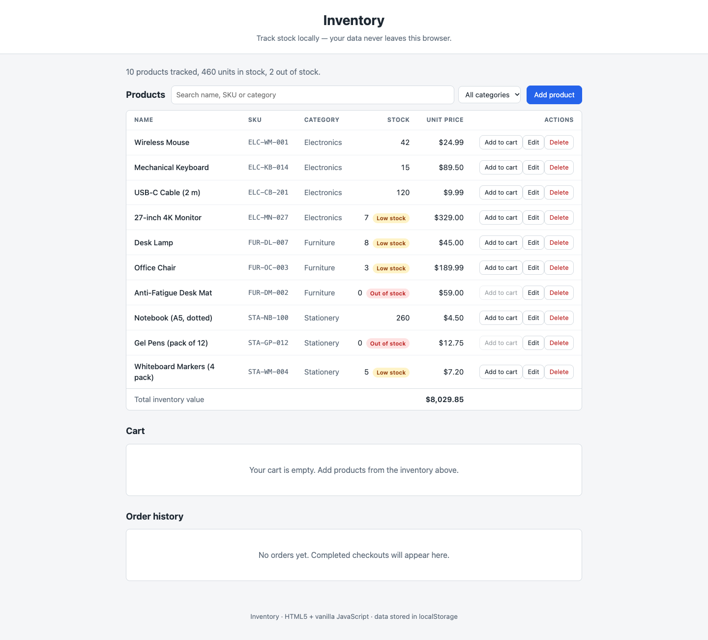
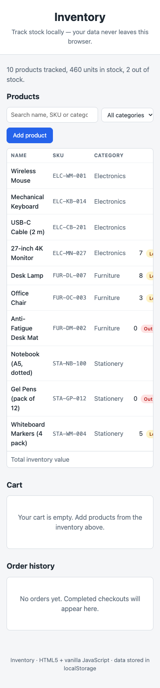
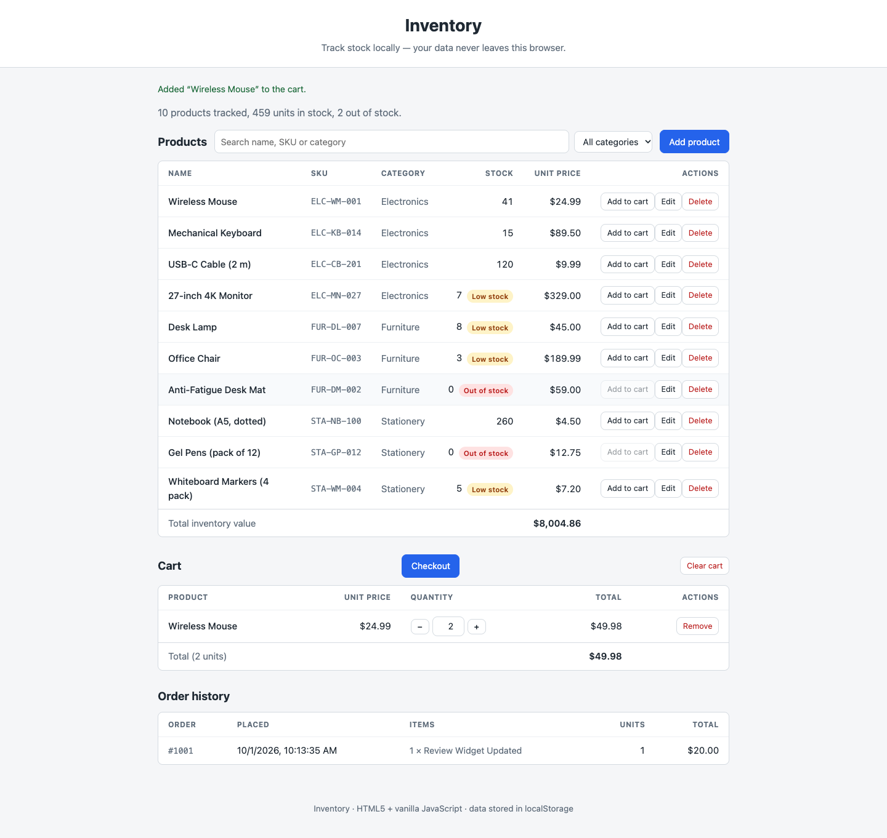
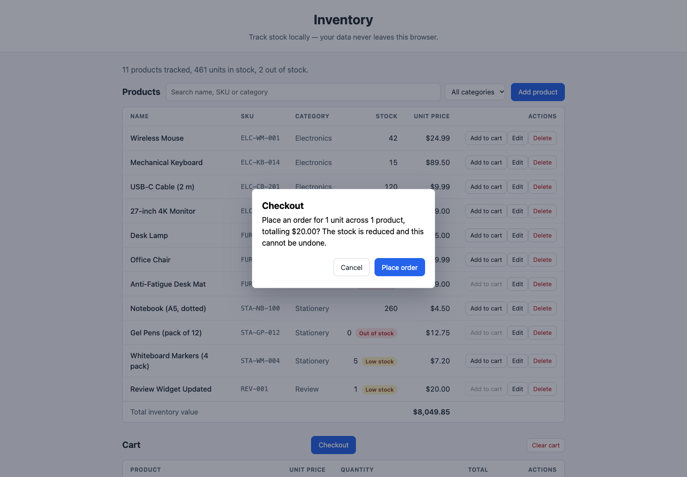
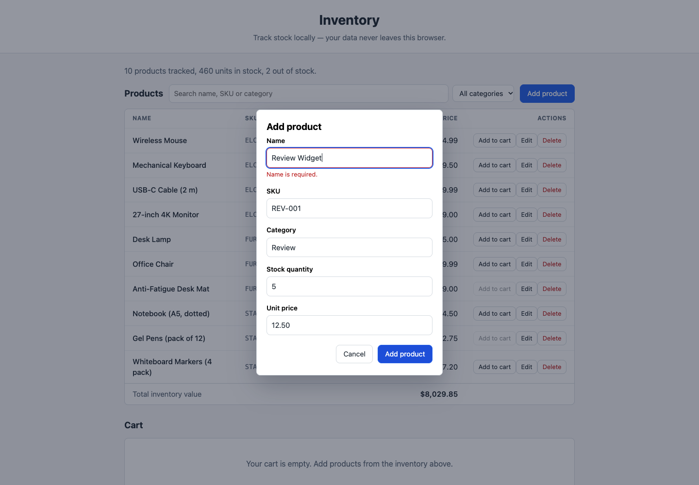
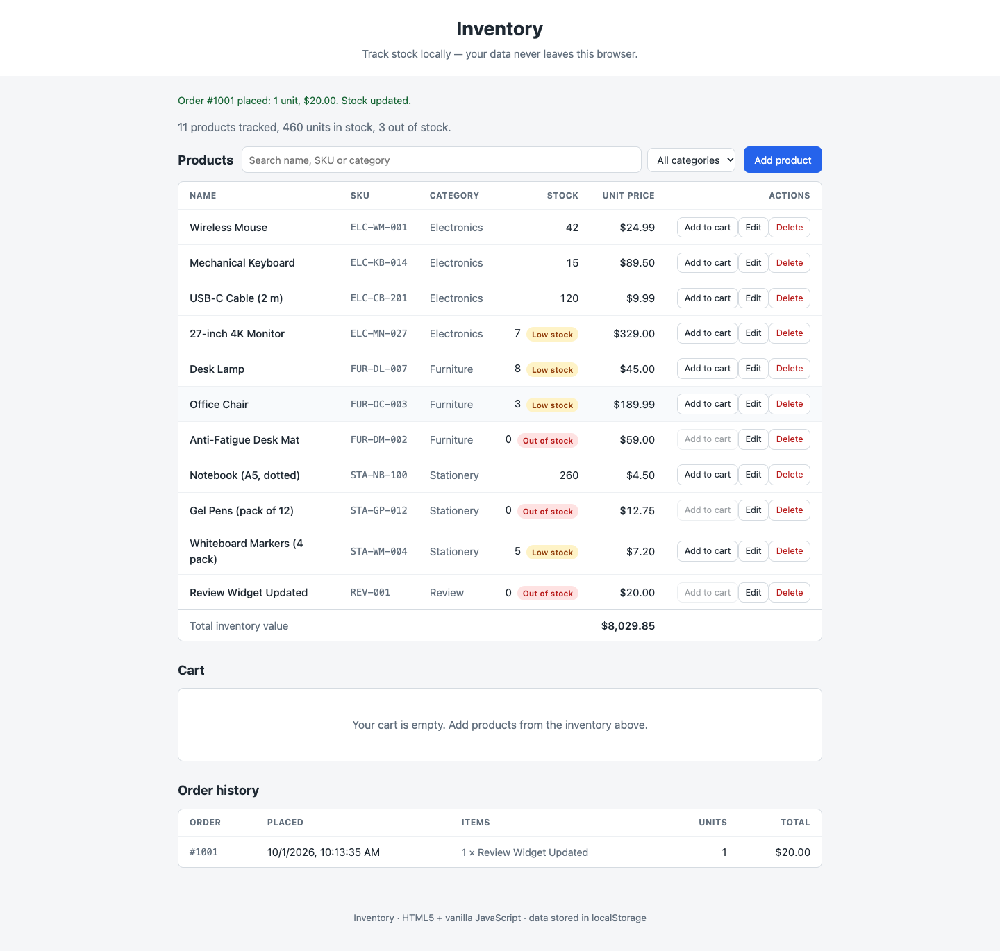
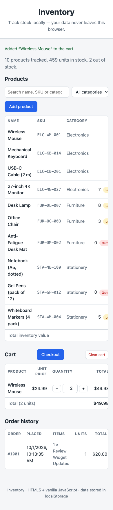

# Inventory

A simple inventory website built with **HTML5 and vanilla JavaScript** — no
frameworks, no libraries, no server. All data is persisted in the browser's
`localStorage`.

## Screenshots

Click any screenshot to open the [live app](https://axionomicai.github.io/AxBenchmark_Oct_26_v1/zai-cloud-glm-5.3-flash/).

<a href="https://axionomicai.github.io/AxBenchmark_Oct_26_v1/zai-cloud-glm-5.3-flash/"></a>

<a href="https://axionomicai.github.io/AxBenchmark_Oct_26_v1/zai-cloud-glm-5.3-flash/"></a>
<a href="https://axionomicai.github.io/AxBenchmark_Oct_26_v1/zai-cloud-glm-5.3-flash/"></a>
<a href="https://axionomicai.github.io/AxBenchmark_Oct_26_v1/zai-cloud-glm-5.3-flash/"></a>
<a href="https://axionomicai.github.io/AxBenchmark_Oct_26_v1/zai-cloud-glm-5.3-flash/"></a>
<a href="https://axionomicai.github.io/AxBenchmark_Oct_26_v1/zai-cloud-glm-5.3-flash/"></a>
<a href="https://axionomicai.github.io/AxBenchmark_Oct_26_v1/zai-cloud-glm-5.3-flash/"></a>

## Running

Open `index.html` in any modern browser. That's it — there is no build step
and nothing to install.

> If your browser blocks `localStorage` for `file://` pages, serve the
> directory instead, e.g. `python3 -m http.server` and visit
> <http://localhost:8000>.

## Using the site

- The table lists every product with its SKU, category, stock level and unit
  price, plus the total inventory value. Products at 0 units are flagged
  **Out of stock**; 10 or fewer are flagged **Low stock**.
- **Lookup:** the search box filters the table as you type, matching name,
  SKU or category — case doesn't matter, and every word you type must match
  ("usb cable" finds the cable, "usb lamp" finds nothing). The dropdown next
  to it narrows the list to one category, **Clear** resets both, and `Esc`
  empties the search box. While a filter is active the summary reads
  "Showing X of Y products" and the footer totals just the shown rows.
- **Add product** opens a form to create one; every row has **Add to cart**,
  **Edit** and **Delete** buttons (deleting asks for confirmation).
- **Cart:** add products from the table, then change quantities with the
  −/+ steppers or by typing a number, remove single lines with **Remove**, or
  empty everything with **Clear cart**. The footer totals the units and the
  price. Quantities never exceed the stock on hand — the button disables once
  every unit of a product is in the cart, and the steppers clamp at the same
  limit. Lines are priced live: editing a product's price updates the cart
  total, and deleting a product removes it from the cart.
- **Checkout:** the **Checkout** button above the cart shows a confirmation
  with the order's units, products and total. Placing the order reduces the
  stock of every purchased product, empties the cart and records the order —
  buying the last unit flips a product to **Out of stock** in the table.
- **Order history:** every completed order is listed newest first with its
  number, the time it was placed, its lines as ordered, the unit count and
  the total. Lines are snapshotted at purchase, so later price edits, stock
  edits or deletions never rewrite what was bought.
- Validation runs through the data layer: a name is required, SKUs must be
  unique (case-insensitive), stock must be a whole number ≥ 0 and the price
  a number ≥ 0. Errors appear under the matching field.
- Changes are saved to `localStorage` immediately and survive reloads.
- The Category field suggests existing categories while you type.

## Structure

```
index.html        Entry point; page skeleton
css/styles.css    Styles
js/store.js       Data layer: products, stock, cart and orders, persisted in localStorage
js/app.js         Application logic (renders into #inventory-root)
test/             Hand-run checks (plain Node, no dependencies)
```

## Data

The data layer (`js/store.js`) keeps products and their stock in the
browser's `localStorage` under the key `inventory.data.v1`, as a JSON record
of the form `{"version": 1, "products": [...]}`. Each product has an `id`,
`name`, `sku`, `category`, `quantity` (stock on hand), `unitPrice` and
`createdAt`/`updatedAt` timestamps.

The shopping cart is stored separately under `inventory.cart.v1`, as
`{"version": 1, "items": [{"id": "...", "quantity": n}]}` — entries keep only
the product id and the quantity. Whenever the cart is read, its entries are
joined with the catalogue: names and prices come from the live products,
entries whose product was deleted are dropped, and quantities are capped at
the stock on hand. An unreadable cart record is discarded and the cart
starts over empty.

Completed orders are stored under `inventory.orders.v1`, as
`{"version": 1, "orders": [...]}` — one record per checkout, kept
chronologically oldest first. Each order has an `id`, a `number` (counting
up from 1001), `placedAt`, and its lines exactly as they were bought: `id`,
`name`, `sku`, `category`, `unitPrice`, `quantity` and `lineTotal` are all
frozen at purchase, so catalogue edits never rewrite history. The units and
total are computed from the lines whenever the history is read. An unreadable
history record is discarded and ordering starts over empty.

On first run the store is seeded with a sample catalogue and saved; a
missing or unreadable record is reseeded the same way. If `localStorage` is
unavailable, data is kept in memory for the session and the page shows a
notice that changes will not be saved.

To start over, clear the site's data in your browser, or run
`InventoryStore.resetToSamples()` (products), `InventoryStore.clearCart()`
(cart) and `InventoryStore.clearOrders()` (order history) from the console.

## Tests

```
node test/store.test.js   # data layer
node test/app.test.js     # UI: table rendering, add/edit/delete, cart and checkout flows
```

Both are plain Node scripts with no dependencies; `app.test.js` drives the
UI through a minimal DOM stub.
